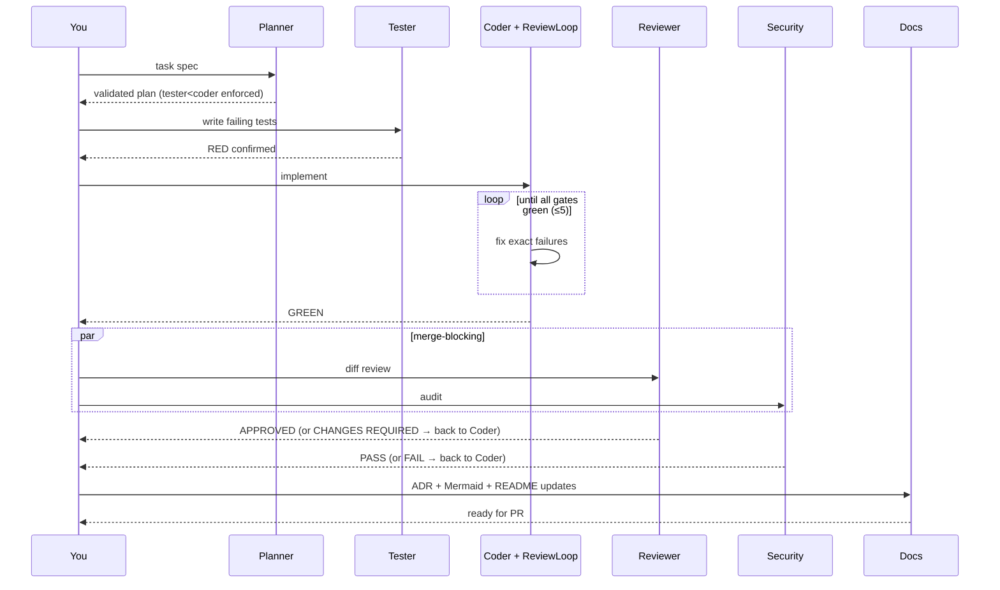

# Developer Guide — Agent Harness v2

> From `git clone` to your first agent-built feature merged to `main`. Offline-first Python stack (FastAPI · Neo4j · Postgres · Redis · arq · Flask) driven by AI subagents through Claude Code.

---

## Table of Contents

1. [Prerequisites](#1-prerequisites)
2. [Clone and bootstrap](#2-clone-and-bootstrap)
3. [First-run verification](#3-first-run-verification)
4. [Claude Code setup](#4-claude-code-setup)
5. [Your first feature — end-to-end walkthrough](#5-your-first-feature--end-to-end-walkthrough)
6. [The subagent pipeline in practice](#6-the-subagent-pipeline-in-practice)
7. [The gate suite — what actually blocks you](#7-the-gate-suite--what-actually-blocks-you)
8. [Working with graph memory](#8-working-with-graph-memory)
9. [Async jobs and the Flask dashboard](#9-async-jobs-and-the-flask-dashboard)
10. [Extending the harness](#10-extending-the-harness)
11. [Troubleshooting](#11-troubleshooting)
12. [Team conventions](#12-team-conventions)

---

## 1. Prerequisites

Install on the host (metal), not in Docker:

| Tool | Version | Why |
|---|---|---|
| Git | ≥ 2.40 | Branch workflow |
| Docker + Compose | Docker 24+, Compose v2 | Stack orchestration |
| Python | 3.11+ | For local `make gates` outside containers |
| **Ollama** | latest | Inference — MUST run on host for GPU/Metal access |
| Node (optional) | 20+ | Only if you install Claude Code |

Pull models once:

```bash
ollama pull qwen2.5-coder:14b     # coding model referenced in settings
ollama pull nomic-embed-text      # 768-dim embeddings matching the Neo4j index
ollama serve &                    # background daemon on :11434
```

Verify: `curl -s http://localhost:11434/v1/models | jq '.data[].id'` should list both.

**Optional but recommended:**
- `jq` — parsing API responses in examples
- `pre-commit` — enforces gates locally (`pip install pre-commit`)
- Neo4j Browser access at `http://localhost:7474` once the stack is up (creds `neo4j` / `harnesspass`)

---

## 2. Clone and bootstrap

```bash
git clone <your-repo-url> agent-harness
cd agent-harness

# Environment
cp .env.example .env
# Edit .env only if you're not using defaults; the compose file reads these

# Install dev tooling (host, not container) — needed for pre-commit + make gates locally
python -m venv .venv && source .venv/bin/activate
pip install -r core/requirements.txt -r core/requirements-dev.txt
pre-commit install

# Bring up the stack (Ollama must already be running on host)
docker compose up -d
```

`docker compose up -d` starts: `postgres`, `neo4j`, `redis`, `api` (FastAPI :8000), `worker` (arq), `frontend` (Flask :5000). The API creates its Postgres tables and the Neo4j vector index on startup (idempotent), so there is no separate migration step. Containers reach Ollama on the host via `host.docker.internal:11434` — this is preconfigured in `docker-compose.yml` with `extra_hosts: host-gateway` so it works on Linux too, not just Docker Desktop.

---

## 3. First-run verification

Run these in order — each proves one layer works:

```bash
# 3.1 Services healthy
docker compose ps
# Every service should show "healthy" or "running" (frontend has no healthcheck)

# 3.2 API responds
curl -s http://localhost:8000/health
# {"status":"ok"}

# 3.3 Neo4j vector index exists (created automatically on API startup)
docker compose exec neo4j cypher-shell -u neo4j -p harnesspass \
  "SHOW INDEXES YIELD name, type WHERE name='artifact_embeddings' RETURN name, type"
# Should list artifact_embeddings | VECTOR

# 3.4 Ollama reachable FROM inside a container (the critical connectivity check)
docker compose exec api curl -s http://host.docker.internal:11434/v1/models | jq -r '.data[].id'
# Must list qwen2.5-coder:14b and nomic-embed-text
# If this fails, agents cannot run. See Troubleshooting §11.

# 3.5 Offline gate suite (the non-negotiables) — run OUTSIDE containers, on host
make gates
# Expect: OFFLINE GATES GREEN — branch-name, ruff, black, mypy, unit, coverage ≥ 80%

# 3.5b Integration gate (needs a running Docker socket — testcontainers)
make gates-integration
# Or `make gates-all` to run both. CI runs gates-all on every push.

# 3.6 Dashboard
open http://localhost:5000
```

If any step fails, stop and fix it before continuing — the pipeline needs all of these working.

---

## 4. Claude Code setup

```bash
npm install -g @anthropic-ai/claude-code   # if not installed
cd agent-harness
claude
```

Claude Code reads `CLAUDE.md` and the `.claude/` directory from the repo root automatically — no wiring needed. Once inside, the six subagents in `.claude/agents/` (planner, tester, coder, reviewer, security, docs) are auto-registered. Confirm with `/agents` — you should see all six listed with their descriptions. `.claude/settings.json` blocks commits to `main` via a PreToolUse hook and auto-runs `ruff --fix` after every write.

---

## 5. Your first feature — end-to-end walkthrough

Goal: add a health-check endpoint that also reports Neo4j and Postgres connectivity. Small enough to finish in one sitting, real enough to exercise the whole pipeline.

### 5.1 Create the agent branch

```bash
git checkout main && git pull
git checkout -b agent/T-first-deep-healthcheck
```

Branch name must match `(agent|feat|fix|chore)/<slug>`; the pre-commit hook rejects anything else.

### 5.2 Write a spec

Paste directly into the Claude Code chat:

```
Extend GET /health to return connectivity status for Postgres and Neo4j
alongside {"status":"ok"}. Response shape:
{
  "status": "ok" | "degraded",
  "checks": {"postgres": bool, "neo4j": bool}
}
- Degraded if any check fails; API still returns 200 (probes decide externally)
- 500ms timeout per check; failures logged with the exception class name
- Unit tests mock both drivers; integration test uses testcontainers
```

### 5.3 Run the pipeline

In the Claude Code session, prompt

```
Use the planner subagent to plan this task, then execute the full pipeline through docs.
```

Claude Code delegates to `planner` → `tester` → `coder` (inside the ReviewLoop) → `reviewer` + `security` → `docs`. Each subagent emits its findings; the pipeline halts if reviewer rejects or security fails.

### 5.4 Verify locally before opening a PR

```bash
make gates          # must be entirely green
git log --oneline   # expect: red: ... → green: ... → docs: ...
```

### 5.5 Open the PR

```bash
git push -u origin agent/T-first-deep-healthcheck
gh pr create --fill
```

CI re-runs every gate. When green, merge to `main`. That's the loop.

---

## 6. The subagent pipeline in practice



**When each subagent triggers**

- **Planner** — always first for anything non-trivial. Skip only for one-line fixes.
- **Tester** — always before Coder. If you feel the urge to skip it, that's exactly when you need it.
- **Coder** — inside the iterate-until-green ReviewLoop (max 5 iterations). If it escalates, read the failure report; the fix is usually a mis-scoped test or a genuine ambiguity in the spec.
- **Reviewer** — always after Coder, before merge. Approval is blocking.
- **Security** — auth, input handling, secrets, file writes, subprocess, network. Skip when purely internal (e.g. refactoring a private helper).
- **Docs** — always last, after Reviewer approves.

**Reading pipeline output**

Check `POST /tasks` → the worker returns a structured result per subtask. Or look at the Flask dashboard for the run lineage. The Neo4j browser (`http://localhost:7474`) shows the full graph:

```cypher
MATCH (t:Task)-[:DECOMPOSED_INTO]->(s:Subtask)-[:EXECUTED_BY]->(a:Agent)
OPTIONAL MATCH (s)-[:PRODUCED]->(ar:Artifact)
RETURN t, s, a, ar LIMIT 25
```

---

## 7. The gate suite — what actually blocks you

```bash
make gates              # OFFLINE: branch-name · ruff · black · mypy --strict · unit · coverage ≥ 80
make gates-integration  # integration tests (needs Docker — testcontainers)
make gates-all          # gates + gates-integration (what CI runs end-to-end)
make gates-fast         # pre-commit subset: no coverage, no integration
```

`make gates` is the default local loop and needs no Docker, so it stays green on a fresh clone. Integration is split out because it spins real Postgres/Neo4j/Redis via testcontainers and requires a running Docker socket.

Enforced in three places:

1. **Pre-commit hook** — `gates-fast` runs before every commit lands
2. **The ReviewLoop** — after Coder writes code, gates run; failures feed back to Coder for up to 5 iterations, then escalate
3. **CI** — `.github/workflows/ci.yml` runs the full suite on every push and PR; `main` requires green

**When a gate is red, the rule is: iterate on that exact failure only.** Never:
- Weaken or delete a failing test to force green
- Add `# type: ignore` without a justification comment above it
- Lower the coverage threshold (`COVERAGE_THRESHOLD` in settings/env, `--cov-fail-under` in the Makefile and CI)
- Skip a gate by commenting it out in the Makefile

If after 5 ReviewLoop iterations gates are still red, the subagent escalates with the full failure report. Read it. Usually the spec is ambiguous or the tests over-specify. Fix the spec or the test — never the gate.

---

## 8. Working with graph memory

Before implementing anything, agents (and you) check whether similar work already exists:

```bash
curl -s "http://localhost:8000/memory/similar?q=rate%20limiting&k=5" | jq
```

Returns the top-k similar prior artifacts by embedding cosine similarity. The subagents in `core/src/agents/base.py` call this automatically via `_memory_context()` before completion.

**Task lineage** — see what agents did for a task:

```bash
TASK_ID=<uuid>
curl -s "http://localhost:8000/tasks/$TASK_ID/lineage" | jq
```

**Directly in Neo4j Browser** — `http://localhost:7474` (neo4j / harnesspass):

```cypher
// Full lineage for the latest 5 tasks
MATCH (t:Task)-[:DECOMPOSED_INTO]->(s:Subtask)-[:EXECUTED_BY]->(a:Agent)
OPTIONAL MATCH (s)-[:PRODUCED]->(ar:Artifact)
RETURN t.id, s.description, a.id, collect(ar.id)
ORDER BY t.id DESC LIMIT 5
```

Memory is a corpus that gets more useful over time. Don't clear it unless you're testing.

---

## 9. Async jobs and the Flask dashboard

**Enqueue a task from the dashboard** — `http://localhost:5000`. It POSTs to `/tasks`, which:
1. Writes a `Task` row in Postgres
2. Generates the `agent/<uuid8>-<slug>` branch name
3. Enqueues `run_pipeline` on arq

**Watch the worker**

```bash
docker compose logs -f worker
```

You'll see subagent transitions logged in order.

**Enqueue from code / scripts**

```python
import httpx
r = httpx.post("http://localhost:8000/tasks", json={
    "title": "Add pagination to /memory/artifacts",
    "spec": "...acceptance criteria..."
})
print(r.json())
```

**On-demand gate suite** for a branch:

```bash
curl -s -X POST "http://localhost:8000/gates/run?branch=agent/T-42-slug" | jq
```

---

## 10. Extending the harness

**Add a new subagent** (say, a `PerformanceAgent` that benchmarks changes):

1. Create `core/src/agents/performance.py` extending `BaseAgent`; set `agent_id = "performance"`
2. Add it to `VALID_AGENTS` in `core/src/agents/planner.py`
3. Register in `Orchestrator._agents` (`core/src/agents/orchestrator.py`)
4. Decide whether it's merge-blocking; if yes, add the check in `Orchestrator.run` alongside reviewer/security
5. Add `.claude/agents/performance.md` with YAML frontmatter (name, description, tools)
6. Unit-test the agent + orchestrator dispatch + planner acceptance of the new role

**Add a new gate** (say, `bandit` for Python security scanning):

1. Add the command to `GATE_COMMANDS` in `core/src/gates/runner.py`
2. Add it to `make gates` in the Makefile
3. Add it to `.github/workflows/ci.yml` — as its own job or inside the `static` job
4. Add it to `.pre-commit-config.yaml` if it's fast enough for pre-commit

**Add a new store** — think twice. The rule is Postgres for transactions, Neo4j for graph/vector, Redis for the queue. Adding a fourth store needs an ADR justifying why the existing three can't serve, plus a security review (offline egress rule).

**Change the coding model** — edit `AGENT_MODEL` in `.env`. Everything else follows because the OpenAI-compatible client just points at Ollama. Same interface if you swap to vLLM later.

---

## 11. Troubleshooting

**Ollama unreachable from containers**
Symptom: `docker compose exec api curl http://host.docker.internal:11434/v1/models` fails.
Fix: verify Ollama listens on all interfaces (`OLLAMA_HOST=0.0.0.0 ollama serve`), and that `host-gateway` is respected on your Linux Docker version (24+). On macOS/Windows Docker Desktop this Just Works.

**Neo4j vector index missing**
Symptom: `similar_artifacts` errors with "no such index".
Fix: restart the API (`docker compose restart api`) — it recreates the index idempotently on startup via `GraphMemory.ensure_schema()`. Verify with `SHOW INDEXES` in Neo4j Browser.

**Integration tests fail with "cannot connect to Docker"**
Testcontainers needs a reachable Docker socket. Confirm `docker ps` works as your user. If you're using Docker Desktop, ensure it's running.

**Gates green locally but red in CI**
The difference is usually the branch-name gate (CI checks `GITHUB_HEAD_REF`) or integration tests (CI uses service containers on `localhost`, locally testcontainers spins fresh). Look at the CI logs before assuming your code is wrong.

**Subagent produces the wrong file format**
The Coder/Tester/Docs agents parse file blocks in the format ```` ```python path=src/foo.py ````. If your model doesn't emit that, either switch to `qwen2.5-coder:14b` (tested), or adjust the parsing regex in each agent's `_extract_*` method. This is the most common issue when trying a new model.

**Review loop escalates immediately**
Usually means the tests are contradictory or the spec is ambiguous. Read the failure report; don't blindly re-run. The 5-iteration cap is a feature — infinite loops burn cycles without improving anything.

**Pre-commit hook rejects your branch name**
Rename it: `git branch -m agent/T-something-descriptive`. Or if it's a genuinely one-off exploration, use `feat/<slug>` or `chore/<slug>`.

---

## 12. Team conventions

**Branch naming** (enforced)
- `agent/<task-id>-<slug>` for AI-driven work
- `feat/<slug>` `fix/<slug>` `chore/<slug>` for human-driven work
- Never commit to `main` directly

**Commit messages** (convention, not enforced)
- `red: <spec>` — failing tests written
- `green: <spec>` — implementation making them pass
- `refactor: <what>` — improvements with gates staying green
- `docs: <what>` — ADR / diagram / README updates

**PR checklist** (paste into the PR description)
```
- [ ] All gates green locally (`make gates`)
- [ ] Coverage ≥ 80% maintained
- [ ] Reviewer subagent approved
- [ ] Security subagent passed (or N/A with justification)
- [ ] ADR added if architecture changed
- [ ] Mermaid diagrams updated to reflect new reality
```

**ADR-worthy decisions**
Any of: adding a new store, changing agent orchestration semantics, changing the gate suite, changing the offline-inference boundary, breaking a public API. If in doubt, write the ADR — it's five minutes and future-you will thank you.

**Model updates**
When you pull a new Ollama model, run the full test suite against it before making it the default. Subagent output format compliance is model-dependent.

**Weekly hygiene**
- Prune stale `agent/*` branches once merged: `git branch --merged main | grep agent/ | xargs -n1 git branch -d`
- Clear old artifacts from Neo4j if memory grows unwieldy: `MATCH (ar:Artifact) WHERE ar.created < date() - duration({days: 90}) DETACH DELETE ar` (add a `created` field first if you want this — currently artifacts have no TTL)
- Review the ADR directory quarterly; deprecate any decisions that no longer apply

---

## Quick reference

| Task | Command |
|---|---|
| Start stack | `docker compose up -d` |
| Offline gates | `make gates` |
| Integration gates | `make gates-integration` |
| Fast gates (pre-commit) | `make gates-fast` |
| Similar prior work | `curl "localhost:8000/memory/similar?q=..."` |
| Task lineage | `curl "localhost:8000/tasks/<id>/lineage"` |
| Worker logs | `docker compose logs -f worker` |
| Dashboard | `http://localhost:5000` |
| Neo4j browser | `http://localhost:7474` |
| Ollama on host | `ollama serve` |

You're set. First PR: pick the deep-healthcheck task from §5, run it through the pipeline of your choice, merge it. Second PR: something real from your backlog.
