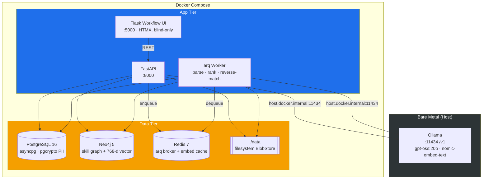
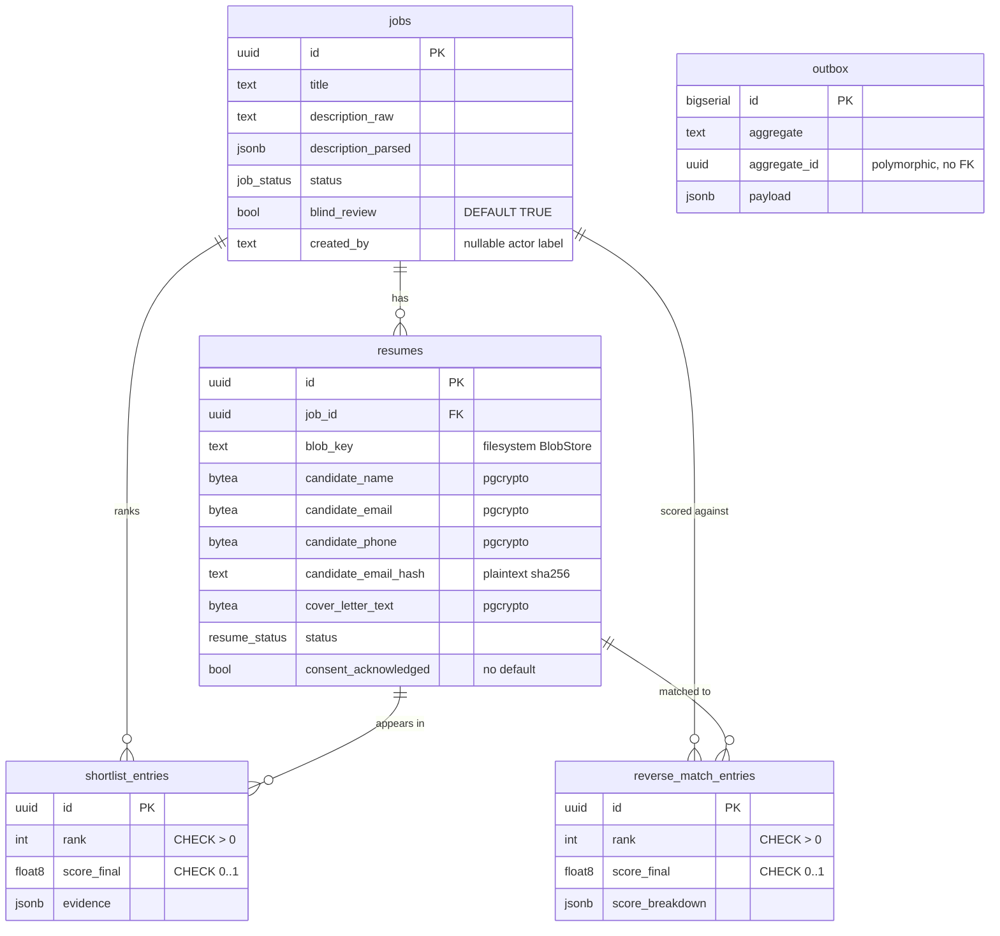

# recruiter-assistant

> Local-first, evidence-backed resume ranking. Upload a job and a stack of resumes; get a ranked shortlist where every claim is a quote verified against the candidate's own document. Inference runs on **Ollama via Tailscale** (the GPU host `aria-gb10`, not local metal) — no cloud endpoints, candidate data never reaches the internet.

Ported from the resume-ranking feature of an internal HRIS onto the offline-first agent harness. The review workflow, JD-Harmonizer, and cloud object storage were dropped; anonymization, the 4-stage ranking engine, shortlists, reverse-match, and exports were kept.

---

## What it does

- **Blind by default** — candidate name / email / phone are redacted in the viewer and excluded from embeddings; reveal is opt-in and audited (decision 4).
- **Evidence-backed** — the LLM produces per-requirement evidence, then an anti-fabrication pass fuzzy-matches every quote (≥ 0.85) against its cited resume chunk; unverifiable quotes are blanked.
- **Hybrid ranking** — Neo4j vector recall + a structured skill/experience/education/seniority score + evidence completeness + motivation.
- **Offline** — all model calls go through an OpenAI-compatible client pointed at Ollama on a local or tailnet peer (default: `aria-gb10` over Tailscale, configurable via `.env`). No cloud endpoint exists anywhere in the code or compose.

---

## System architecture



**Store responsibilities**

| Store | Role |
|---|---|
| **PostgreSQL** (raw asyncpg) | Transactional data: jobs, resumes, shortlist / reverse-match entries, outbox. Candidate PII is encrypted at rest with pgcrypto. |
| **Neo4j** | Skill / experience graph + four 768-d cosine vector indexes for coarse recall and skill-graph scoring. |
| **Redis** | arq task broker + embedding cache. No domain data. |
| **`./data` BlobStore** | Original resume + cover-letter files on the local filesystem — MinIO was dropped (see ADR-004). Implemented in Phase 1 as an async `BlobStore` (see below). |

There is **no migration framework**: `init_schema` (Postgres) and `bootstrap_neo4j_schema` (Neo4j) run idempotently on every API/worker boot. The `BlobStore` bootstraps its root directory on construction (bucket-bootstrap parity), also with no migration step.

### Filesystem BlobStore

`core/src/storage/blob_store.py` — an async `BlobStore(root)` rooted at `settings.storage_dir` (default `/data`, bind-mounted to `./data`), stdlib-only (`pathlib` / `asyncio` / `os`; no `aiofiles` or S3/MinIO dependency). Every op runs its blocking filesystem IO in `asyncio.to_thread`. Interface: `put(key, data, content_type=None)` · `get(key) -> bytes` (raises `BlobNotFound`) · `delete(key)` (missing key is a no-op success) · `exists(key) -> bool` · `list_keys(prefix="") -> list[str]` (sorted, root-relative, POSIX-separated; **directory-scoped** prefix, not MinIO substring-prefix). The store is a dumb byte sink — it never parses or extracts text, so nothing here feeds an embedding path.

**Path-safety & at-rest perms.** Every key-taking method funnels through one `_resolve` guard (before any IO) that raises `InvalidBlobKey` on `..` segments, absolute / Windows-drive / backslash keys, empty or root-resolving keys, null-byte keys, and symlink escapes (realpath + `is_relative_to`); `list_keys` applies the same realpath filter so an escaping symlink cannot be enumerated. Store-created directories are `0o700` and blobs are `0o600` — the PIPEDA/FIPPA control for raw resume bytes at rest (blobs are permission-gated; Postgres PII columns are pgcrypto-encrypted — two different at-rest controls). Interface and rationale: [ADR-005](docs/adr/005-filesystem-blobstore-interface-path-safety.md).

The store is wired onto `app.state.blob_store` (with a `get_blob_store` FastAPI dependency) in the API lifespan and onto `ctx["blob_store"]` in the worker startup. It has **no HTTP surface yet** — the upload/fetch/flush call sites that invoke it are ported in Phases 3–6.

---

## Data model (Postgres)



Five tables (`jobs`, `resumes`, `shortlist_entries`, `reverse_match_entries`, `outbox`). The four PII columns (`candidate_name` / `candidate_email` / `candidate_phone` / `cover_letter_text`) are `BYTEA` encrypted via `pgp_sym_encrypt` under the `app.pii_key` GUC; only `candidate_email_hash` is plaintext, and only so subject-access requests can find a candidate. Full column list and the three deliberate deviations from the source schema are in [ADR-004](docs/adr/004-phase-0-storage-schema-embedding-contract.md).

---

## Neo4j schema

`bootstrap_neo4j_schema` creates 5 node uniqueness constraints (`Job`, `Resume`, `Skill`, `Company`, `Institution`) and four 768-d cosine vector indexes (`resume_summary_idx`, `job_summary_idx`, `skill_emb_idx`, `chunk_emb_idx`). The `768` is read from `settings.llm_embedding_dim` — one number, one place — so the indexes can never drift from the embedding model.

`ResumeChunk` deliberately has **no** uniqueness constraint on `id`: chunk ids (`c_001`, `c_002`, …) are deterministic per-resume and intentionally collide across resumes. A stale `chunk_id_unique` constraint is actively dropped on bootstrap; re-adding it silently caps every shortlist at one candidate.

---

## Schemas

`core/src/schemas/` is the pydantic **v2** contract layer (Phase 2) — three modules plus an `__init__` re-export (`from src.schemas import JobCreate, ResumeParsed, MatchWeights, …`). Pure data models: no I/O, no services, no routes. They are the contract for four things at once — the API request/response DTOs, the strict LLM `chat_json` output schemas, the jsonb columns persisted verbatim, and the ranking weights. The routes/pipeline that consume them land in Phases 3–6.

| Module | Contract for |
|---|---|
| `jobs.py` | `JobCreate`/`JobUpdate`/`JobTransition`/`JobOut`/`JobDeleteOut`/`JobListItem`, `JDExtractText`, `BulkJobResult` (job API DTOs); `Skill`/`Education`/`JDExtracted` (LLM extraction → `jobs.description_parsed` jsonb). |
| `resumes.py` | `ResumeParsed`/`ResumeCore`/`ResumeSkill*`, `CandidateInfo`, `CoverLetterParsed` (LLM/jsonb parse shapes); `ResumeOut`/`ResumeListItem`/`ResumeUploadResult`/`ResumeDeleteOut` (resume API DTOs). Carries `_coerce_year` (two-digit-year pivot) and the lossy `_drop_invalid_rows`/`_coerce_*` pre-validators so one malformed row never fails a whole parse. |
| `matching.py` | `MatchWeights` (+ `DEFAULT_WEIGHTS`) — the ranking-weight contract; `ScoreBreakdown`/`EvidenceObject`/`PipelineMeta` (jsonb shapes); `ShortlistEntry`/`JobMatchEntry`/`JobMatchResultOut` (shortlist / reverse-match DTOs). `ShortlistEntry` also carries `score_structured`/`score_evidence`/`pipeline_meta` (surfaced from the same jsonb columns for the "Why this rank?" panel, ADR-031). |

**Review workflow cut.** The 2nd-review pipeline the source carried is not ported and is not importable: `PipelineStage`, `DispositionReason`, `ShortlistDecision*`, `StageTransition*` are gone, `ShortlistEntry` drops `current_decision`/`current_stage` (keeping only the blind-review `blinded`/`display_label`), and `JobListItem` drops the Taleo/JD-comment columns. A merge-blocking cut-guard test keeps them out.

**`MatchWeights` = the ranking weights.** A frozen model whose defaults encode the algorithm — `0.6·structured + 0.3·evidence + 0.1·motivation` on top, `0.40·skill + 0.25·exp + 0.10·edu + 0.15·seniority + 0.10·vector` below, `evidence_verify_fuzz = 0.85` (the anti-fabrication quote threshold). A sums-to-1.0 validator rejects any weight vector that would silently rescale scores. This is the single source of the ranking constants; Phase 4's scorer reads them.

The DTOs are aligned to the Phase 0 DDL at three points, and the redaction boundary is recorded: `ResumeOut`/`ResumeListItem` expose *decrypted* PII (`candidate.*`, `candidate_name`, `cover_letter_text`) with a `blinded` flag the schema does not act on — Phase 5 redaction must mask those fields before DTO construction. Full boundary + deviations: [ADR-006](docs/adr/006-schema-port-trim-ddl-alignment.md).

---

## Ingest & parse pipeline

`core/src/pipeline/{parsing,llm,skills}/`, `core/src/services/`, `core/src/worker/{tasks,resume_tasks}.py` (Phase 3) — ports the résumé/JD ingest pipeline from hris. `extract_text` (PyMuPDF / python-docx / striprtf) enforces three input-safety caps at the trust boundary, independent of any Phase 6 upload-side cap: a 10 MB raw-blob cap, a 300-page PDF cap (malformed-page-tree exceptions wrapped to a typed error), and a 50 MB DOCX decompression ceiling enforced by streaming *real* decompressed bytes rather than trusting the zip's forgeable central-directory size. `LLMClient` is the pipeline's only egress — hand-rolled on `httpx` against `settings.llm_base_url` (no `openai` dependency), with retry/circuit-breaker and a Redis-backed `CachedEmbedder` (`emb:v1:*` keyspace, on the same Redis instance as the arq broker — a recorded deviation from "Redis only as arq broker"). The `parse_job`/`parse_resume` arq tasks encrypt candidate PII at rest via pgcrypto (`services/pii.py`, strict `current_setting('app.pii_key')`; the worker now fails loud at startup if `PII_KEY` is unset) and write a `resume.parsed`/`job.parsed` outbox row for Phase 4's graph projection. The outbox payload deliberately excludes the candidate block, raw chunk/summary text, and carries only embeddings that have been scrubbed of candidate identifiers at the embed boundary — no candidate identity rides into Neo4j. Graph projection itself (`project_to_graph`) is deferred to Phase 4. Full PII-at-rest boundary and the merge-blocking audit rounds that shaped it: [ADR-007](docs/adr/007-phase3-ingest-parse-hardening.md).

---

## Ranking algorithm

Four stages, implemented in `core/src/pipeline/matching/{stages,orchestrator}.py` (Phase 4c):

1. **Coarse recall** — Neo4j `resume_summary_idx` vector query, scoped to the job, 3× oversample → k = 50.
2. **Structured score** — `0.40·skill + 0.25·exp + 0.10·edu + 0.15·seniority + 0.10·vector` over the skill graph, with ontology partial-credit, years/recency weighting, and a must-have-miss penalty (keyed off the candidate's actual ontology match, not a raw zero score — see [ADR-009](docs/adr/009-matching-engine-port.md)). Education (`edu`) compares degree **level** against `jd.education.min_level`; when the JD also lists `education.fields`, a candidate who meets the level bar but whose qualifying degree is in a non-allowed field is capped at `education_partial` (0.5) rather than full credit, via a fuzzy field-name match (`rapidfuzz.fuzz.token_set_ratio ≥ education_field_fuzz`, default 0.85) — see [ADR-028](docs/adr/028-education-field-relevance.md), resolving ADR-009 §7.
3. **Evidence** — LLM per-requirement evidence, then anti-fabrication verify: every quote fuzzy-matched (`rapidfuzz.fuzz.partial_ratio` ≥ 0.85) against its cited résumé chunk, or blanked. **Fails closed** (stages 2 and 3, forward shortlist only — [ADR-021](docs/adr/021-llm-failover-fail-closed-ranking.md) §2 / [ADR-029](docs/adr/029-fail-closed-ranking-fu7.md)): an LLM outage (`LLMUnavailableError`) or invalid/empty output (`LLMOutputInvalidError`, including empty-`content` detection — ADR-021 §6) anywhere in the LLM/embedder path raises `RankingUnavailableError` instead of persisting a shortlist with a silently-zeroed evidence/motivation component. Reverse-match keeps the pre-existing per-candidate isolation (out of scope for this fail-closed change).
4. **Combine + rank** — `0.6·structured + 0.3·evidence_completeness + 0.1·motivation` → ranked entries. Reverse-match (résumé → jobs) reuses stages 2–4 against an inverted stage-1 query.

Embeddings **exclude** name/email/phone by construction. 768-d `nomic-embed-text`, cosine — matching the Neo4j indexes. `MatchWeights` is sourced from `Settings` via `weights_from_settings`, and (Phase 4d) `matching_context_from_settings` is the single call site that builds the rest of `MatchingContext` (family weight, concurrency, model names, `git_sha`) from `Settings` too — no hard-coded tunables reach a real worker run.

**Write path (Phase 4d, `core/src/worker/matching_tasks.py` + `core/src/services/shortlist_service.py`):** the arq tasks `shortlist_job`/`reverse_match_job` run the orchestrator and persist the result with `persist_shortlist`/`persist_reverse_match` — raw asyncpg, DELETE-first per run (rerun replaces, never duplicates), into `shortlist_entries`/`reverse_match_entries` (Postgres only; there is no Neo4j `SHORTLISTED` edge write in this repo). The two persist functions are deliberate mirror images of each other (dictated by the two tables' different column shapes — see [ADR-010](docs/adr/010-shortlist-reverse-match-write-path.md)): `shortlist_entries` has no dedicated `score_structured`/`score_evidence` columns and a `NOT NULL` evidence column, so those scores are folded into the `score_breakdown` jsonb and a missing evidence object is written as `{}`; `reverse_match_entries` has dedicated columns and a nullable evidence column, written as SQL `NULL` when absent. Evidence quotes are persisted verbatim — no redaction happens at this write layer (display-time redaction is Phase 5, below).

`shortlist_job` catches `RankingUnavailableError` (ADR-029) and writes a dedicated, nullable `jobs.shortlist_state`/`_reason`/`_at` column trio — NOT a `job_status` enum value, same reasoning as ADR-026's withdrawal columns — instead of persisting a degraded shortlist. Below `settings.shortlist_max_tries` it raises `arq.Retry(defer=settings.shortlist_retry_defer_s)`; at the ceiling it returns `"awaiting_llm"` and leaves the state visible for a human to re-trigger. A success persists the shortlist and clears the state in one transaction. The Flask workflow UI's shortlist poll renders "Waiting for AI to rank candidates…" (distinct from "Generating…") while this state is set, via `GET /jobs/{id}/shortlist/status`.

**Read + export path (Phase 5, `core/src/services/{shortlist_service,resume_service,redaction}.py`):** `shortlist_service.list_for_job`/`get_one`/`export_rows` and `resume_service.list_for_job`/`get_one(reveal=...)` read the same tables back. Under blind review (`jobs.blind_review`, default `TRUE`), every one of these paths redacts BEFORE building the response DTO — never after — closing [ADR-006](docs/adr/006-schema-port-trim-ddl-alignment.md) §4's redaction-boundary contract in code: `redact_text` masks name/email/phone-shaped substrings and relabels employers/schools to stable pseudonyms ("Employer A"), `pseudonym(rank)` replaces the candidate's name in shortlist rows, and foreign (non-Canadian) locations are masked while Canadian ones stay visible. This is **display-only** — it changes what a blind caller's response contains, not what Postgres stores; ADR-007 §6/§7's cleartext-at-rest posture is unchanged. `shortlist_csv`/`shortlist_evidence_csv`/`shortlist_json` are pure formatters over `export_rows`' already-redacted output. `original_filename` is also masked under blind (`redacted_filename()` returns a generic `resume<ext>`) — closed by a post-first-green fix rather than left open. Full boundary + accepted residuals: [ADR-011](docs/adr/011-display-redaction-read-export-boundary.md).

`shortlist_entry_detail`'s panel (below) reads `ShortlistEntry.score_structured`/`score_evidence`/`pipeline_meta` — folded/selected off the same jsonb columns by the read layer above, on both blind and non-blind paths — through one pure display-only function, `src/services/explanation.py::shortlist_entry_explanation`, which never re-derives or re-reads anything: [ADR-031](docs/adr/031-why-this-rank-defense-pack.md).

---

## API layer (Phase 6)

`core/src/api/routes/{jobs,resumes,shortlist}.py` — the HTTP surface over the service layer Phases 3–5
built, plus `core/src/api/deps.py`'s configurable auth switch. Phase 6 shipped eleven routes; post-v1
features added `PATCH /jobs/{id}` (Workflow UI), `POST /resumes/{id}/reveal` (FU-1 audited reveal), and
`POST /jobs/bulk` (FU-3 bulk JD upload). **Merged to `main`** — see "Status & roadmap" below.

| Method | Path | Purpose |
|---|---|---|
| POST / GET | `/jobs` | Create a draft job (enqueues `parse_job`) / list |
| POST | `/jobs/bulk` | **FU-3** — bulk-create one job per uploaded JD file (loose or `.zip`) + optional CSV metadata manifest; dedup by `description_sha256` |
| GET / PATCH | `/jobs/{id}` | Get one / general partial update (allowlist-guarded; `status` not settable here) |
| PATCH | `/jobs/{id}/status` | The only status-mutating route — forward-only, 409 on an invalid transition |
| POST | `/jobs/jd-extract` | Pre-fill helper — extract JD text from an upload, no DB write |
| POST / GET | `/jobs/{id}/resumes` | Upload résumés (multi-file / `.zip`; **FU-1** cover-letter file; **FU-2/3** per-résumé cover-letter pairing via filename convention or a `pairing_manifest`) / list |
| GET | `/resumes/{id}` | Get one résumé (redacted under blind review; **FU-4** — no `reveal` query param any more, blind-only) |
| POST | `/resumes/{id}/reveal` | **FU-1** — AUDITED de-anonymization: writes a `reveal_audit` row, returns the un-blinded résumé (**FU-4** — admin/recruiter only, and now the ONLY un-blinding path in the API) |
| POST | `/resumes/{id}/match-jobs` | Trigger reverse-match (enqueues `reverse_match_job`) |
| GET | `/resumes/{id}/match-results` | Read reverse-match result — **no redaction** (the caller owns the résumé) |
| GET / PATCH | `/jobs/{id}/shortlist` | List / (schema-level) |
| GET | `/jobs/{id}/shortlist/status` | **FU-7 (ADR-029)** — the fail-closed ranking state (`state: "awaiting_llm" \| null`, `reason`, `at`) the frontend poll consults; job-assignment-scoped exactly like `GET /jobs/{id}`, so an unassigned or nonexistent job both 404 (closes an IDOR/existence-oracle caught mid-build) |
| GET | `/jobs/{id}/shortlist/export` | Export csv / evidence-csv / json (**FU-4** — blind-only, `reveal` query param removed; it was an unaudited bulk de-anonymization across the whole shortlist) |
| GET | `/shortlist/{id}` | Get one shortlist entry |

**Auth (FU-4 — keyed roles)** replaces Phase 6's single `Settings.api_key` switch with four flat role
keys — `api_key_admin`/`api_key_recruiter`/`api_key_hiring_manager`/`api_key_auditor`. Auth is disabled
iff all four are empty (local-dev default, a loud startup `WARNING`, every caller resolves to `admin`);
enabled iff any is non-empty. `resolve_role` matches the presented `X-API-Key` against all four
configured keys, constant-time (`secrets.compare_digest`, UTF-8 bytes, no short-circuit) — an unknown or
missing key is 401, a valid key whose role isn't in a route's allowed set is 403. `require_role(*roles)`
is applied per route, not router-wide, since different routes on the same router allow different role
sets (e.g. `PATCH /jobs/{id}` is admin/recruiter-only while `GET /jobs/{id}` is open to all four — see
the table above). A stale legacy `API_KEY` env var refuses to boot (`RuntimeError`) rather than silently
falling back to auth-disabled; two role keys configured to the same value also refuses to boot, rather
than silently collapsing two roles into one. An optional `X-Actor-Name` header (capped at 128 chars,
never an authorization input) populates the nullable `created_by`/`uploaded_by` audit columns.
Roles are role-level, not row-level — a `hiring_manager`/`auditor` key reads every job company-wide, and
the Flask viewer presents one fixed `recruiter` key outbound for every browser it serves. Full decisions:
[ADR-018](docs/adr/018-rbac-keyed-roles.md).

**Upload** accepts local multi-file or a single `.zip` (expanded, one entry = one résumé) — the
Taleo/CSV-manifest connector is explicitly cut and deferred to a future connectors feature. The zip guard
(`core/src/services/zip_upload.py`) mirrors the Phase-3 DOCX decompression-bomb defense: never trusts the
archive's declared entry size, streams and sums real decompressed bytes, and rejects path-traversal
entries, disallowed extensions, and per-entry/total/entry-count overages before writing anything.

Full decisions + residuals: [ADR-012](docs/adr/012-api-routes-auth-upload-scope.md); activity report:

---

## Evals (Phase 7)

Phase 7 also shipped the last v1-scope evals item: no new fixtures (Phase 4a's corpus + 4c's live
orchestrator wiring already satisfied "ranking-quality fixtures"), plus a **live end-to-end eval**
(`core/tests/evals/run_evals_live.py`) that seeds the pre-parsed corpus at the post-parse boundary, drives
the real `project_to_graph`/`shortlist_job`, reads persisted rows, and re-checks every `thresholds.toml`
gate against a real Ollama-backed stack. It has been run and passed, reproduced identically twice — a
manual/local harness, never part of CI. Full detail: [ADR-013](docs/adr/013-phase7-evals-viewer.md) §5;

---

## Workflow UI

`core/frontend/{api_client.py,app.py,templates/,static/}` — a full recruiter **workflow UI**: create a
job, upload résumés, generate a shortlist, review ranked candidates, and export, all from the browser at
`:5000`. This is a **post-v1 feature** (not "Phase 8" — the extraction plan's phase table ends at Phase 7
and stays closed) that replaces Phase 7's minimal read-only viewer. It reproduces the recruiter workflow
from the source `hris` Next.js frontend, scoped strictly to **job → résumé → shortlist** — the
review/decision workflow, JD-Harmonizer, comment threads, admin console, and CAS auth all stay cut.

**Stack: Flask + HTMX + a hand-authored `app.css`, not a Node/Tailwind build.** HTMX is vendored
(`static/vendor/htmx.min.js`, 2.0.4, served locally — no CDN) and drives 3-second polling
(job-parse status, résumé-table status, shortlist generation) and partial-page swaps; `app.css` is a
small hand-authored utility/component stylesheet — there is no `tailwind.config.js` or Node toolchain
anywhere in the repo. Every HTMX-swapped fragment is rendered server-side by Jinja2; no client-side JS
assembles a response from raw JSON. `api_client.py` is the same thin sync `httpx` wrapper Phase 7 built
(one function per consumed backend route, `build_client()`/`BackendError`/`NotFound`/
`BackendUnavailable`/`Conflict`), extended with write calls (`create_job`, `patch_job`,
`transition_status`, `upload_resumes`, `generate_shortlist`).

**Screens:** jobs list (`/`, create-job form with JD-file auto-extract + blind-review checkbox +
status-filter pills) → job detail (`/jobs/<uuid>`, 3s-polled "parsing…" badge, status-transition buttons,
blind-review toggle, consent-gated résumé upload + 3s-polled résumé status table) → résumé detail
(`/resumes/<uuid>`, always blind) → shortlist (`/jobs/<uuid>/shortlist`, Generate/Regenerate button that
polls until ranked, per-candidate cards with rank/score/sub-score tiles/skill chips/evidence, three
anonymized export formats) → shortlist entry detail (`/shortlist/<uuid>`, the "Why this rank?" score
-composition + verified-evidence panel, ADR-031).

**Blind-only by construction, carried forward from Phase 7.** The workflow UI never sends `reveal` to the
backend, even though it is now write-enabled — `get_resume` stays hardcoded `reveal=False`;
`list_shortlist`/`get_shortlist_entry` take no `reveal` parameter at all; export proxies the backend's
`reveal=False` default without a browser-side way to flip it. `resume_detail.html` still has no template
branch capable of rendering `candidate.name`/`email`/`phone`/`location` at all. Reveal/reveal-export
remains an audited, non-viewer backend surface (ADR-011/012).

**One backend addition:** `PATCH /jobs/{id}` (`job_service.update_job`) — an allowlist-guarded partial
update needed for the blind-review toggle; `status` stays unwritable through it (every status change still
goes through the Phase 6 `PATCH /jobs/{id}/status` state machine). The only `core/src/` change in this
feature — the ranking engine and every other Phase 6 route are byte-unchanged.

**Not built:** a reverse-match trigger on the résumé-detail page — the backend endpoints
(`POST /resumes/{id}/match-jobs`, `GET /resumes/{id}/match-results`) already exist and the old
`match_results.html` view remains wired; only the trigger button is missing (a scoped follow-up, see
[HANDOFF.md](HANDOFF.md)).

Full decisions + residuals: [ADR-014](docs/adr/014-workflow-ui.md).

---

## Status & roadmap

**Phases 0–7 are ALL merged to `main`, CI green — the locked v1 extraction-plan scope is complete.** All four Phase-4 sub-phases (4a evals corpus, 4b graph projection, 4c matching engine, 4d shortlist/reverse-match write path), Phase 5 (persist + anonymize + export, PR #14), Phase 6 (API routes, PR #15), and Phase 7 (evals + minimal Flask viewer, PR #16, squash merge `1039e5c`, 2026-07-17) are all merged. There is no Phase 8.

**Eight post-v1 features have since shipped, all merged to `origin/main`, CI green** (named features, not numbered phases):

| Feature | PR / merge | ADR | What it added |
|---|---|---|---|
| **Workflow UI** | #18 `3eba9cf` | [014](docs/adr/014-workflow-ui.md) | Phase 7's read-only viewer → a full create/upload/generate job → résumé → shortlist workflow (Flask + HTMX, blind-only) |
| **FU-2 — evidence chunk expansion** | #19 `8d7ce0b` | [015](docs/adr/015-evidence-chunk-expansion.md) | Evidence `evidence_chunk_ids` expanded to redacted source text in the CSV export + card panel |
| **FU-1 — audited reveal** | #20 `bc055f4` | [016](docs/adr/016-audited-reveal.md) | Blind stays default; identity exposed only via an **audited** `POST /resumes/{id}/reveal` (`reveal_audit` sink + a button on the résumé page and each shortlist card). Also: cover-letter **file** upload |
| **FU-3 — bulk ingest** | #21 `e033d31` | [017](docs/adr/017-bulk-ingest-pairing.md) | Bulk résumé upload with per-résumé cover-letter pairing (filename convention or `manifest.json`), bulk JD upload (`POST /jobs/bulk` + CSV manifest + dedup), reverse-match UI, and the shortlist-poll fix |
| **FU-4 — RBAC** | #23 `961caab` | [018](docs/adr/018-rbac-keyed-roles.md) | Four keyed roles (`admin`/`recruiter`/`hiring_manager`/`auditor`), per-route authorization, CSRF-per-résumé on reveal, and removal of two unaudited bulk-reveal paths. Closes FU-1's residuals R1/R2/R5 |
| **FU-5 — CAS identity + attributable audit** | #29 `ae18687` | [019](docs/adr/019-cas-identity-attributable-audit.md) | The first real `users` table, SFU CAS authentication for humans, `role` as data rather than a hardcoded enum, and a generalized `audit_log` that also records `blind_review` flips. Makes a reveal name a person instead of `"api"` |
| **Live-app bug fixes** | #30 `22db93f` | — | zip-upload empty-file 422, résumé-upload 404, slow-job progress honesty, duplicate-run dedupe |
| **FU-6 — Per-job assignment + row-level scoping** | #31 `c2f6a57` | [020](docs/adr/020-per-job-assignment-scoping.md) | A `job_assignees` table so hiring managers see only their assigned jobs; scoping enforced off the CAS **session** role in SQL, unassigned reads 404 not 403; auditor read-logging |

**Five further features landed on `origin/main` on 2026-07-29** (the four below were previously local-only and reached `origin` via the reconciliation push `c2f6a57 → 5cab283`; FU-8 was then built and merged on top). `origin/main` == `sfu-aria/main` == `6903691`, both repos public, CI green in-cloud. Ordered oldest-first:

| Feature | commit / PR | ADR | What it added |
|---|---|---|---|
| **Configurable shortlist size** | `2e2da05` | [024](docs/adr/024-configurable-shortlist-size.md) | Per-job `shortlist_top_percent` (1–100%, default 100 = keep-all) caps the persisted forward shortlist to the top P% of the ranked pool |
| **`/my/jobs` hiring-manager viewer default** | `f3b2998` | [020](docs/adr/020-per-job-assignment-scoping.md) | ADR-020 §7 "viewer half" — a hiring_manager lands on the assignment-scoped `/my/jobs` view by default; landed after the local FU-6 merge, so it was not part of PR #31 |
| **CAS live integration** | `adb55fd`+`d54a6be` | [019](docs/adr/019-cas-identity-attributable-audit.md) | Turned the FU-5 CAS flow on against real SFU CAS via `compose.cas.yml` (now tracked + port-parameterized, on by default in the quickstart): split-origin (frontend/API) post-login redirect fix + a header auth widget (user · role · Logout/Login) |
| **User admin — granular roles** | `45eba6d` (slices 1–8) | [025](docs/adr/025-user-admin-roles.md) | No-role-by-default first login (fail-closed, reverses ADR-019 §10a), the `require_role_assigned` gate, an admin-session-gated `GET /users` + `PATCH /users/{id}/role` (atomic `role_changed` audit, last-admin lockout), and a Flask `/admin/users` role-assignment page |
| **FU-8 — Résumé withdrawal** | PR #37, squash `0162302` | [026](docs/adr/026-resume-withdrawal-lifecycle.md) | A candidate-withdrawal action (audited, `POST /resumes/{id}/withdraw` + `/reinstate`) that un-projects the résumé from Neo4j so it drops out of new shortlists/reverse-matches, distinct from a parse `failed`; reinstate replays the last parse rather than re-embedding; and a per-job résumé-status breakdown (`GET /jobs/{id}/resume-status`). All five gates green + CI green in-cloud on merge. The §4 consent-revocation purge path stays deferred |

**FU-7 (scoped by ADR-021, 2026-07-20) is built in three slices; one decision remains open:**

| Slice | commit / PR | ADR | What it added |
|---|---|---|---|
| **§3 — honest résumé parse status** | PR #44, `69e6ac0` | [027](docs/adr/027-honest-resume-parse-status-fu7.md) | `uploaded → parsing → failed` state machine actually reachable in code; a timed-out parse now lands at `failed` with a reason instead of hanging at `uploaded` forever |
| **§2 + §6 — fail-closed ranking + empty-content detection** | PR #52, `79d69ac` | [029](docs/adr/029-fail-closed-ranking-fu7.md) | Fails closed on **both** an LLM outage and invalid/empty output during forward-shortlist ranking (widened by human decision beyond §2's literal Mode-B-only scope); a dedicated `jobs.shortlist_state` column trio + bounded arq retry replace the prior silent zero-score; empty-`content` is now detected and diagnosed on both LLM client code paths |
| **§4 — degraded-parse visibility** | branch `feat/fu7-degraded-parse-visibility` | [030](docs/adr/030-fu7-degraded-parse-visibility.md) | A résumé whose skills extraction fell back to the keyword scan is marked `degraded` (rides the existing `resumes.parsed` jsonb, no DDL), badged in the list/detail UI and a per-job status-breakdown sub-count, and excluded from ranking (its graph-projection outbox event is skipped, mirroring the ADR-026 withdrawn-during-parse skip) until re-parsed via re-upload |

**Still open (ADR-021 decision 1, not yet scheduled):** an ordered multi-provider chain with per-provider circuit breakers and failover on availability errors.

**"Why this rank?" defense pack (`docs/ROADMAP.md` card #1), slice 1** — branch `feat/why-this-rank-defense-pack`, PR pending, [ADR-031](docs/adr/031-why-this-rank-defense-pack.md). A deterministic score-composition + verified-evidence panel on the shortlist entry detail page (`GET /shortlist/{id}`, both API and Flask UI) — no LLM, no DDL, no scoring-math change; every number was already persisted in `score_breakdown`/`evidence`/`pipeline_meta`. Weights shown are the ones recorded in `pipeline_meta` at generation time, never current settings — a missing or malformed stamp renders "weights unavailable" rather than a substituted default, and an unrecorded sub-score renders "not recorded" rather than an affirmative "0%". Forward-shortlist only (reverse-match's `score_final` scale isn't comparable, ADR-009). Slice 2 (optional grounded-LLM narrative + decision-rationale export) is deferred.

A plain-language explainer of the scoring model, written for HR and compliance review — including the seventeen policy decisions currently encoded as configuration defaults — is at [docs/process/ranking-metrics-explainer.html](docs/process/ranking-metrics-explainer.html).

What is live on `main` today: `docker compose up` brings up the stack, Postgres + Neo4j schema come up idempotently on boot, the ingest/parse pipeline, the Neo4j skill graph, the 4-stage matching engine, the shortlist/reverse-match write path, the persist/anonymize/export read layer, the job/résumé/shortlist/reverse-match/reveal/bulk HTTP routes, and **the Flask Workflow UI** — a full job → résumé → shortlist recruiter workflow with audited reveal and bulk ingest, blind-only by construction — are all wired and merged. A live end-to-end eval against a real Ollama-backed stack has been run and passed (see [ADR-013](docs/adr/013-phase7-evals-viewer.md) §5); this is a manual/local harness, not part of CI. On top of that, FU-6's per-job assignment scoping is live too (merged to `origin/main`), and the four local-`main`-only features in the table above are live on top of it: SFU CAS login (enabled via `compose.cas.yml`), the `/my/jobs` hiring-manager default view, configurable shortlist size, and the `/admin/users` role-administration page — with new users landing role-less (no access) until an admin grants a role.

| Phase | Deliverable | State |
|---|---|---|
| **0 · Seed & infra** | Compose, settings (768-d contract), asyncpg startup DDL, Neo4j bootstrap | **done** |
| **1 · Storage** | Filesystem `BlobStore` (put/get/delete/exists/list_keys, path-safe, `0o600`/`0o700`) + app/worker wiring | **done** |
| **2 · Schemas** | `jobs`, `resumes`, `matching` pydantic schemas (review workflow cut; `MatchWeights` ranking contract) | **done** |
| **3 · Ingest + parse** | extract/chunk, LLM client+cache, PII encryption on parse, `parse_job`/`parse_resume` | **done, merged** |
| **4a · Evals corpus** | Labelled resumes-vs-JD fixture corpus + `thresholds.toml` | **done, merged** |
| **4b · Graph projection** | Outbox drainer + Neo4j skill graph (`skill_normalize`, ADR-008 PII-safe-by-construction) | **done, merged** |
| **4c · Matching engine** | `stages`/`orchestrator` (4-stage hybrid), reverse-match, `weights_from_settings` | **done, merged** |
| **4d · Shortlist + reverse-match write path** | `shortlist_job`/`reverse_match_job` arq tasks, `persist_shortlist`/`persist_reverse_match`, `matching_context_from_settings` | **done, merged** |
| **5 · Persist + anonymize + export** | `list_for_job`/`get_one`/`export_rows`, `redaction.py`, csv/evidence-csv/json export with `reveal` | **done, merged (PR #14)** |
| **6 · API** | job/resume/shortlist/reverse-match routes (above), configurable auth | **done, merged (PR #15)** |
| **7 · Evals + viewer** | precision@k / evidence-verification fixtures (already satisfied by 4a/4c, no new fixtures this phase); read-only Flask viewer (blind-only); live end-to-end eval against a real stack | **done, merged (PR #16, squash `1039e5c`)** |
| **Workflow UI** (post-v1 feature) | Flask + HTMX recruiter workflow (create job → upload → generate shortlist → review → export), blind-only carried forward, `PATCH /jobs/{id}` backend addition | **done** |

Architecture decisions: [docs/adr/README.md](docs/adr/README.md). Open work: [docs/ROADMAP.md](docs/ROADMAP.md).

---

## Quick start (fresh box)

**Prerequisites**
1. **Docker Desktop** (with Compose v2) running.
2. **Reach the inference host.** Inference does **not** run on the app box — it runs on the dedicated GPU host **`aria-gb10`** over **Tailscale**, which already has both models (`gpt-oss:20b` + `nomic-embed-text`) pulled and calibrated. **Your box must be joined to the tailnet.** `.env.example` ships `LLM_BASE_URL` = aria-gb10's tailnet IP + `LLM_TIMEOUT_S=300`. (Only if you deliberately run your *own* Ollama on the app box instead: set `LLM_BASE_URL=http://host.docker.internal:11434/v1`, `LLM_TIMEOUT_S=120`, and `ollama pull gpt-oss:20b nomic-embed-text` — ~13 GB.)

**Windows (PowerShell) — one command:**
```powershell
./scripts/quickstart.ps1
```
It generates the required `PII_KEY`/`SKILL_HASH_SALT` if unset, writes the unique host ports + inference config into `.env`, **verifies both models are reachable at `LLM_BASE_URL`**, port-preflights (clear "port N held by <container>" message), brings the stack up **with CAS on**, waits for health, and prints the URLs. Flags: `-Build` (rebuild images), `-NoCas` (dev-anonymous-admin, no login), `-Down [-Reset]` (stop / wipe volumes), `-Logs`.

**Any OS — manual:**
```bash
cp .env.example .env
#   set PII_KEY and SKILL_HASH_SALT (32 random bytes, base64 each):  openssl rand -base64 32
#   confirm LLM_BASE_URL points at your Ollama (peer or local)
docker compose -f docker-compose.yml -f compose.cas.yml up -d   # CAS on (drop -f compose.cas.yml for anonymous)
curl localhost:29800/health    # -> {"status":"ok"}   (API_PORT default 29800)
```
Postgres tables + Neo4j vector indexes are created on API startup — no migration step.

**Unique host ports.** `docker-compose.yml` publishes `${X_PORT:-<stock>}`, and `.env.example` ships a `29xxx` block (API `29800`, frontend `29500`, pg `29432`, redis `29379`, neo4j `29474`/`29687`) so the stack never collides with other apps on the machine. Only the host side changes — in-network DSNs are unchanged.

> **Auth is config-gated, not optional.** CAS (SFU login + RBAC + user management) is **on by default** in `quickstart.ps1` / with `-f compose.cas.yml`. A *plain* `docker compose up` (no CAS override) runs `cas_enabled=False` = dev-anonymous-admin (no login screen) — a **boot mode, not a missing feature**: RBAC (ADR-018), CAS identity (ADR-019), per-job scoping (ADR-020), and user administration (ADR-025) are all on `main`.

`PII_KEY` / `SKILL_HASH_SALT` protect every encrypted candidate column and the skill-graph keys. Losing `PII_KEY` makes those columns unrecoverable; `.env` is gitignored — never commit it.

---

## Gates

`make gates` is the **offline** default — no Docker required, green on a fresh clone:

1. `ruff check` — lint
2. `black --check` — format
3. `mypy --strict` — types (no unjustified `# type: ignore`)
4. `pytest tests/unit` — unit tests (drivers mocked; no live services)
5. Coverage ≥ **80%**
6. Branch name matches `agent/<task-id>-<slug>` or `feat|fix|chore/<slug>`

`make gates-integration` runs the testcontainers suite (real Postgres + Neo4j) and needs a Docker socket. CI runs `make gates-all`.

---

## Repository layout

```
recruiter-assistant/
├── core/
│   ├── src/
│   │   ├── api/         # FastAPI app (/health + lifespan; wires blob_store/arq); deps.py auth switch + routes/{jobs,resumes,shortlist}.py (Phase 6)
│   │   ├── models/      # asyncpg pool + idempotent startup DDL
│   │   ├── pipeline/    # extract/chunk, LLM client+cache, skills scan (Phase 3); matching/{stages,orchestrator} 4-stage ranking engine (Phase 4c/4d)
│   │   ├── prompts/     # Jinja prompt templates: jd_extract/resume_core/resume_skills/cover_letter (Phase 3)
│   │   ├── schemas/     # pydantic contract layer: jobs/resumes/matching (Phase 2)
│   │   ├── services/    # pii, job/resume/outbox services (Phase 3); shortlist_service persist (Phase 4d) + list/get/export (Phase 5); redaction.py, errors.py (Phase 5); zip_upload.py, jd_import_service.py (Phase 6); job_service.update_job (Workflow UI)
│   │   ├── storage/     # filesystem BlobStore (Phase 1)
│   │   ├── worker/      # arq worker + Neo4j bootstrap; parse_job/parse_resume (Phase 3); shortlist_job/reverse_match_job (Phase 4d)
│   │   └── settings.py  # single source of truth (pydantic-settings)
│   ├── frontend/        # Flask + HTMX workflow UI — api_client.py + app.py + templates/ + static/{app.css,vendor/htmx.min.js} (Phase 7 read-only viewer, superseded by the post-v1 Workflow UI feature; blind-only throughout)
│   └── tests/{unit,integration}/
├── CLAUDE.md            # Claude Code instruction layer (auto-read)
├── .claude/            # build subagents + commands
├── docs/{adr,}          # ADRs + the extraction plan
├── docker-compose.yml   # pg · neo4j · redis · api · worker · frontend
├── Makefile             # gates + stack controls
└── .env.example
```
