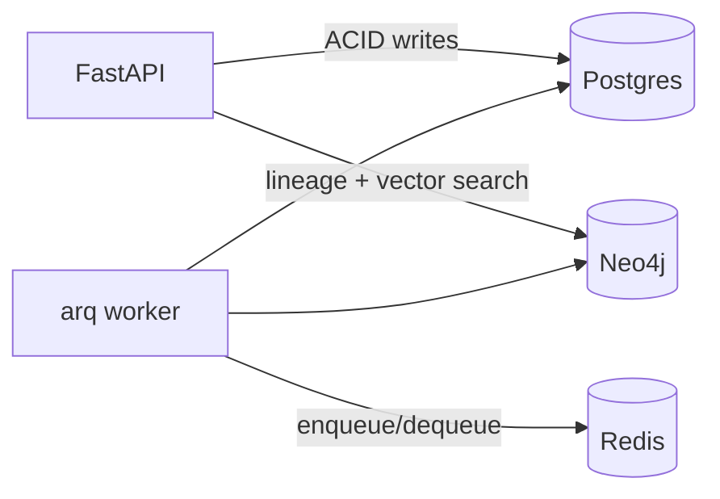

# ADR-002: Neo4j as Agent Memory, Postgres as Transaction Ledger

**Status:** Accepted — partially superseded by [ADR-004](004-phase-0-storage-schema-embedding-contract.md)
**Date:** 2026-07-09

> **Note (2026-07-10):** This ADR describes the template's demo app, which Phase 0
> removed. The store-by-access-pattern split (Postgres transactional · Neo4j graph +
> vector · Redis broker) still holds, but the specifics are superseded: the Postgres
> tables are no longer SQLAlchemy models created via `create_all` (now raw asyncpg +
> idempotent DDL, ADR-004), and the Neo4j graph is the ranking domain (jobs / resumes /
> skills), not the agent-lineage model shown below.

## Context

Agents need two very different kinds of persistence: (a) an auditable, transactional record of tasks, runs, and gate results, and (b) an associative memory answering "what have we built before that resembles this?" plus lineage traversal ("which agent produced which artifact for which task?").

## Decision

Split by access pattern, not by "one database to rule them all":

- **Postgres** — tasks, runs, gate results, audit rows. ACID, queried by the API and Flask dashboard. Tables are created directly from the SQLAlchemy models on startup (`init_schema`); no migration framework yet — add Alembic when a real schema-change history begins to matter.
- **Neo4j** — lineage graph `(:Task)-[:DECOMPOSED_INTO]->(:Subtask)-[:EXECUTED_BY]->(:Agent)`, artifacts with a 768-dim vector index (`nomic-embed-text` via Ollama). Agents query it before implementing.
- **Redis** — arq broker/results only; no domain data.

## Consequences

- Clear ownership: a datum lives in exactly one store
- Vector retrieval gives agents genuine reuse of prior work
- Schema for both stores is created idempotently on startup (`init_schema` for Postgres, `GraphMemory.ensure_schema` for Neo4j) — one bootstrap path, no migration tooling to keep in sync while the schema is still young

## Alternatives Considered

- **pgvector only**: workable for vectors, weak for lineage traversal; rejected
- **Neo4j only**: no strong transactional guarantees for the run ledger; rejected
