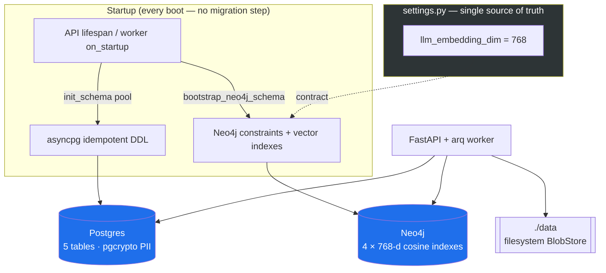

# ADR-004: Phase 0 — Filesystem Storage, asyncpg Startup DDL, the 768-d Embedding Contract

**Status:** Accepted (supersedes ADR-002 on the Postgres persistence mechanism and the graph domain model)
**Date:** 2026-07-10

## Context

Phase 0 seeds the recruiter-assistant on the offline-first agent harness. The template's demo app (`core/src/agents`, `gates`, `memory`, `models/db.py`) was removed and replaced with the ranking-domain foundation ported from an internal HRIS. Four infrastructure decisions were made and need to be recorded so later phases and reviewers can hold the line.

## Decision

### 1. Filesystem BlobStore, not MinIO

Original resume and cover-letter files land on the local filesystem under `./data` (`storage_dir=/data`), behind a thin `BlobStore` (put/get/delete, Phase 1). MinIO — the only object store the source used — is dropped: MinIO Community Edition was archived 2026-04-25 (source-only, no CVE fixes). A local-first single-machine deployment does not need an S3 API; a bind mount is simpler, has one fewer container, and keeps candidate files on the operator's own disk.

### 2. Raw asyncpg + idempotent startup DDL, not SQLAlchemy/Alembic

Postgres access is raw asyncpg with hand-written SQL (porting the source's proven queries). The schema is created by `init_schema`, which executes a tuple of idempotent statements (`CREATE ... IF NOT EXISTS`, enums guarded on `pg_type`) on every API/worker boot. There is no ORM and no migration framework. This keeps the harness's "no migration framework yet" stance, avoids an ORM layer over jsonb-heavy queries, and makes the schema re-runnable rather than versioned while it is still young. `sqlalchemy[asyncio]` was removed from requirements.

### 3. The 768-d embedding contract, enforced from settings

`settings.llm_embedding_dim = 768` is the single source of the dimension. `neo4j_bootstrap` reads that value and builds all four vector indexes from it (`_DIM = get_settings().llm_embedding_dim`), so the Neo4j `vector.dimensions` and the `nomic-embed-text` model can never drift apart. A unit test asserts the index dimension equals the setting. Change the embedding model → change one setting → the indexes follow.

### 4. Three deliberate schema deviations from the source

- **`jobs.blind_review` DEFAULT TRUE** (source: `FALSE`). Blind review is on by default (decision 4); reveal is opt-in and audited.
- **`created_by` / `uploaded_by` are nullable `TEXT`** (source: `UUID` FK → `users(id)`). There is no users/auth table in v1 (CAS was cut; minimal auth arrives in Phase 6), so these are plain nullable actor labels.
- **`score_final` unified to `DOUBLE PRECISION` + `CHECK (score_final BETWEEN 0 AND 1)`** across both `shortlist_entries` and `reverse_match_entries`. The source typed one `NUMERIC(5,4)` and its twin `DOUBLE PRECISION`, so asyncpg returned a `Decimal` from one and a `float` from the other. Unifying removes that footgun. `reverse_match_entries.rank` also gains the `> 0` CHECK its twin already had.

## Architecture Diagram

## Consequences

- One fewer container and no S3 dependency; candidate files stay on the operator's disk. The `BlobStore` interface keeps object storage swappable if a networked deployment ever needs it.
- Idempotent DDL means the schema heals on restart (e.g. the dropped `chunk_id_unique` constraint), but there is no migration history — a future schema change with data already present will need care. Add a migration tool when that day comes.
- The 768-d contract is enforced by a test, not just convention; changing the embedding model is a one-line settings change plus an index rebuild.
- PII columns (`candidate_name` / `candidate_email` / `candidate_phone` / `cover_letter_text`) are `BYTEA` encrypted at rest under `app.pii_key`; losing `PII_KEY` makes them unrecoverable. The invariant "PII never enters an embedding" is enforced from Phase 3 — Phase 0 only lays the columns.

## Alternatives Considered

- **Keep MinIO**: rejected — archived upstream, no CVE fixes, unnecessary for single-machine local-first.
- **SQLAlchemy + Alembic**: rejected for now — an ORM adds friction over the ported jsonb SQL, and versioned migrations are premature while the schema is still forming. Revisit once real production data exists.
- **Hard-code 768 in the Cypher**: rejected — lets the index dimension and the embedding model drift silently; deriving it from settings makes drift a test failure.
- **Match the source schema exactly** (blind default FALSE, UUID FKs, mixed numeric types): rejected — the deviations above fix a real type footgun, reflect decision 4, and drop an auth model v1 does not have.
