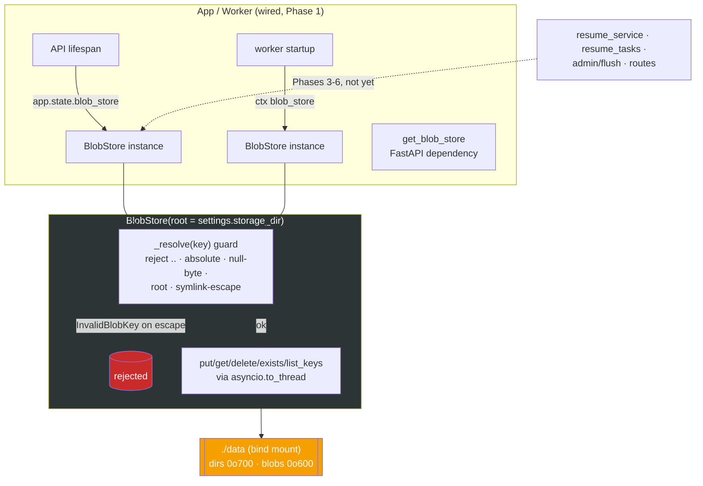

# ADR-005: Phase 1 — Filesystem BlobStore — Interface & Path-Safety

**Status:** Accepted (extends ADR-004 §1, "Filesystem BlobStore, not MinIO")
**Date:** 2026-07-10

## Context

ADR-004 chose a local filesystem blob store over MinIO for original resume and cover-letter files. Phase 1 builds that primitive: a thin `BlobStore` rooted at `settings.storage_dir` (default `/data`, bind-mounted to `./data`) that replaces hris's raw `minio-py` call sites (`put_object` / `get_object` / `remove_object` / `list_objects`). Phase 1 ships the primitive and its app/worker wiring only — no route, service, or task invokes it yet; those call sites are ported in Phases 3–6.

Two properties had to be decided here rather than deferred: (1) the exact async interface later phases code against, and (2) the path-safety posture, since `blob_key` / `cover_letter_blob_key` are unvalidated `TEXT` columns and the root is a bind-mounted host directory — a merge-blocking security criterion carried forward from Phase 0.

## Decision

### 1. Async put/get/delete/exists/list_keys, stdlib-only

`BlobStore(root)` resolves `root` to an absolute realpath once and bootstraps the directory (`mkdir(parents=True, exist_ok=True)`) — bucket-bootstrap parity with MinIO, so callers never create it. The interface is:

| method | signature | behaviour |
|---|---|---|
| `put` | `async def put(key, data, content_type=None) -> None` | write `data`, overwrite if present, create parent dirs under root. `content_type` is accepted for MinIO call-site parity and **ignored** — a filesystem store has no per-file MIME; the key's extension carries it downstream. |
| `get` | `async def get(key) -> bytes` | read bytes; raise `BlobNotFound` if absent. |
| `delete` | `async def delete(key) -> None` | remove; **missing key is success** (idempotent retention — mirrors hris swallowing `NoSuchKey`). |
| `exists` | `async def exists(key) -> bool` | true iff `key` is a regular file under root. |
| `list_keys` | `async def list_keys(prefix="") -> list[str]` | sorted, root-relative, POSIX-separated keys of regular files under `<root>/<prefix>`, recursive. |

The interface is async because the project rule is async everywhere; the filesystem IO is synchronous, so each op runs its blocking work in `asyncio.to_thread` off the event loop (mirroring hris, which ran every blob op via `to_thread`). No new dependency — stdlib `pathlib` / `asyncio` / `os` only, no `aiofiles`. Two module exceptions, `BlobNotFound` and `InvalidBlobKey(ValueError)`, let callers distinguish "no such object" and "bad key" from a disk error. The store is a dumb byte sink: it never parses or extracts text, so nothing here feeds a summary/embedding path (the PII-never-in-embeddings invariant has no surface in this layer).

### 2. Path-safety as the PIPEDA/FIPPA control for blobs-at-rest

Every key-taking method funnels through one private `_resolve(key) -> Path` guard that runs **before any IO** and raises `InvalidBlobKey` on:

- the empty key, or a key containing a null byte (which would otherwise make `Path.resolve()` raise a bare `ValueError`);
- absolute keys — leading `/`, a Windows drive (`C:`), or backslash paths (separators are normalised first so a backslash key is checked as segments, not one literal POSIX filename);
- any `..` path *segment* (a segment check, not a substring check — dots inside a filename are fine);
- a key resolving to the root itself;
- **symlink escape** — the candidate is realpath-resolved and asserted strictly under the realpath'd root (`is_relative_to`), so a parent component symlinked outside the root is rejected.

`list_keys` applies the same realpath filter on the read side: `rglob` follows symlinks, so entries whose realpath is not under root are dropped from the listing — an escaping symlink cannot leak into an enumeration.

Perms posture: store-created directories are `0o700` (each missing level is `mkdir` + `chmod`, deterministic regardless of umask) and blobs are created `0o600` via `os.open(..., O_CREAT, 0o600)` then `chmod` so an overwrite tightens a looser pre-existing file. This is the PIPEDA/FIPPA control for **blobs at rest**: raw resume bytes are the record on disk and must not be world-readable. It contrasts with the Postgres PII posture (ADR-004 §4): candidate PII columns are pgcrypto column-encrypted under `app.pii_key`; blobs are not encrypted, they are permission-gated. Two different at-rest controls for two different stores.

### 3. `list_keys` prefix is directory-scoped, not MinIO substring-prefix

`list_keys(prefix)` lists files under the `<root>/<prefix>` **directory**, not every key whose string starts with `prefix` (MinIO's `list_objects(prefix=…)` is a substring match). This is a semantic difference the Phase 3/4 call-site port must account for when translating hris `flush_service`'s `list_objects(recursive=True)` — a prefix that was a bare string filter in hris must map to a directory boundary here.

## Architecture Diagram

## Consequences

- Every later phase codes against a stable, async, stdlib-only blob interface; swapping to a networked store later means one class, not scattered `minio-py` calls.
- The traversal guard is a real guard, not convention: the ranking-evals gate mutated it off and confirmed the traversal tests go red (guard-mutation test).
- Blobs-at-rest are perm-gated (`0o600`/`0o700`), not encrypted — an operator with root on the host can still read them. That is accepted for a single-machine local-first deployment where the disk is the operator's own; PII *fields* remain pgcrypto-encrypted in Postgres.
- Three guardrails were deliberately deferred to later phases (security noted, non-blocking for a primitive with no call sites):
  1. **Symlink TOCTOU** — `_resolve` realpaths then IO happens in a separate `to_thread` call; a symlink planted between the two could still be followed. Acceptable while the store has no adversarial caller; revisit if untrusted keys ever reach it directly.
  2. **Unbounded blob size** — `put` writes whatever bytes it is handed. The upload size cap belongs to **Phase 3** (resume ingest), at the HTTP boundary.
  3. **Unbounded `list_keys` walk** — `rglob("*")` walks the whole subtree into memory. Pagination lands when the flush/retention call site does (Phase 5), where a large store makes it matter.

## Alternatives Considered

- **`aiofiles` for async IO**: rejected — a new runtime dependency for what `asyncio.to_thread` already gives; hris itself used `to_thread`, so parity favours it.
- **Store `content_type` in a sidecar file**: rejected — the key's extension already carries the MIME downstream (hris recovers it via `key.rsplit('.',1)[-1]`); a sidecar adds a second file to keep consistent for no Phase-1 benefit.
- **Substring-prefix `list_keys` to match MinIO exactly**: rejected — directory-scoping is the natural filesystem semantic and cheaper to walk; the difference is documented (§3) for the call-site port rather than papered over.
- **Encrypt blobs at rest too**: rejected for v1 — key management for file blobs duplicates the pgcrypto key path for marginal gain on a single-operator machine; perms are the proportionate control. Revisit for a multi-tenant or networked deployment.
