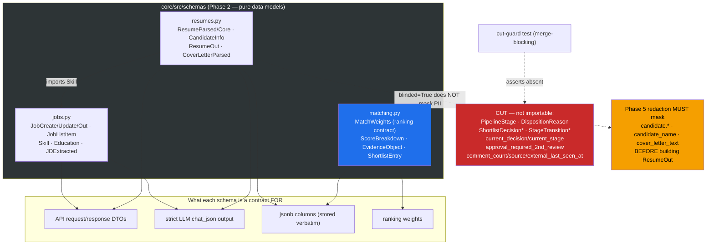

# ADR-006: Phase 2 — Schema Port — Trim & DDL Alignment

**Status:** Accepted (extends ADR-004 §4, "Three deliberate schema deviations from the source")
**Date:** 2026-07-11

## Context

Phase 2 ports the pydantic **v2** schema layer from hris (`packages/schemas/src/schemas/`)
into `core/src/schemas/`. These are the contract types the later phases code against: the
API request/response DTOs, the strict LLM-output schemas fed to `chat_json`, the jsonb shapes
persisted verbatim, and the ranking-weight contract. Phase 2 ships pure data models only —
no I/O, no services, no routes, no DB or LLM calls. Phases 3–6 consume them.

Two things had to be decided at port time rather than deferred: (1) the KEEP/CUT boundary —
the source carries a 2nd-review workflow and JD-Harmonizer/Taleo provenance that recruiter-
assistant does not have; and (2) how the DTO field types align to the Phase 0 DDL (ADR-004),
since the source assumed a users/auth table and columns this project cut. A third property —
the redaction boundary — surfaced in review and is recorded here because the schema layer
*cannot* enforce it and a later phase must.

## Decision

### 1. Three modules, KEEP set only; review workflow + Taleo/JD-comments CUT

`core/src/schemas/` is three modules plus an `__init__` re-export:

| module | contents |
|---|---|
| `jobs.py` | `JobCreate` / `JobUpdate` / `JobTransition` / `JobOut` / `JobDeleteOut` / `JobListItem`, `JDExtractText`, `BulkJobResult`; the LLM-extraction schemas `Skill` / `Education` / `JDExtracted`; the `JobStatus` / `EmploymentType` / `Seniority` / `RemotePolicy` literal aliases. |
| `resumes.py` | resume/cover-letter parse shapes (`ResumeChunk`, `Bullet`, `Experience`, `EducationItem`, `CandidateInfo`, `ResumeSkill`, `CoverLetterParsed`, `ResumeParsed`, `ResumeCore`, `ResumeSkillNames`/`Detail`/`Details`) + the API DTOs (`ResumeUploadResult`, `ResumeListItem`, `ResumeOut`, `ResumeDeleteOut`); the `_coerce_year` helper and the `_drop_invalid_rows` / `_coerce_*` lossy pre-validators. Imports `Skill` from `jobs`. |
| `matching.py` | the ranking contract `MatchWeights` (+ `DEFAULT_WEIGHTS`), `ScoreBreakdown` / `SkillContribution`, `EvidenceObject` / `RequirementEvidence` / `CoverLetterEvidence`, `PipelineMeta`, `ShortlistEntry`, `JobMatchEntry` / `JobMatchResultOut`. |

The **KEEP/CUT boundary** matches the plan's extraction (EXTRACTION_PLAN §"What we keep vs cut"):

- **CUT — 2nd-review workflow** (must NOT be importable): the `PipelineStage`, `TERMINAL_STAGES`,
  `DispositionReason`, `DecisionKind` aliases and the `ShortlistDecisionCreate/Out`,
  `StageTransitionCreate/Out` models are deleted from `matching.py`. `ShortlistEntry` loses its
  `current_decision` and `current_stage` fields — but KEEPS `blinded` / `display_label`, which
  are blind-review (v1 scope), not the review workflow.
- **CUT — Taleo / JD-comments**: `JobListItem` drops `comment_count` (JD comments), `source` and
  `external_last_seen_at` (Taleo ingest provenance) — none of those columns exist in the Phase 0 DDL.
- `approval_required_2nd_review` is dropped from `JobCreate` / `JobUpdate` / `JobOut` — the review
  workflow is cut and the DDL has no such column.

The `__init__` re-exports only the KEEP surface, so `from src.schemas import JobCreate,
ResumeParsed, MatchWeights` works and no CUT name is reachable. A merge-blocking cut-guard test
mirrors Phase 0's cut guards: it asserts `not hasattr(matching, <cut name>)` for every CUT symbol,
that `current_decision`/`current_stage` are not in `ShortlistEntry.model_fields`, that
`approval_required_2nd_review` is not a `JobCreate`/`JobOut` field, and that `JobListItem` has none
of the three Taleo/comment columns — so review creep fails the gate.

### 2. Three DDL-alignment deviations (from ADR-004 §4)

The DTOs are aligned to the Phase 0 DDL, not the hris source, at exactly three points. Each is
commented inline with `DEVIATION`:

- **`JobOut.created_by` and `ResumeOut.uploaded_by`: `UUID` → `str | None`.** The source typed these
  `UUID` FKs into a `users` table. The Phase 0 DDL (no users/auth in v1; CAS cut, minimal auth in
  Phase 6) made them nullable `TEXT` actor labels. The DTOs match — a plain string validates and
  `None` is allowed.
- **`JobCreate.blind_review` default `False` → `True`.** The DDL default is `TRUE` (blind-by-default,
  decision 4). The `JobCreate` schema default is flipped to `True` so the schema default matches the
  DDL / decision-4 default. `JobUpdate.blind_review` stays `bool | None = None` (a PATCH omit means
  "unchanged").
- **`approval_required_2nd_review` dropped** (also a CUT above): the DDL has no such column, so the
  DTO does not carry it.

### 3. `MatchWeights` is the ranking-weight contract; sums-to-1.0 is an invariant

`MatchWeights` (`ConfigDict(frozen=True, extra="forbid")`) encodes the plan's ranking algorithm and
is the single source of the weights. Its defaults are load-bearing and ported exactly:

- top-level combine: `structured=0.6, evidence=0.3, motivation=0.1`;
- structured sub-weights: `skill=0.40, experience=0.25, education=0.10, seniority=0.15, vector=0.10`;
- `must_have_miss_penalty=0.5`, `implied_experience_relief=0.75`, and
  `evidence_verify_fuzz=0.85` — the ≥0.85 anti-fabrication quote threshold the evidence stage
  (Phase 4) will enforce.

The `@model_validator(mode="after") _sums_close_to_one` enforces three invariants: the top trio
sums to 1.0 (±0.01), the sub-five sums to 1.0 (±0.01), and `implied_experience_relief >=
must_have_miss_penalty` (relief must be the softer penalty). These are correctness constraints for
the scorer, not cosmetics: a weight vector that does not sum to 1.0 silently rescales every score.
The ranking-evals gate asserts `DEFAULT_WEIGHTS` matches the algorithm exactly and includes a
mutation test — flipping a default off-sum makes the validator reject, proving the guard is real.
`MatchWeights` is frozen, so weights cannot be mutated after construction (they change only via a
new instance built from settings).

### 4. Redaction-boundary contract — schemas cannot enforce it, Phase 5 must

Security flagged, and this ADR records, that the DTO layer is the **redaction boundary but cannot
enforce redaction**. `ResumeOut` exposes `candidate: CandidateInfo` (name/email/phone/location),
`candidate_name` (on `ResumeListItem`), and `cover_letter_text` — all *decrypted plaintext* — and
carries a `blinded: bool` flag. Nothing in the schema masks those fields when `blinded=True`: a
caller can construct a `ResumeOut(blinded=True, candidate=<real PII>, cover_letter_text=<real
text>)` and pydantic will happily serialize the PII. The schema deliberately does **not** expose the
ciphertext (`blob_key` / `candidate_email` bytea) — that part of the boundary holds — but the
plaintext-masking half is the caller's responsibility.

**Contract for Phase 5:** the redaction step MUST mask `candidate.*`, `candidate_name`, and
`cover_letter_text` (identity + employers/schools/grad-years under blind review) **before** DTO
construction. The schema layer records the boundary; it cannot police it. This is carried into the
Phase 5 acceptance criteria in EXTRACTION_PLAN.

## Architecture Diagram

## Consequences

- Later phases code against a stable, typed contract layer: DTOs, LLM-output schemas, jsonb shapes,
  and the ranking weights are all defined once. The `extra="forbid"` DTOs reject unknown request
  keys; the `extra="ignore"` LLM schemas coerce/drop small-model noise so one bad row never fails a
  whole parse (`_drop_invalid_rows`, `_coerce_year`, `_coerce_names`/`_coerce_rows`).
- The review workflow is provably absent, not just unused — the cut guard makes any re-introduction
  a red gate.
- The three DDL deviations mean the DTOs and the tables agree by construction; the alternative
  (matching the source exactly) would reintroduce the UUID-FK/users assumption and the wrong
  blind-review default.
- `MatchWeights` centralises the ranking algorithm's constants behind a frozen, self-validating
  model; changing a weight is a deliberate, validated act, and the sums-to-1.0 invariant is a test
  failure if broken.
- **Open contract for Phase 5:** the redaction-boundary gap (§4) is a real risk the schema cannot
  close. If Phase 5 builds `ResumeOut` from decrypted rows without masking first, blind review leaks
  PII through a `blinded=True` response. Recorded as a Phase 5 acceptance criterion.
- Two security *low* findings are carried forward (non-blocking for pure schemas): per-field
  `max_length` bounds on the LLM string fields as a belt-and-braces cap (Phase 3), and
  `JobOut.blind_review` defaulting to `False` (fail-open) where a response is built without the flag
  set (Phase 6). Recorded in EXTRACTION_PLAN.

## Alternatives Considered

- **Match the hris schema exactly** (keep review types, UUID FKs, `blind_review` default False):
  rejected — it reintroduces a users/auth model v1 does not have, the wrong blind default, and a
  whole review workflow this project cut. The deviations are deliberate and DDL-driven.
- **Enforce redaction inside the schema** (e.g. a `blinded` model-validator that blanks
  `candidate.*`): rejected — the schema layer has no access to the blind/reveal decision or the
  audit path, and a DTO that silently blanks fields would hide bugs in the redaction service.
  Redaction is a Phase 5 service concern operating *before* DTO construction; the schema records the
  boundary and the cut of the ciphertext fields, and leaves masking to the layer that owns the
  decision.
- **Keep `MatchWeights` sums unvalidated** (trust the defaults): rejected — the weights are also
  built from settings later; an off-sum settings override would silently rescale every candidate's
  score. The validator makes that a construction-time failure instead of a silent ranking bug.
