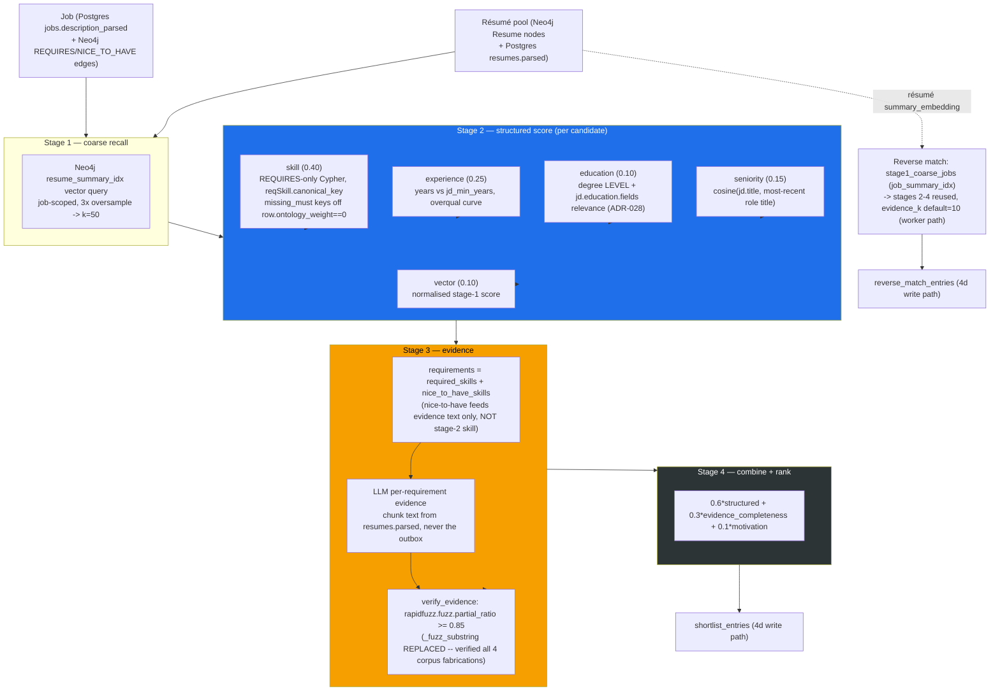

# ADR-009: Matching Engine Port — Stages, Orchestrator, and the 4b→4c Blocker Closures

**Status:** Accepted (closes the "4b → 4c BLOCKERS" section of `docs/EXTRACTION_PLAN.md`; aligns with
ADR-008's `canonical_key` rename; extends ADR-006 §4's redaction boundary and ADR-007's PII-at-rest
posture — the matching engine is the first Phase-4c code to read `resumes.parsed` chunk text and
Neo4j `Skill` nodes together)
**Date:** 2026-07-15

## Context

Phase 4c ports the 4-stage matching engine from hris (`packages/pipeline/src/pipeline/matching/
{stages,orchestrator}.py`) into `core/src/pipeline/matching/{stages,orchestrator}.py`, wires
`MatchWeights` through `src/settings.py::weights_from_settings`, and — for the first time — makes
`core/tests/evals/run_evals.py` a real, live gate: it runs the 4a/4b corpus through the actual
orchestrator instead of exiting 1 as a scaffold. Phases 4a and 4b each recorded, in advance, specific
places where a naive verbatim port of hris's code would either silently mis-score or fail loud against
this repo's schema. This ADR records what the port did instead of the naive copy, and what it
deliberately left alone.

Four items were flagged, in order, as blocking this PR by the corpus's own hardening history
(`docs/EXTRACTION_PLAN.md`, "4b → 4c BLOCKERS") plus two further items surfaced during the port itself
(reviewer finding on `git_sha`; the NICE_TO_HAVE behaviour, carried forward as a "port verbatim, record
don't fix" item). Each is a separate decision below.

## Decision

### 1. `_fuzz_substring` is REPLACED, not ported — `rapidfuzz.fuzz.partial_ratio` at `evidence_verify_fuzz = 0.85`

hris's evidence verifier (`_fuzz_substring`) is a character-**set** overlap ratio, not a sequence
metric — Phase 4a's hardening branch measured it verifying all four of the corpus's fabricated
`negative_evidence` quotes (0.928 / 0.943 / 0.988 / 0.935, every one ≥ the 0.85 bar). `stages.py`'s
`verify_evidence` uses `rapidfuzz.fuzz.partial_ratio` instead (`_fuzz_ratio`), and the choice was
re-measured against the full corpus during this port, not just the 4a sample:

- `partial_ratio` **rejects** all four fabricated corpus quotes, scoring **0.41–0.46** — clear of the
  0.85 bar — and **survives** all four `gold_evidence` anchors at **1.000**.
- `fuzz.WRatio` scores r02's fabricated `c_002` quote at **0.855** — it would leak past the 0.85 bar.
  (`token_set_ratio` is also safe and was considered equivalent; `partial_ratio` was chosen as the
  metric whose semantics — "is `needle` a span of `haystack`" — most directly match "is this quote a
  substring of its cited chunk".)
- `fuzz.ratio` scores the corpus's own **gold** anchors at **0.648** (Python) / **0.796** (PostgreSQL) —
  below 0.85. An engine implementing plain `ratio` can never reach `verification_rate_min = 1.0`; it
  would reject valid evidence.
- `partial_token_set_ratio` (considered, not used) returns **1.000** on 2 of the corpus's 4 negative
  anchors — also unsafe.

This closes the single most important finding carried out of Phase 4a.

### 2. `missing_must` keys off `reason == "missing"` (row `ontology_weight == 0`), never `score == 0.0`

This is 4b→4c blocker #1. `score_skill_breakdown`'s must-have-miss detection must identify rows the
candidate **genuinely does not hold** — no exact match, no ontology/family credit. hris's own
`score == 0.0` check conflates two different things once `categories.yaml`'s family credit exists
(4b, not present through 4a):

- A **family-credited** miss (`ontology_weight=0.5`, e.g. present-but-zero-tenure) can score `0.0` on
  the numeric axis (years=0 zeroes `years_score * recency * ontology_weight`) while the candidate
  genuinely holds a related skill — not a miss.
- A **genuine** miss's *built* `SkillContribution` defaults `ontology_weight=None` (it's set only on
  the branch that computes a real score), so `contribution.ontology_weight == 0` is **also** wrong —
  `None == 0` is `False` in Python, so a check against the *built object's* field silently never fires
  for the exact case it exists to catch.

The fix keys off the **row's** `ontology_weight == 0` (computed once, before the contribution object is
built) and stamps `reason="missing"` on the contribution at that point; `missing_must` then filters on
`reason == "missing"`, never on the contribution's numeric `score`.

**Why this is verified single-candidate on r18, not by any pairwise rank/gap check.** The pairwise
ordering-control mechanism (`min_score_gap`, rank comparison) that gates every other ordering pair in
the 4a/4b corpus is **provably unable to gate this one**. The algebra: `score_skill_breakdown` forces a
genuinely-missing row's per-row score to exactly `0.0`, independent of the penalty multiplier — so for
r18 (4 of 5 required skills present, 1 genuinely missing: `REST API design`, which carries no ontology
family so its absence is unambiguous), the **pre-penalty** mean is `0.8` regardless of the penalty's
value. The penalty only multiplies that mean once, afterward:

- `must_have_miss_penalty = 0.5` (shipped default): r18 scores `0.8 × 0.5 = 0.40`. Gap vs its twin r01
  (`1.00`, no miss): `0.60` skill units → `0.144` `score_final` units (`0.6 × 0.40 × 0.60`).
- `must_have_miss_penalty = 1.0` (the mutation that deletes the penalty): r18 scores
  `0.8 × 1.0 = 0.80`. Gap vs r01: `0.20` skill units → `0.048` `score_final` units
  (`0.6 × 0.40 × 0.20`).

Un-wiring the penalty **raises** r18's own score (0.40 → 0.80); the pair's gap merely **shrinks**
(0.144 → 0.048, a ~3× reduction) and stays strictly positive — it can never reverse or reach zero,
because the genuinely-missing row is *arithmetically forced* to contribute `0.0` to the pre-penalty
mean no matter what the penalty is. A rank-and-gap ordering check therefore cannot distinguish "penalty
wired correctly" from "penalty deleted entirely" for this pair, by construction — not by a gap in the
fixture's design. The verification instead is a **single-candidate, before/after numeric check on r18
alone**: `score_final(r18, must_have_miss_penalty=0.5)` must be measurably lower than
`score_final(r18, must_have_miss_penalty=1.0)`, by approximately `0.048`. This is a **review
obligation**, not a mechanical gate — `run_evals.py::_assert_must_have_penalty_fires_on_r18` runs it
directly against the live orchestrator (`RankInput`/`run_match`) as part of the corpus's exit-0 run,
in the same spirit as Phase 4a round 7's M-3 obligations for the three blind-engine mutations.

### 3. `canonical_name` → `canonical_key` Cypher rename (blocker #4, ADR-008 alignment)

`_stage2_skill_rows`' Cypher reads `reqSkill.canonical_key`, matching ADR-008's Phase-4b rename of the
`Skill` node's unique key. hris's `_stage2_skill_rows` reads `reqSkill.canonical_name` — a property
that has never existed on a `Skill` node in this repo (Phase 3 onward; ADR-008 §1). A verbatim port
would return `skill=None` on every row against a real Neo4j, which fails loud
(`SkillContribution.skill: str` ← `None` → pydantic `ValidationError`) rather than silently mis-scoring
— but it would cost a debugging session on day one of the port if not caught. Verified against a real
Neo4j: `test_stage2_skill_rows_reads_canonical_key_not_canonical_name`.

### 4. NICE_TO_HAVE skills feed stage-3 evidence text but NOT the stage-2 structured skill sub-score — ported verbatim, RECORDED not "fixed"

This is 4b→4c blocker #5. `_stage2_skill_rows`' Cypher matches only `(j:Job)-[:REQUIRES]->(Skill)` —
`NICE_TO_HAVE` edges never feed `score_skill_breakdown`. `_stage3_per_candidate` builds its evidence
`requirements` list as `required_skills + nice_to_have_skills`, so a nice-to-have skill can earn
evidence-completeness credit (stage 3 / the 0.3-weighted evidence sub-score) but contributes nothing
to the 0.40-weighted structured skill sub-score. This is hris's shipped behaviour, ported verbatim —
recorded here as a decision, not silently inherited and not "fixed" as an unrequested improvement (a
scope discipline: extending nice-to-have's reach into stage 2 is new behaviour, not a port).

### 5. `match_reverse_evidence_k` default = 10 (worker path; blocker #10)

recruiter-assistant has no synchronous reverse-match endpoint — reverse match runs only on the async
`reverse_match_job` worker path (4d), so there is no proxied request to protect from per-role LLM
fan-out. `settings.match_reverse_evidence_k` therefore inherits hris's **current**, worker-path default
(`10`, hris ADR 0023), not hris's now-superseded synchronous-endpoint default of `0`. `orchestrator.py`'s
`match_resume_to_jobs` ranks purely on structured fit (`_STRUCTURED_ONLY_WEIGHTS`) only when a caller
explicitly passes `evidence_k=0`; the default argument and the `Settings` default agree at `10`.

### 6. `git_sha` routed through `Settings` (reviewer finding) + an AST meta-test against scattered `os.environ`

The first cut of `orchestrator.py` read `os.environ.get("GIT_SHA")` directly at two call sites
(`_shortlist_meta`, `match_resume_to_jobs::_meta`) to populate `PipelineMeta.git_sha` — a direct
violation of CLAUDE.md's "config only via `src/settings.py`" rule, caught by reviewer. Fixed:
`settings.git_sha: str | None = None` (mapped from the `GIT_SHA` env var, `None` when unset — behaviour
-identical to the prior `os.environ.get` default), threaded through `MatchingContext.git_sha` and read
by both `_shortlist_meta` and `match_resume_to_jobs`'s `_meta` closure. The fix is now enforced by a
gate, not review alone: `core/tests/unit/test_no_scattered_os_environ.py` walks every `.py` module
under `src/` via `ast` (not text grep, so it doesn't false-positive on the docstring/comment in
`orchestrator.py` that documents this very finding) and fails if any module other than `settings.py`
reads `os.environ`/`os.getenv`, in any import shape (`import os`, `import os as _os`,
`from os import environ`, `from os import getenv`).

### 7. `jd.education.fields` — RESOLVED (2026-08-01): extended, see ADR-028

**`score_education` ignores `jd.education.fields` entirely** — it compares only the candidate's best
degree **level** against `jd.education.min_level`; the JD's `education.fields` list (e.g.
`["Computer Science", "Software Engineering", "Data Engineering"]`) is read nowhere in the scorer.
Field-relevance is decorative in the shipped contract today. Flagged since Phase 4a (round 5) and left
open at port time — this port did not resolve it, because extending the scorer is new behaviour, not a
port, and needed its own tests/ADR. Two options were on the table for a human to pick between:

1. **Extend `score_education`** to read `fields` (e.g. a non-allowed field earns only
   `education_partial` even at a sufficient level).
2. **Drop `fields`** from the JD contract as unused.

The corpus's r14/r11 education ordering pair was deliberately built to survive either resolution (both
twins' fields are JD-allowed, so the pair turns on level alone) — this was not blocking, but was not to
be read as tacit acceptance of option 2.

**Decision (2026-08-01): option 1, extend.** `score_education` now reads `jd.education.fields`: a
candidate who meets the level bar but whose qualifying degree is in a non-allowed field is capped at
`education_partial` instead of `1.0`, via a fuzzy field-name match (`rapidfuzz.fuzz.token_set_ratio`,
new `MatchWeights.education_field_fuzz` knob). Full algorithm, the unknown-field-penalizes decision and
its counter-risk, and the corpus impact: [ADR-028](028-education-field-relevance.md).

## Accepted Residuals

- **Eval-harness `Any` typing** (`run_evals.py`'s `_breakdown_for`/`_extract_evidence` helpers use
  loosely-typed dict/`Any` shapes to bridge fixture JSON into the pipeline's typed structs). Reviewer
  nit, non-blocking — the harness is test infrastructure, not `src/`, and `mypy --strict` is scoped to
  `src` only.
- **Tunable-default duplication.** The same tuning constants exist in three places right now:
  `orchestrator.py`'s module-level literals (`_FAMILY_MATCH_WEIGHT`, `_LLM_CONCURRENCY`,
  `_EVIDENCE_MAX_TOKENS`, `_REVERSE_EVIDENCE_K`, `_COARSE_K`, `_EVIDENCE_K`), `MatchingContext`'s
  dataclass field defaults (which mirror those literals so unit tests can construct a context without
  wiring `Settings`), and `Settings.match_*`. They agree today by construction (`test_settings_matching
  .py` pins every one), but nothing yet **populates** `MatchingContext`/`weights` from `Settings` in the
  actual worker path — that wiring is a stated **4d requirement**, not a 4c gap: 4c proves the settings
  bridge (`weights_from_settings`) is correct in isolation; 4d must be the one call site that actually
  uses it when constructing the real `MatchingContext` for `shortlist_job`/`reverse_match_job`.
- **An LLM failure in stage 3 becomes a silent ranking penalty.** `orchestrator.py:506-512` catches `LLMOutputInvalidError` and returns `None`, so the candidate keeps their structured score but scores 0.0 on the 0.3-weighted evidence and 0.1-weighted motivation components — 40% of the composite — behind only a `log.warning`. The resulting number is indistinguishable from a genuinely weak candidate. Deferred to FU-7 / ADR-021.
- **Reverse-match scores are not comparable to forward-match scores.** `rank_job_matches` (lines 797-801) omits the motivation term, so reverse `score_final` maxes at 0.9 under default weights while forward maxes at 1.0. Nothing in the API, the export, or the UI signals this. Accepted for now; must be documented wherever both numbers can appear to the same reader.
- **Two ranking numbers are not reachable from settings** — `_STRUCTURED_ONLY_WEIGHTS` (line 220) and the stage-1 3x oversample factor (line 279: `oversample=k * 3`) are in-code literals while all 26 `MatchWeights` values and both k values are env-configurable. Minor inconsistency; low priority.
- **Reverse match has no separate coarse-k** — it reuses `match_coarse_k`; there is no `match_reverse_coarse_k`. Minor.

## Architecture Diagram

## Consequences

- `run_evals.py` is a live gate from this PR forward: `main()` exits 0 only when the real orchestrator
  clears every `thresholds.toml` obligation against the 4a/4b corpus — precision@k, evidence
  verification + gold recall, the adversarial backstop, all ordering-control pairs (education, overqual,
  motivation, skill_missing_must, recency), the r18 single-candidate penalty check, the PII leak-check,
  and determinism. A regression in the engine now fails a gate instead of only a docs cross-reference.
- The must-have-miss fix (#2) and the canonical-key rename (#3) are both scoring-correctness fixes that
  only exist because 4b ran the 4a corpus through a **real** Neo4j; neither would have been found by
  reasoning about the algorithm in the abstract.
- The evidence-verifier metric choice (#1) is now pinned by fixture-measured numbers, not by
  documentation claims about hris's behaviour — re-verify against real `rapidfuzz` if `stages.py`'s
  `_fuzz_ratio` is ever changed to a different rapidfuzz function.
- 4d inherits two explicit obligations from this ADR: wire `MatchingContext`/`weights` from `Settings`
  at the real worker call sites (not the in-code defaults), and carry the `jd.education.fields` decision
  to a human before extending or trimming the JD contract.

## Alternatives Considered

- **Port `_fuzz_substring` verbatim** ("faithful to hris") — rejected. Measured to verify all four
  corpus fabrications; a fabrication verifier that verifies fabrications defeats the entire point of
  stage 3's anti-fabrication design.
- **Key `missing_must` off `SkillContribution.score == 0.0`** (hris's shipped check) — rejected;
  proven wrong by the r18 algebra above (`None == 0` is `False` for a genuine miss's default
  `ontology_weight`, and a family-credited-but-zero-tenure row can hit `score == 0.0` without being a
  miss at all).
- **Extend `score_education` to read `jd.education.fields` now, as part of this port** — rejected;
  it is new behaviour, not a port, and would smuggle an unreviewed scoring change into a PR whose job is
  to port existing behaviour faithfully (with two named, deliberate exceptions). Left as an explicit
  open decision for a human instead.
- **Default `match_reverse_evidence_k = 0`** (hris's pre-ADR-0023 synchronous-endpoint value) —
  rejected; there is no synchronous reverse-match endpoint in this repo to protect, so the rationale for
  `0` does not apply, and `10` (hris's own current worker-path default) is the correct inheritance.
