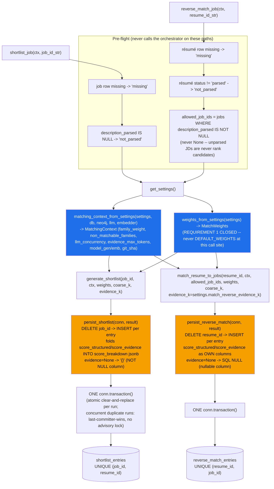

# ADR-010: Shortlist + Reverse-Match Write Path — Persistence Asymmetry, Settings Wiring Closure, and the PII-at-Rest Residual

**Status:** Accepted (closes ADR-009's carried "Requirement 1" obligation — wiring `MatchingContext`/
`MatchWeights` from `Settings` at a real worker call site; extends ADR-007 §6/§7's PII-at-rest boundary
to the shortlist/reverse-match tables; the matching engine itself, `stages.py`/`orchestrator.py`'s scoring
surface, is untouched — this ADR is about persistence, not ranking)
**Date:** 2026-07-16

## Context

Phase 4d ships the write path for the 4c matching engine: two arq tasks (`shortlist_job` /
`reverse_match_job`, `core/src/worker/matching_tasks.py`) that call the orchestrator
(`generate_shortlist` / `match_resume_to_jobs`) and persist the result via two new functions
(`persist_shortlist` / `persist_reverse_match`, `core/src/services/shortlist_service.py`) — raw asyncpg,
no SQLAlchemy, matching the pattern already established by `job_service.py` / `resume_service.py` /
`outbox_service.py`. Per the plan-of-record, 4d is the write path only: `list_for_job` / `get_one` /
`export_rows` and display redaction are deliberately out of scope, staying Phase 5.

Two things ADR-009 explicitly carried forward as Phase-4d obligations, not closed in 4c, are closed here
(§3 below): wiring `MatchingContext`/`MatchWeights` from `Settings` at a real construction site (4c only
proved the settings bridge — `weights_from_settings` — correct in isolation), and the still-open
`jd.education.fields` human decision (NOT resolved here either — see §5).

Built TDD: RED `24419b0` (failing unit + integration tests for the write path — `ModuleNotFoundError`
against `src.services.shortlist_service` and `src.worker.matching_tasks`, which did not exist) → GREEN
`6c2bf43` (the implementation). All three merge-blocking gates green on the GREEN commit: reviewer
APPROVE, security PASS, ranking-evals PASS. **4d is gate-green and pre-PR** — CI (`gates-all`, including a
live `run_evals.py` re-measurement against Ollama) has not yet run; do not read this ADR as recording a
merged state.

## Decision

### 1. DELETE-then-INSERT per run — the idempotency mechanism, and what it's keyed on

Both `persist_shortlist(conn, result)` and `persist_reverse_match(conn, result)` are DELETE-first: they
unconditionally delete any prior run's rows for the same key *before* inserting the new result — even
when the new result is empty (a rerun that now yields zero candidates must still clear a stale prior
shortlist, not leave it stranded).

- `persist_shortlist`: `DELETE FROM shortlist_entries WHERE job_id = $1`, then one `INSERT` per ranked
  entry. The re-insert satisfies the DDL's `UNIQUE (job_id, resume_id)` constraint on
  `shortlist_entries` (`core/src/models/ddl.py`) — a persist that inserted without deleting first would
  raise `asyncpg.exceptions.UniqueViolationError` on the second run against the same
  `(job_id, resume_id)` pair, not merely "leave stale rows behind." Proven against a real Postgres,
  not just a mocked connection: `test_persist_shortlist_rerun_replaces_prior_run` and
  `test_persist_shortlist_rerun_same_resume_new_rank_ok`
  (`core/tests/integration/test_shortlist_persistence_pg.py`).
- `persist_reverse_match`: `DELETE FROM reverse_match_entries WHERE resume_id = $1`, then one `INSERT`
  per entry, satisfying the named unique index `reverse_match_entries_resume_job_idx ON
  reverse_match_entries (resume_id, job_id)`. Proven the same way:
  `test_persist_reverse_match_rerun_replaces_prior_run`.

Both persist functions take an **open connection** and leave transaction scoping to the caller — the
worker wraps the DELETE + every INSERT of one run in a single `conn.transaction()`
(`shortlist_job`/`reverse_match_job`), so a rerun's clear-and-replace commits atomically: a crash
mid-write can never leave a job/résumé with a half-old, half-new shortlist visible to a reader.

**Concurrency acceptance — no advisory lock.** Nothing serializes two concurrent enqueues of
`shortlist_job` for the same `job_id` (e.g. a duplicate enqueue from a retry or a double-click on a
"regenerate" action once Phase 6 has a route). Each run's `DELETE` + `INSERT`s run inside its own
transaction, so the result is **last-committer-wins** — whichever run's transaction commits last is
what a reader sees, and the other run's rows are gone even though its own I/O (the LLM calls, the Neo4j
queries) were not wasted from Postgres's point of view — only its persisted result is discarded. This is
accepted for v1: a lost duplicate ranking run is wasted compute, not a correctness hazard (no partial
writes are ever visible — the transaction boundary prevents that), and nothing in the current worker
surface enqueues duplicates by design (Phase 6 hasn't shipped a route yet). Revisit with a Postgres
advisory lock (`pg_advisory_xact_lock(hashtext(job_id::text))`) keyed per job/résumé if a future phase
adds a user-facing "regenerate" action that can plausibly be double-clicked.

### 2. The mirror-image asymmetry — dictated by the DDL, not arbitrary

`persist_shortlist` and `persist_reverse_match` handle the *same shaped* `ScoreBreakdown` +
`EvidenceObject | None` pair from the orchestrator in **opposite** ways, because the two tables' column
shapes differ (`core/src/models/ddl.py`):

| | `shortlist_entries` | `reverse_match_entries` |
|---|---|---|
| dedicated `score_structured`/`score_evidence` columns | **No** | **Yes** |
| `evidence` column nullability | `JSONB NOT NULL` | `JSONB` (nullable) |
| where `score_structured`/`score_evidence` land | folded into `score_breakdown` jsonb | own SQL args, kept out of `score_breakdown` |
| `entry.evidence is None` on the wire | coerced to the JSON literal `{}` | passed through as SQL `NULL` |

`persist_shortlist` therefore **folds** `score_structured`/`score_evidence` into the `score_breakdown`
jsonb dict before serializing it (`breakdown["score_structured"] = entry.score_structured`, etc.) —
dropping them would be silent data loss, since the table has nowhere else to put them — and coerces a
missing evidence object to `"{}"` rather than `None`, because the column is `NOT NULL`.
`persist_reverse_match` does neither: it writes `score_structured`/`score_evidence` as their own
positional SQL args (kept OUT of the breakdown jsonb, so the same numbers are never duplicated in two
places on that table), and passes `entry.evidence.model_dump()` or Python `None` straight through — the
nullable column accepts real SQL `NULL`.

**Residual: shortlist's `{}` is a minor, accepted information-loss at the raw-SQL level.** Because
`shortlist_entries.evidence` is `NOT NULL`, the raw column value for "stage 3 never ran (e.g. no
required skills, or the résumé had no chunks)" and "stage 3 ran and produced a genuinely empty
`EvidenceObject`" are **both** `{}` — a reader querying the column directly (not through the ORM/pydantic
layer, which never had this ambiguity because `ShortlistResultEntry.evidence: EvidenceObject | None`
still round-trips correctly at the Python level) cannot tell the two apart from the jsonb alone. This is
accepted for v1 — it is a display/read-layer nuance, not a correctness bug (nothing currently reads the
raw column outside the ORM path), and it is Phase 5's problem to flag if `list_for_job`/`get_one`'s SQL
ever needs to distinguish "not scored" from "scored empty" directly in a query rather than in application
code. `reverse_match_entries` does not have this ambiguity — its nullable column preserves the
distinction natively.

Proven at the unit level with a mocked connection (`test_services_shortlist_persist.py`, both persist
functions asserted against the *same* fixture entries so the asymmetry is the only variable) and at the
integration level against a real Postgres, where the `NOT NULL` constraint on `shortlist_entries.evidence`
is the thing actually being satisfied
(`test_persist_shortlist_none_evidence_satisfies_not_null_constraint`).

### 3. Requirement 1 CLOSED — `MatchingContext`/`MatchWeights` now built from `Settings` at the real worker call sites

ADR-009 §"Accepted Residuals" (the "Tunable-default duplication" item) and its "Consequences" section
both stated plainly that 4c only proved `weights_from_settings` correct **in isolation** — nothing in the
repo called it at a real `MatchingContext`/`MatchWeights` construction site. That gap is closed here:

- `matching_context_from_settings(settings, *, db, neo4j, llm, embedder) -> MatchingContext`
  (new, `src/pipeline/matching/orchestrator.py`) is the **single** call site that populates
  `family_weight` / `non_matchable_families` (via the also-new
  `non_matchable_families_from_settings(settings)`) / `llm_concurrency` / `evidence_max_tokens` /
  `model_gen` / `model_emb` / `git_sha` from a `Settings` instance, rather than `MatchingContext`'s own
  dataclass-field defaults (which mirror `orchestrator.py`'s module-level literals
  `_FAMILY_MATCH_WEIGHT=0.5`, `_NON_MATCHABLE_FAMILIES=("other","domain")`, `_LLM_CONCURRENCY=4`,
  `_EVIDENCE_MAX_TOKENS=2048` — the exact literals those dataclass defaults exist to let unit tests build
  a `MatchingContext` without wiring `Settings`).
- `shortlist_job`/`reverse_match_job` (`src/worker/matching_tasks.py`) call
  `matching_context_from_settings(get_settings(), ...)` and pass
  `weights=weights_from_settings(get_settings())` into `generate_shortlist`/`match_resume_to_jobs` — never
  the orchestrator's `DEFAULT_WEIGHTS` fallback default argument. `reverse_match_job` additionally sources
  `evidence_k=settings.match_reverse_evidence_k` rather than the orchestrator's `_REVERSE_EVIDENCE_K`
  module literal (which happens to equal 10 today by construction — ADR-009 §5 — so the two cannot be
  told apart except by a non-default override).

**The load-bearing test class — the one bug that live evals cannot catch.** A `shortlist_job` that
silently fell back to `DEFAULT_WEIGHTS` instead of `weights_from_settings(settings)` would be invisible
to `run_evals.py` under an **unconfigured** `Settings`, because `Settings`' `match_*` defaults are pinned
(`test_settings_matching.py`, ADR-009) to equal `MatchWeights`' own defaults — `weights_from_settings(
Settings()) == DEFAULT_WEIGHTS` **by construction**. Only a non-default `.env`/`Settings` override would
expose the fallback, and the eval corpus deliberately never runs against a non-default configuration. This
is why `test_matching_context_settings_wiring.py` builds every test around **non-default** `Settings`
values chosen specifically to differ from the orchestrator's literal fallbacks
(`test_matching_context_from_settings_populates_tunables`,
`test_shortlist_job_passes_weights_from_settings_not_default_weights`,
`test_reverse_match_job_uses_match_reverse_evidence_k_from_settings`) — plus one test that pins the
*default*-`Settings` path also flows through the factory rather than coincidentally matching it for a
different reason (`test_matching_context_from_settings_default_settings_still_wires_through`). This class
of bug — "the wiring silently no-ops and nobody notices because the defaults happen to agree" — is exactly
the shape CLAUDE.md's "config only via `src/settings.py`" rule and the Phase 4c `git_sha` reviewer finding
(ADR-009 §6) both exist to prevent, and it cannot be caught by `run_evals.py` (which only ever exercises
`Settings()` defaults) — only by a settings-wiring unit test asserting non-default propagation.
`settings.git_sha` is threaded through the same factory end-to-end into the real orchestrator's
`PipelineMeta.git_sha` (`test_git_sha_from_settings_lands_in_shortlist_pipeline_meta`), and the same
propagation is proven again against a real Postgres round trip
(`test_shortlist_job_end_to_end_persists_pipeline_meta_weights_from_settings`,
`test_reverse_match_job_e2e_persists_pipeline_meta_weights`).

### 4. `reverse_match_job`'s `allowed_job_ids` filter — parsed jobs, not `status = 'open'`

`reverse_match_job` scopes the candidate jobs it ranks a résumé against to
`SELECT id FROM jobs WHERE description_parsed IS NOT NULL` and passes that set explicitly as
`allowed_job_ids` to `match_resume_to_jobs` — **never `None`** (which means "no filter" to the
orchestrator). Ranking a résumé against a job with `description_parsed IS NULL` would have no
`required_skills`/`nice_to_have_skills` to score against — an unparsed JD is not a candidate job to
rank, full stop, independent of any lifecycle state.

**Why `description_parsed IS NOT NULL`, not `status = 'open'`.** The `jobs.status` column
(`job_status`, ADR-004) exists in the DDL, but nothing in the codebase through Phase 4d ever transitions
it — there is no route, task, or trigger that sets a job to `'open'`, `'closed'`, or any other value
after creation. Filtering on `status = 'open'` today would filter every job in the database to zero
candidates (or, depending on the column's default, would silently rank against jobs the operator
considers closed) — either way, gating on a status dimension the schema carries but the product does not
yet populate would be a filter that looks intentional but is actually inert or wrong. `description_parsed
IS NOT NULL` is the one predicate that is both meaningful today (a job either has been parsed by
`parse_job` or it hasn't) and does not silently depend on a lifecycle feature Phase 6's routes haven't
built yet. Revisit this filter when a Phase-6 route starts transitioning `jobs.status` — `status = 'open'`
may then be the *additional* filter reverse-match wants (an unparsed job is still never a candidate; an
explicitly-closed-but-parsed job might reasonably be excluded too).

### 5. `score_education` / `jd.education.fields` — STILL OPEN, carried forward again

ADR-009 §7 flagged, and this port does not resolve, that `score_education` reads only the candidate's
degree **level** against `jd.education.min_level` — `jd.education.fields` is read nowhere in the scorer,
so JD field-relevance stays decorative. 4d touches none of `stages.py`/`orchestrator.py`'s scoring code
(the diff is entirely new modules — `matching_context_from_settings`, `shortlist_service.py`,
`matching_tasks.py` — `stages.py` is byte-unchanged), so this decision is untouched, not newly relevant,
and is recorded here again only so it is not lost between ADRs. **A human still needs to pick**: extend
`score_education` to read `fields`, or drop `fields` from the JD contract as unused.

### 6. PII-at-rest — evidence quotes ride verbatim into `shortlist_entries`/`reverse_match_entries` (security-flagged, recorded here)

Both persist functions write the stage-3 `EvidenceObject`'s per-requirement quotes into the `evidence`
jsonb column **exactly as extracted** — no new redaction, scrubbing, or masking is introduced anywhere in
the 4d write path (`test_shortlist_pii_framing.py` pins this as a *deliberate* decision, not an oversight:
`test_persist_shortlist_writes_resume_chunk_evidence_quote_verbatim`,
`test_persist_shortlist_writes_cover_letter_evidence_quote_verbatim`, and — the sharpest of the three —
`test_persist_shortlist_does_not_redact_a_pii_shaped_evidence_string`, which feeds a quote containing an
embedded email address and asserts it lands in the column byte-for-byte unchanged).

This is a **symmetric extension**, not a new risk class, of the posture ADR-007 §6/§7 already accepted for
`resumes.parsed`: those quotes are themselves derivative of `resumes.parsed` chunk text (ADR-009's
blocker #7 — stage 3 reads chunk text from `resumes.parsed`, never the outbox), the destination tables
sit behind the exact same Postgres instance and DB-access boundary as `resumes.parsed` and the encrypted
`candidate_*` columns, and — critically — the evidence jsonb never rides the outbox and is never
embedded (it is LLM-*output*, consumed by nothing downstream that vector-indexes it). So this does not
open a new PII-in-embeddings path (the invariant ADR-007/ADR-008 both protect) — it is cleartext-at-rest
behind an already-accepted boundary, one hop further from the source. **Accepted for v1, revisit before
any multi-tenant deployment** (per ADR-007 §7's own framing) — cross-reference ADR-007 §6/§7 rather than
re-litigating the boundary here. Any future redaction of shortlist/reverse-match evidence is explicitly
Phase 5's job, is display-only (masking at read/export time, matching the ADR-006 §4 contract for
`ResumeOut`/`ResumeListItem`), and — per `test_shortlist_pii_framing.py`'s own stated purpose — must not
be introduced as a silent change to this write path; it needs its own tests and its own ADR entry.

## Architecture Diagram

## Consequences

- ADR-009's "Requirement 1" (wire `MatchingContext`/`MatchWeights` from `Settings` at a real call site) is
  closed: `matching_context_from_settings` + `weights_from_settings` are now called from
  `shortlist_job`/`reverse_match_job`, proven by tests built specifically to fail if the wiring silently
  falls back to in-code defaults — a bug class `run_evals.py` structurally cannot catch, because its
  corpus only ever runs against `Settings()` defaults, which equal `MatchWeights`' own defaults by
  construction.
- The shortlist/reverse-match persistence asymmetry (§2) is dictated by the DDL, not by inconsistent
  code — but it does leave a minor, accepted read-layer ambiguity on the shortlist side (`{}` conflates
  "never evidence-scored" with "scored, found nothing") that Phase 5's read/list/get/export layer should
  be aware of, since it is the first code to query these columns outside the write path.
- The PII-at-rest extension (§6) is a symmetric, not novel, application of ADR-007's already-accepted
  boundary — but it is recorded explicitly here (not only in a test docstring) so a future security review
  of `shortlist_entries`/`reverse_match_entries` does not have to rediscover the reasoning from test code.
- No advisory lock exists for concurrent duplicate shortlist/reverse-match runs (§1) — accepted because
  nothing in the current worker surface enqueues duplicates by design; this should be revisited once
  Phase 6 ships a user-facing "regenerate" route that can be double-clicked or retried.
- `jd.education.fields` (ADR-009 §7) is untouched and still needs a human decision before any future PR
  extends or trims the JD contract's education scoring.

## Alternatives Considered

- **UPSERT (`ON CONFLICT ... DO UPDATE`) instead of DELETE-then-INSERT** — rejected for this phase. A
  rerun that ranks *fewer* résumés/jobs than the prior run (e.g. a résumé was deleted, or a job's
  candidate pool shrank) would leave orphaned rows from the prior run under an UPSERT-only strategy;
  DELETE-first guarantees the table always reflects exactly the latest run's membership, not a superset.
  UPSERT would need an additional `DELETE ... WHERE NOT IN (new keys)` anyway, which is strictly more
  complex than DELETE-then-INSERT for the same guarantee.
- **A shared jsonb-folding helper for both persist functions** — considered, rejected. The two tables'
  column shapes are genuinely different (§2), and a shared helper would either need a table-shape
  parameter (re-deriving the asymmetry at a different layer, no simpler) or would silently paper over the
  one case (`shortlist_entries.evidence NOT NULL`) that actually needs different null-handling — explicit,
  separate functions make the asymmetry a reviewable fact in the diff instead of a runtime branch.
- **Advisory lock on every shortlist/reverse-match run, now, pre-emptively** — rejected as premature.
  Nothing in the current call graph enqueues a duplicate run of the same job/résumé; adding lock
  acquisition/contention-handling now would be unreviewed complexity against a risk that does not yet
  exist in the product surface. Recorded as a named follow-up in §1 instead.
- **`status = 'open'` as the reverse-match job filter, matching a naive read of the DDL** — rejected;
  `jobs.status` is never transitioned by any code path through Phase 4d, so filtering on it would filter
  to zero (or an arbitrary default) rather than to "is this job currently a legitimate ranking target."
  `description_parsed IS NOT NULL` is the predicate the product actually populates today (§4).
- **Redacting evidence quotes at write time in 4d** — rejected as scope creep. Redaction is explicitly a
  Phase 5, display-only concern (ADR-006 §4, ADR-007 §6/§7); introducing it silently in the write path
  would also make it impossible for a future reveal/audit feature to recover the original evidence, and
  it was never a stated 4d requirement in the plan-of-record.
