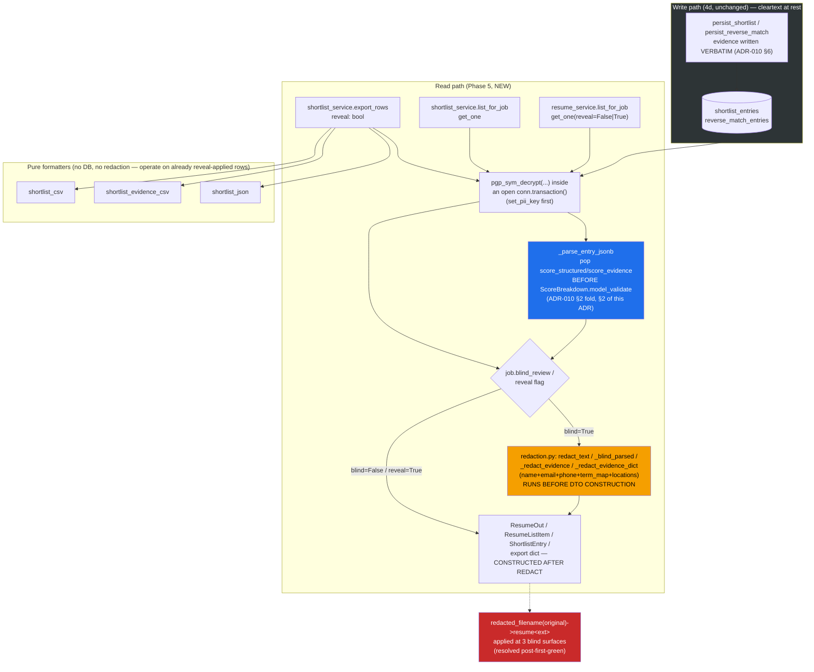

# ADR-011: Display Redaction — Read/Export Boundary Enforcement

**Status:** Accepted (closes ADR-006 §4's redaction-boundary contract in code; extends ADR-010 §6's
statement that "any future redaction of shortlist/reverse-match evidence is explicitly Phase 5's job" —
this ADR is that redaction; ADR-007 §6/§7's cleartext-at-rest posture is UNCHANGED and explicitly still in
force — this phase is display-only masking, not at-rest protection)
**Date:** 2026-07-16

## Context

Phase 5 ships the read and export paths the write-only 4d persistence layer (ADR-010) was missing:
`shortlist_service.list_for_job`/`get_one`/`export_rows` (+ pure formatters `shortlist_csv`/
`shortlist_evidence_csv`/`shortlist_json`) and `resume_service.list_for_job`/`get_one(reveal=False)`. All
of these can serialize decrypted candidate PII into a response DTO — `ResumeOut`/`ResumeListItem`
(ADR-006 §4) and `ShortlistEntry` alike — so this is the first phase where the redaction-boundary
contract ADR-006 §4 recorded as a schema-layer *risk* (the schema cannot enforce it) has real read-path
code to land on.

`core/src/services/redaction.py` (new) is ported near-verbatim from hris
`apps/api/src/api/services/redaction.py`: `redact_text` (name/email/phone masking, `term_map`
employer/institution relabeling, optional `redact_locations` foreign-location scrub),
`pseudonym(rank)` ("Candidate A/B/…"), `blind_label_map(employers, institutions)`, and
`is_foreign_location`. `core/src/errors.py` (new) adds `AppError`/`NotFoundError` for the two new
`get_one` not-found cases.

Built TDD: RED `3e383ff` → GREEN `33512c2` (first pass) → RED `8b1597e` (a security-gate finding,
written as a regression test) → GREEN `b6b1ec7` (the fix). HEAD `b6b1ec7`. **Phase 5 is gate-green and
pre-PR** — all three merge-blocking gates (reviewer APPROVE, security PASS, ranking-evals PASS) are green
on `b6b1ec7`, but CI (`gates-all`, including a live `run_evals.py` re-measurement) has not run, since no
PR exists yet. Do not read this ADR as recording a merged state.

## Decision

### 1. Redaction happens BEFORE DTO construction — the ADR-006 §4 contract is now enforced in code, not just recorded

Every blind read path builds the redacted value first and only then constructs the pydantic DTO:
`resume_service.get_one`'s blind branch builds `_blind_parsed(...)` (which redacts `summary`,
`chunks[].text`, `cover_letter_chunks[].text`, and `experience[].bullets[].text`, relabels
`experience[].company`/`education[].institution`, and nulls `education[].year`) before passing it as
`ResumeOut(parsed=...)`; `shortlist_service._row_to_blind_entry` builds `_redact_evidence(...)` before
`ShortlistEntry.model_validate(raw)`; `export_rows`/`_apply_reveal` builds `_redact_evidence_dict(...)`
before the export dict is finalized. No blind code path ever passes a decrypted PII value straight into a
DTO constructor and redacts afterward — the ordering is real in every call site, not merely intended.

This is proven by **three black-box byte-scan tests** (assert the candidate's real name/email/phone
byte-sequence is absent anywhere in the serialized blind `ResumeOut`/`ShortlistEntry`/export-dict — not
just in specific known fields, so a redaction path that missed a field a future refactor adds would still
be caught) plus reviewer mutation testing (each redaction call site was mutated out — e.g. skipping
`_blind_parsed` and passing `parsed` straight through — and every mutation was killed by a test).

**Restated explicitly: this is display-only redaction, not at-rest protection.** ADR-007 §6/§7's
cleartext-at-rest posture for `resumes.parsed`/`candidate_*` columns and ADR-010 §6's PII-at-rest
extension to `shortlist_entries`/`reverse_match_entries`.evidence are both **unchanged** by this phase —
Phase 5 masks what a blind caller *sees*, never what Postgres *stores*.

### 2. `ScoreBreakdown` fold read guard — required to read ANY 4d-written shortlist row

`persist_shortlist` (4d, ADR-010 §2) folds `score_structured`/`score_evidence` into the
`score_breakdown` jsonb column because `shortlist_entries` has no dedicated columns for them.
`ScoreBreakdown` is `extra="forbid"`, so `_parse_entry_jsonb` (`shortlist_service.py`) pops
`score_structured`/`score_evidence` out of the loaded dict **before** calling
`ScoreBreakdown.model_validate(sb)`. Without this pop, `.model_validate()` raises on every row 4d ever
wrote — this is not an edge case, it is the *only* shape rows are written in. Proven at the integration
level against the real jsonb codec (`test_shortlist_read_export_pg.py`): a row persisted via
`persist_shortlist` is round-tripped through `list_for_job`/`get_one`/`export_rows` and the folded keys
are confirmed absent from the resulting `ScoreBreakdown` while still present, correctly, in the flattened
export dict's `score_structured`/`score_evidence_completeness` columns.

### 3. Cover-letter-evidence redaction gap closed beyond a verbatim hris port

hris's `_redact_evidence` never redacts `cover_letter_evidence[].evidence` or `overall_motivation` — only
`requirements[].evidence` and `overall_summary`. A cover-letter evidence quote can carry the candidate's
own name (a cover letter routinely opens "Dear Hiring Manager, my name is ..."), so porting the hris
function verbatim would have left a name-shaped leak in exactly the field most likely to carry one. Phase
5's `_redact_evidence` (read path) and `_redact_evidence_dict` (export path) both redact **all four**
fields — `requirements[].evidence`, `overall_summary`, `cover_letter_evidence[].evidence`,
`overall_motivation` — closing the gap in both places redaction happens, not just one.

### 4. `cover_letter_chunks[].text` blind redaction — the RED→GREEN security-fix cycle this phase actually ran

The first GREEN (`33512c2`) redacted `resumes.parsed.chunks[].text` (résumé body chunks) but not
`resumes.parsed.cover_letter_chunks[].text` — a security-gate HIGH finding **after** first green: a
cover-letter chunk's first ~200 characters routinely carry raw letterhead PII (name/email/phone), and
that raw text was still reachable through `ResumeOut.parsed.cover_letter_chunks` under `blinded=True`, a
direct violation of the ADR-006 §4 contract this phase exists to close. Written as a failing regression
test first (`8b1597e`), then fixed (`b6b1ec7`) by extending `_blind_parsed` to redact
`cover_letter_chunks[].text` with the same `_r()` helper used for `chunks[].text` and
`experience[].bullets[].text`. Mutation-proven: removing the `cover_letter_chunks` redaction line
re-fails the regression test.

### 5. Latent hris regex bug fixed — grouped alternation, not ported verbatim

hris's name/term redaction pattern built an ungrouped alternation
(`(?<!\w){alt}(?!\w)`, alt = `p1|p2|p3`), which binds the leading lookbehind only to the *first*
alternative and the trailing lookahead only to the *last* — so a middle name-part ("Smith") could match
**inside** a longer word ("Smithsonian"), leaking a partial-word false-positive redaction (or, worse,
under-redacting the intended token in some orderings). Phase 5's `_name_pattern`/`_terms_pattern`
(`redaction.py`) group the alternation — `(?<![\w])(?:{alt})(?![\w])` — so the whole-word boundary applies
to every arm. A test forbids the ungrouped form regressing (asserts the compiled pattern source contains
the grouping construct), and a case-specific test pins "Smith" not matching inside "Smithsonian" while a
bare "Smith" token still redacts.

### 6. Locked human decisions this phase

- **Scope included `resume_service.list_for_job`/`get_one`** (not deferred again) — specifically so
  ADR-006 §4's redaction-boundary contract has real code to land on, not just the schema-layer risk
  statement.
- **`redact_locations` ported opt-in, default `False`** (matching hris's default), but every blind call
  site in Phase 5 (`resume_service._blind_parsed`, `shortlist_service._redact_evidence`/
  `_redact_evidence_dict` under `reveal=False`) passes `redact_locations=True` explicitly — the default-off
  behaviour exists for callers outside the blind path (e.g. a future reveal-with-partial-masking mode),
  not because foreign-location scrubbing is optional under blind review.
- **Blind `ResumeListItem.candidate_name` → `None`, not a pseudonym.** The shortlist's blind entries use
  `pseudonym(rank)` ("Candidate A") because a shortlist row always carries a rank. A plain résumé list has
  no rank to build a pseudonym from — assigning one would imply an ordering the list does not have — so
  `resume_service.list_for_job` masks straight to `None` under blind review instead.

## Accepted-for-v1 residuals (security-flagged, non-blocking)

- **`original_filename` shown verbatim under blind — RESOLVED (fixed post-first-green).** A real
  de-anonymization vector (`First_Last_Resume.pdf` identifying a candidate under blind shortlist review)
  was closed by a post-first-green commit: `redacted_filename(original: str | None) -> str` (new in
  `redaction.py`) returns a generic `resume<ext>` (extension preserved+lowercased, bare `resume` if no
  extension or None), replacing the candidate-identifying original name under blind review ONLY
  (reveal=True or non-blind jobs pass the real filename straight through). Wired at the three blind
  surfaces: `resume_service.get_one`, `resume_service.list_for_job`, `shortlist_service._apply_reveal`
  (csv/json export under reveal=False). TDD: RED `c1e4e04` → GREEN `02af27c` with mutation-proven gate
  re-verification (security PASS and reviewer APPROVE both re-confirmed). The human chose to fix it now
  rather than defer.
- **`redacted_filename` trusts `os.path.splitext` — LOW residual, deferred to Phase 6 upload validation.**
  A pathological filename like `cover.Jane_Smith` (no true extension) yields `resume.jane_smith`,
  leaking the lowercased suffix of a candidate's name if it happens to collide with the part after a dot.
  Real-world résumé filenames (e.g. `Name_Resume.pdf`) are fully masked by this fix. Accepted for v1:
  the risk is low (requires both a dot-containing name component AND upload under that exact name).
  Recommend an extension allowlist (e.g. `.pdf`, `.docx`) + a length cap on the extension when Phase 6
  implements upload validation, to eliminate even the low residual.
- **`candidate_email_hash` returned under blind.** `resume_service.get_one` returns the plaintext
  `candidate_email_hash` (a one-way sha256) even when `blinded=True`. Accepted: it is non-reversible and
  is deliberately plaintext-by-design so a subject-access request can look a candidate up by email without
  decrypting every row — symmetric with the at-rest posture ADR-007 already accepts for that column.
- **CSV formula / CSV-injection.** `shortlist_csv`/`shortlist_evidence_csv` write candidate-controlled
  text (evidence quotes, skill names) into CSV cells without neutralizing a leading `=`/`+`/`-`/`@`, which
  a spreadsheet application can interpret as a formula. Accepted for v1 — this is an offline tool used by
  a trusted recruiter opening their own export, not a multi-party file exchange. The one-line fix (prefix
  such cells with `'`) is noted for a future hardening pass, not implemented here.
- **Shortlist `evidence={}` ambiguity (ADR-010 §2, carried, not newly introduced).** The read layer
  (`_parse_entry_jsonb`) deserializes a raw `{}` to a valid, empty-fielded `EvidenceObject` and does not
  disambiguate "stage 3 never ran for this entry" from "stage 3 ran and found nothing" — both produce the
  same object at the Python level. Recorded again here because this is the first code that actually reads
  the column outside the write path; still accepted, not fixed.

## Still-open human decision, carried forward AGAIN — not touched by this phase

`score_education` ignores `jd.education.fields` (ADR-009 §7, restated ADR-010 §5). Phase 5 touches no
scoring code — `stages.py`/`orchestrator.py` are byte-unchanged — so this remains exactly as open as it
was after 4c/4d. Either extend the scorer to read `fields`, or drop `fields` from the JD contract.

## Architecture Diagram

## Consequences

- ADR-006 §4's redaction-boundary contract is no longer only a risk statement the schema layer records —
  it is enforced code, proven by byte-scan tests plus mutation testing on every blind call site. A future
  refactor that adds a new PII-bearing field to `ResumeParsed`/`EvidenceObject` and forgets to redact it
  would still need to defeat the byte-scan tests (which check for the *raw PII bytes* anywhere in the
  serialized output, not a specific field path) to slip through unnoticed — though it is not proof against
  every possible future field shape, only the ones the byte-scan probes cover today.
- The `ScoreBreakdown` fold/pop guard (§2) is now load-bearing for **any** future code that reads
  `shortlist_entries` — not just Phase 5's own read path. A future feature that queries the table directly
  must repeat this pop or hit the same `ValidationError` every 4d-written row would raise.
  `reverse_match_entries` has no equivalent because its dedicated columns never needed folding (ADR-010 §2).
- The `original_filename` de-anonymization vector is RESOLVED (above, §"Accepted-for-v1 residuals") via
  `redacted_filename()` in the read/export paths; a LOW residual on `os.path.splitext` truncation is
  recorded for Phase 6 upload validation to close. The earlier phase deliberately did not close this
  because it sat outside the redaction-boundary contract's stated scope; the human later chose to fix it
  before the PR, proving that scope-reassessment and human oversight remain live.
- ADR-007 §6/§7 and ADR-010 §6's cleartext-at-rest postures are unchanged and remain the accepted v1
  posture — nothing in this phase encrypts or scrubs data at rest; it only changes what a blind caller's
  response payload contains.

## Alternatives Considered

- **Redact inside the DTO (a pydantic validator on `ResumeOut`/`ShortlistEntry` that blanks fields when
  `blinded=True`)** — rejected, restating ADR-006 §4's own "Alternatives Considered": the schema layer has
  no access to the decrypted values it would need to selectively mask (by the time a validator runs, the
  raw PII is already inside the model), and a DTO that silently blanks its own fields would hide bugs in
  the redaction service rather than surface them. Redaction stays a service-layer concern that runs
  strictly before construction.
- **Port `_redact_evidence` verbatim from hris (leaving `cover_letter_evidence`/`overall_motivation`
  unredacted)** — rejected once the gap was noticed (§3): shipping a known, then-still-open redaction hole
  in the exact field most likely to carry a name would defeat the whole point of this phase.
- **Treat `original_filename` as in-scope and redact it under blind** — initially rejected as scope
  creep beyond ADR-006 §4's stated field list (filename is plaintext metadata, not ciphertext PII). The
  human later decided to fix it preemptively and built `redacted_filename()` in a post-first-green commit
  (`c1e4e04`→`02af27c`), reasoning that a blind de-anonymization vector (`First_Last_Resume.pdf` naming
  a shortlist candidate) is too real to ship even as an accepted v1 residual. Decided: generic
  `resume<ext>` under blind; real filename under reveal/non-blind. A LOW residual on extension
  truncation-leaking is recorded for Phase 6's upload validation to close.
- **Leave `ScoreBreakdown` as `extra="ignore"` instead of popping the folded keys** — considered,
  rejected: `extra="ignore"` would silently swallow `score_structured`/`score_evidence` into nowhere
  instead of routing them to their real destination (the export formatters' `score_structured`/
  `score_evidence_completeness` columns), which are populated from the *unfolded* dict, not from
  `ScoreBreakdown` itself. An explicit pop keeps the fold/unfold symmetric and reviewable in one place
  (`_parse_entry_jsonb`) rather than relying on a permissive model config to paper over it.
