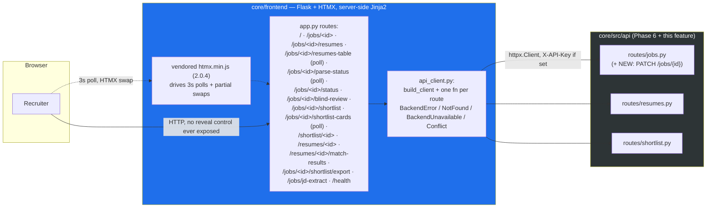

# ADR-014: Workflow UI — Flask + HTMX Recruiter Interface

**Status:** Accepted
**Date:** 2026-07-17

## Context

The v1 extraction plan (Phases 0–7) shipped `core/frontend/` as a minimal **read-only** Flask viewer
(ADR-013) over the Phase 6 API — a proof that the redaction boundary held end-to-end, not a working tool.
This is a **post-v1 feature** (not "Phase 8" — the extraction plan's phase table intentionally ends at
Phase 7 and stays closed). It replaces the read-only viewer with a full recruiter **workflow UI**:
create a job → upload résumés → generate a shortlist → review ranked candidates → export, all driven from
the browser at `:5000`. It reproduces the recruiter workflow that exists in the source `hris` Next.js
frontend, but scoped strictly to **job → résumé → shortlist** — every other hris surface (review/decision
workflow, JD-Harmonizer, comment threads, admin console, CAS auth) stays cut, per the plan's original
keep/cut boundary.

## Decision

### 1. Stack: Flask + HTMX + a hand-authored `app.css`, not a Node/Tailwind build

CLAUDE.md locks the stack at "Flask (frontend)" — no framework substitution. The workflow UI is built on
that same Flask app, extended with **HTMX** (vendored `core/frontend/static/vendor/htmx.min.js`, 2.0.4,
served locally from Flask's static route — no CDN `<script>` tag) for the interactive pieces (polling,
partial-page swaps, form submission without a full reload) and a **hand-authored** `core/frontend/static/app.css`
utility/component stylesheet.

`app.css`'s own file header states this explicitly: *"Deliberately NOT a Tailwind build: there is no Node
toolchain in the container, so these are a small, readable set of utility + component classes. Offline-only:
no `@import`, no remote fonts, no external URLs."* There is no `tailwind.config.js`, no `package.json`, no
`node_modules` anywhere in the repo — a future contributor should not go looking for one. This keeps the
whole stack inside the container's Python/pip toolchain (`make gates` never needs `npm`), keeps the app
fully offline/air-gapped (matching the project's no-cloud-endpoint posture for the LLM layer), and keeps the
PII redaction boundary server-side: every response HTMX swaps into the page is rendered by Jinja2 on the
Flask process, never assembled client-side from raw JSON, so there is no client-side code path that could
accidentally forward an unredacted field.

Server-rendered HTMX also matches the pattern Phase 7 already established (server-side Jinja2, no
client-side JS re-fetching raw endpoints) — this feature extends that pattern with polling and partial
swaps rather than replacing it with a client-rendered SPA.

### 2. Blind-only, by construction — carried forward from ADR-013, extended to the write path

The full workflow UI never forwards a `reveal` parameter to the backend, even though it is now a
write-enabled surface (uploads, status transitions, shortlist generation) rather than a read-only one:

- `api_client.get_resume` keeps `reveal: bool = False` as its default and is called with `reveal=False`
  hardcoded at the one call site (`app.py::resume_detail`) — a browser-supplied `?reveal=` query string is
  never read.
- `api_client.list_shortlist`/`get_shortlist_entry` take no `reveal` parameter at all — there is
  structurally nothing to pass, mirroring `shortlist_service.list_for_job`/`get_one` accepting no such
  kwarg either.
- The three export formats (below) are proxied through the viewer's own export route without exposing a
  way to flip `reveal` from the browser; the backend default (`reveal=False`) is what ships.
- `resume_detail.html` has no template branch that can render `candidate.name`/`email`/`phone`/`location`
  at all — proven by structural byte-scan tests (assert the real candidate PII byte sequence is absent
  from the rendered blind page), not merely gated on the backend's `blinded` flag. This is the same
  by-construction posture ADR-013 §2 established, now carried through the write-enabled UI unchanged.

Reveal/reveal-export remains an audited, non-viewer backend surface (ADR-011/012) — this feature adds no
new path to it.

### 3. Scope: job → résumé → shortlist only

Explicitly **NOT** built, and must stay cut per the plan's original keep/cut boundary:

- The review/decision workflow — no approve/reject, no pipeline stages, no assignment, no review queue, no
  review-status reports. (`ShortlistDecision*`/`PipelineStage`/`StageTransition*` remain deleted at the
  schema layer per ADR-006 — this feature adds no route or template that would need them.)
- JD-Harmonizer (`jd-bank`/`jd-quality`) — not ported, not referenced.
- Comment threads on jobs or résumés.
- An admin console.
- CAS (or any SSO) auth — auth is still the single optional `X-API-Key` mechanism from ADR-012 §1
  (empty disables auth; non-empty enables fail-closed constant-time comparison), with the frontend's own
  `flask_secret_key` for session/flash-message signing only.

### 4. One backend addition: `PATCH /jobs/{id}`

The only `core/src/` change in this feature is `PATCH /jobs/{id}`
(`src/api/routes/jobs.py::update_job` → `src/services/job_service.py::update_job`), added because the
blind-review toggle on the job-detail screen needs a general partial-update route that Phase 6 did not
ship (Phase 6 only shipped the status-transition route). It is a plain allowlist-guarded partial update:

- Built from `payload.model_dump(exclude_unset=True)` — an **omitted** field means "unchanged," not "set
  to null." This matters specifically for `blind_review: bool | None = None`: `False` is a legitimate
  value a client sends on purpose and must stay distinguishable from "the client didn't send this field."
- Filtered a second time through `_UPDATABLE_JOB_COLUMNS`, an explicit allowlist, as defence in depth
  beyond the schema.
- `status` is **not** settable through this route — `JobUpdate` carries no `status` field at all
  (`extra="forbid"` 422s a client that tries), so every status change is still forced through the
  state-machine-guarded `PATCH /jobs/{id}/status` from Phase 6. This route cannot be used to bypass the
  forward-only transition guard.
- An empty payload (nothing sent, or everything filtered out) is a no-op that returns the current row —
  it never issues an UPDATE with an empty SET clause.

This is additive only: `stages.py`/`orchestrator.py` (the ranking engine) and every other Phase 6 route are
byte-unchanged by this feature.

## Screens and flow

1. **Jobs list** (`/`) — create-job form (title/department/location/min-years/JD text, with a JD-file
   upload that auto-extracts text into the description field via `POST /jobs/jd-extract`, unchanged from
   Phase 6) plus a blind-review checkbox (default checked) and status-filter pills (draft/open/closed/
   archived) over the job list.
2. **Job detail** (`/jobs/<uuid>`) — a "parsing…" badge driven by a 3-second HTMX poll
   (`hx-trigger="every 3s"` on `/jobs/<uuid>/parse-status`) that stops issuing itself once `parsed_at` is
   set on the job; status-transition buttons (open/close/archive) that are disabled for the draft→open edge
   until parsing has completed; a blind-review toggle (`POST /jobs/<uuid>/blind-review` → `PATCH
   /jobs/{id}`); a consent-gated résumé upload (the consent checkbox is enforced server-side — no candidate
   bytes are forwarded to the backend without it) feeding a status-pill résumé table
   (`/jobs/<uuid>/resumes-table`) that polls every 3 seconds while any row is still `uploaded`/`parsing`
   and stops once every row reaches a terminal `parsed`/`failed` state.
3. **Résumé detail** (`/resumes/<uuid>`) — always blind (see §2 above): skills chips colour-coded by
   recency (current/aging/stale, computed against `current_year` passed from the route, never a
   candidate field), experience/education, cover letter, no code path capable of rendering PII.
4. **Shortlist** (`/jobs/<uuid>/shortlist`) — a Generate/Regenerate button (`POST
   /jobs/<uuid>/shortlist`) that kicks off the async ranking job then polls
   `/jobs/<uuid>/shortlist-cards` every 3 seconds until ranked entries exist (rendering "Generating…" in
   the interim); per-candidate cards showing rank, `score_final × 100` rounded, five sub-score tiles,
   matched/missing skill chips, and an evidence panel with the cited verified quotes; three anonymized
   export formats (`csv`, `evidence-csv`, `json`) via `/jobs/<uuid>/shortlist/export?format=...`.

## Architecture Diagram

## Consequences

- The recruiter can now run the full job → résumé → shortlist workflow from the browser without any direct
  API call — Phase 7's read-only viewer is superseded, not merely extended.
- `core/frontend/` remains inside the existing gate scope Phase 7 widened `make gates`/CI to cover
  (`ruff`/`black`/`mypy --strict`/coverage over `core/frontend/` alongside `core/src`); no new gate suite
  was needed for HTMX/CSS since neither is Python.
- `Settings.flask_secret_key` and `Settings.api_key` both still default to weak/empty values that must be
  overridden via environment for any non-local deployment — pre-existing since Phase 6/7, out of this
  feature's scope, flagged as a hardening backlog item (see "Accepted residuals" below).
- The one backend surface change (`PATCH /jobs/{id}`) is a strict superset capability of what Phase 6
  already exposed at the schema layer (`JobUpdate` existed since Phase 2/6) — no new PII exposure, no new
  scoring-code touch.
- `Settings.MAX_CONTENT_LENGTH` (see "Security fixes" below) now bounds every multipart request Flask will
  buffer into process memory, closing a resource-exhaustion vector that existed the moment uploads became
  reachable through this UI.

## Gate outcome

All gates green: `ruff`/`black`/`mypy --strict` clean over `core/src` + `core/frontend` + `core/tests`;
**2364 unit tests @ 91.30% coverage**. All screens were live-verified end-to-end against the real running
stack: create job → LLM parse → upload → shortlist generation → ranked cards, confirmed blind throughout.

**Merge-blocking gates:** reviewer **APPROVE** (after fixing one Major finding — the export route had
dropped the `?format=` query parameter, silently always exporting `csv`; fixed by reading and validating
`request.args.get("format")` against the allowed set before calling `api_client.export_shortlist`);
security **PASS**. Two security fixes applied during the review pass:

1. `app.config["MAX_CONTENT_LENGTH"]` added (210 MiB — sized off the backend's own 10 MB/file × 20-file
   upload caps plus headroom) so an oversized multipart request is rejected by Werkzeug with 413 **before**
   it is buffered into Flask process memory, rather than relying solely on the backend's own per-file/
   file-count limits to reject it after the fact.
2. An explicit `httpx.Timeout` (30s overall, 5s connect) was added to the `api_client` build, so the
   viewer's outbound calls to the backend never rely on `httpx`'s implicit (no-timeout) default.

## Accepted residuals (non-blocking, recorded not fixed)

- **LOW — create/upload error paths render the backend's 4xx `detail` verbatim.** `_format_error` in
  `app.py` takes whatever the backend's `422`/`400` `detail` body contains and renders it into the
  re-rendered form via Jinja2 autoescaping. Today the backend only ever puts field-level pydantic
  validation text there — no PII, no raw uploaded content — so this is accepted for v1. If the backend
  ever changes to surface something PII-bearing or attacker-controlled in `detail` (e.g. an uploaded
  filename echoed back unfiltered), this should be mapped to a fixed set of friendly messages instead of
  rendered verbatim. Not fixed this feature — flagged for the next time `detail`'s contents change.
- **Pre-existing, out of scope — weak/empty `flask_secret_key`/`api_key` defaults.** Both remain
  env-overridable, empty-by-default settings inherited from Phase 6/7. Hardening backlog item, not
  introduced or worsened by this feature.

## Deferred (not built, follow-up candidate)

**Reverse-match UI.** A "find matching jobs" trigger button on the résumé-detail screen was scoped as an
optional slice and **not built** in this feature. The backend endpoints it would call already exist and
are unchanged (`POST /resumes/{id}/match-jobs`, `GET /resumes/{id}/match-results`, both Phase 6), and the
Phase 7 `match_results.html` view remains in the template directory, already wired to
`app.py::resume_match_results`. Wiring a trigger button on `resume_detail.html` that calls the existing
`api_client.get_match_results`/a new thin POST wrapper is a clean, low-risk follow-up — no backend change
needed.

## Alternatives Considered

- **A Node/Tailwind build pipeline** — rejected: no Node toolchain exists in the container, CLAUDE.md locks
  the frontend stack at Flask, and introducing `npm`/`node_modules` would add an entire second build
  toolchain to `make gates` for a small, hand-maintainable set of utility classes. A hand-authored `app.css`
  achieves the same visual language at zero new tooling cost.
- **A client-rendered SPA (React/Vue) consuming the FastAPI JSON directly from the browser** — rejected:
  would require either exposing `reveal`-capable endpoints directly to browser JS (undermining the
  server-side redaction boundary ADR-011/012/013 establish) or duplicating redaction logic client-side.
  It would also need a full JS build toolchain, a client-side story for the `X-API-Key` header (defeating
  the "browser never sees the API key" property `api_client.build_client` currently provides), and would
  replace rather than extend the server-rendered pattern Phase 7 already established and gated. HTMX keeps
  every redacted response assembled once, server-side, in Python, and its server-authoritative-swap model
  was already proven correct by Phase 7's tests.
- **A reveal toggle in the new write-enabled UI, gated behind the same `X-API-Key`** — rejected for the same
  reason ADR-013 §"Alternatives Considered" rejected it for the read-only viewer: a browser-facing reveal
  control puts de-anonymization one click away from whoever has the tab open. The backend capability
  already exists for anyone who needs it directly; this feature does not re-expose it, write-enabled or not.
- **Building the reverse-match UI now, as part of this feature** — deferred rather than rejected: scoped as
  optional slice S9, cut for time; the backend surface is unchanged and ready, so it is a clean, separately
  gate-able follow-up rather than a decision this feature needed to resolve.
