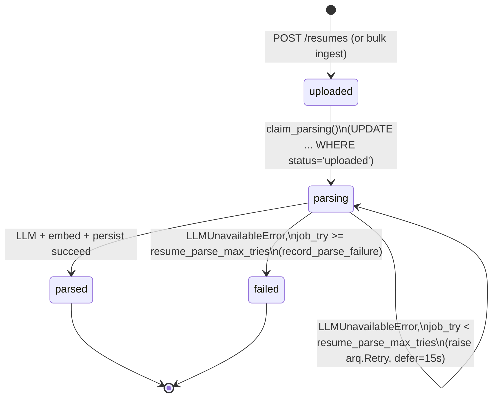

# ADR-027: Honest résumé parse status (FU-7, ADR-021 §3 implementation)

**Status:** Accepted — implemented, gate-green on branch `feat/fu7-honest-parse-status` (tip `bf1da36`),
pending merge.
**Date:** 2026-07-30

## Context

ADR-021 scoped six decisions arising from the 2026-07-19/20 incident (16 résumés stuck at status
`uploaded` for ~18 hours). **This ADR covers decision 3 only — "honest résumé parse status."** ADR-021's
other decisions remain deferred as separate FU-7 work:

- **Decision 1** (ordered provider chain with per-provider circuit breakers, failover on availability
  errors) — deferred.
- **Decision 2** (fail-closed ranking: block shortlist production and surface "waiting for AI to rank
  candidates…" instead of silently zeroing evidence/motivation on `LLMOutputInvalidError`) — deferred.
- **Decision 4** (degraded-parse visibility: `degraded`/`degradation_reason` on `ResumeParsed`, excluding
  degraded résumés from ranking) — deferred.
- Decisions 5 (timeout sizing) and 6 (reasoning-model handling) are documentation/config guidance, not
  build items, and are unaffected by this ADR.

ADR-021 §3 specified two state transitions the code did not implement: `uploaded → parsing` (the
`'parsing'` enum value existed in `resume_status` but nothing ever wrote it) and `parsing → failed` (a
timed-out row stayed at `uploaded` forever, indistinguishable from a job that was never enqueued — the
literal defect in the 2026-07-19/20 incident).

## Decision

### `uploaded → parsing` claim

`resume_service.claim_parsing(conn, resume_id) -> bool` runs
`UPDATE resumes SET status='parsing' WHERE id=$1 AND status='uploaded'` at the start of `parse_resume`.
The conditional `WHERE` makes the claim idempotent on arq retry: a second attempt against an
already-`parsing` row updates 0 rows and returns `False`, which is the normal (not exceptional) case on a
retried task — the boolean is used for logging only, never to short-circuit the parse. This makes the
previously-unreachable `'parsing'` enum value real.

### `parsing → failed` on retries-exhausted

A single `try/except LLMUnavailableError` boundary wraps the whole LLM/embed/persist section of
`parse_resume`:

- On the **last** try (`ctx["job_try"] >= settings.resume_parse_max_tries`): call `record_parse_failure`
  and return `"failed"`.
- On an **earlier** try: `raise arq.Retry(defer=15s)`, so arq re-queues the job instead of the exception
  propagating uncaught.

`settings.resume_parse_max_tries: int = 5` is a new pydantic-settings field, and `WorkerSettings.max_tries`
is sourced from it directly — one setting drives both the give-up decision inside the task and arq's own
retry ceiling, so the two numbers cannot drift apart.

### No new observability surface needed

FU-8's `GET /jobs/{id}/resume-status` (ADR-026 decision 5) already buckets by `resume_status`, including
`parsing` and `failed`. This ADR makes those buckets carry real data for the first time — no API or UI
change was needed.

## Architecture Diagram (Mermaid)

The `parsing → parsing` self-loop is arq re-queuing the same job, not a code-level state write; it is
shown to make explicit that a row can cycle through several `parsing` claims (each a no-op after the
first) before either succeeding or giving up.

## Consequences

- A résumé that hits the incident's failure mode now reaches `failed` with a `failure_reason`, and is
  excluded from future shortlist attempts, instead of hanging at `uploaded` indefinitely.
- The per-job status breakdown (already shipped, ADR-026 decision 5) becomes accurate: `parsing` counts
  reflect jobs genuinely in flight, and `failed` counts reflect genuine give-ups, both newly reachable.
- `resume_parse_max_tries` has no upper sanity cap — accepted residual, see below.
- ADR-021 decisions 1, 2, and 4 are still open. A recruiter can still see a shortlist ranked with a
  silently-zeroed evidence component (decision 2) or a "parsed" résumé with silently-missing skills
  (decision 4) — this ADR closes only the `uploaded`-stranding failure mode, not the broader FU-7 scope.

## Accepted residuals (non-blocking, recorded not fixed)

- **`resume_parse_max_tries` has no upper sanity cap.** A large operator-set value simply means more
  15-second-deferred retries; it is operationally bounded by the existing `job_timeout=3600` arq setting,
  not by anything this change adds. Minor.

## Notes / corrections — ADR-021 §3's arq premise was factually wrong

ADR-021 §3 proposed detecting retries-exhausted via `ctx["job_try"] >= ctx["max_tries"] - 1`, and its §2
narrative asserted that a propagating `LLMUnavailableError` was "expected to [be handled by] arq's retry
mechanism." Both claims were checked against the installed `arq==0.28.0` (`arq/worker.py`) while
implementing this ADR and are wrong:

1. **`ctx` has no `max_tries` key.** The task context arq passes in only carries `job_try` (the current
   attempt number). §3's suggested comparison cannot be implemented as written; this ADR instead compares
   `ctx["job_try"]` against `settings.resume_parse_max_tries` read directly from settings (which also
   drives `WorkerSettings.max_tries`, so the two cannot diverge).
2. **A plain uncaught exception does not trigger an arq retry.** arq only re-queues a job when the task
   raises `arq.Retry`. An uncaught `LLMUnavailableError` propagating out of `parse_resume` — the behaviour
   the pre-existing code comment (and ADR-021 §2) described as intentional, relying on arq to retry — in
   fact fails the job **permanently on the first attempt**. Nothing ever calls `record_parse_failure`, and
   the row is stranded at `uploaded`. The incident's *symptom and root cause* (résumé rows stuck at
   `uploaded`) were correctly diagnosed in ADR-021; the *mechanism* (arq silently retrying and eventually
   giving up) was not — arq was never retrying at all.

This is why the fix in this ADR explicitly raises `arq.Retry` on every non-final attempt rather than
relying on an uncaught exception. The misleading code comment (that a propagating `LLMUnavailableError` is
intentionally left for arq to retry) was corrected in this branch to describe the actual `try/except` +
explicit `arq.Retry` control flow.

## Security fix folded into this branch

The give-up path's `failure_reason` must be PII-free by construction, matching the repo's existing
`failure_reason` privacy invariant (ADR-007 §6). It was initially written as `f"...: {exc}"`, and
`LLMClient`'s 4xx-triggered `LLMUnavailableError` embedded `response.text[:200]` — an upstream LLM
response body can reflect résumé/candidate content back verbatim, which would land in a cleartext,
blind-review-exposed Postgres column. Fixed in this branch:

- `client.py` now raises `LLMUnavailableError` with only `HTTP <status_code>` on a 4xx — the full response
  body is logged, never persisted.
- The worker's `failure_reason` on give-up is the fixed string
  `f"llm unavailable after {job_try} retries"` — no interpolated exception text. The full exception still
  goes to logs.

## Alternatives Considered

- **Detect retries-exhausted via `ctx["max_tries"]`, as ADR-021 §3 originally suggested** — not possible;
  `arq==0.28.0`'s `ctx` does not expose that key (see Notes above). Rejected on the facts, not on
  preference.
- **Keep relying on the uncaught exception for arq to retry, and only add the `failed` transition on
  final give-up** — rejected once verified that arq does not retry on an uncaught exception at all; without
  an explicit `arq.Retry`, every failure would still be a first-attempt permanent failure, defeating the
  purpose of a retry ceiling.
- **Add a new terminal enum value instead of reusing `'parsing'`/`'failed'`** — rejected; both values
  already exist in `resume_status` (`core/src/models/ddl.py`) and were simply unreachable. No schema
  change was needed.
- **Interpolate the raw exception into `failure_reason` for operator convenience** — rejected on the
  security fix above; full exception detail belongs in logs, not in a cleartext, blind-review-exposed
  column.

## Cross-references

ADR-021 (source scoping, decisions 1/2/4 still deferred); ADR-026 (per-job résumé-status breakdown this
ADR makes accurate, `failure_reason` cleartext-at-rest precedent); ADR-007 §6 (the `failure_reason`
PII-free-by-construction invariant this branch's security fix restores parity with).
