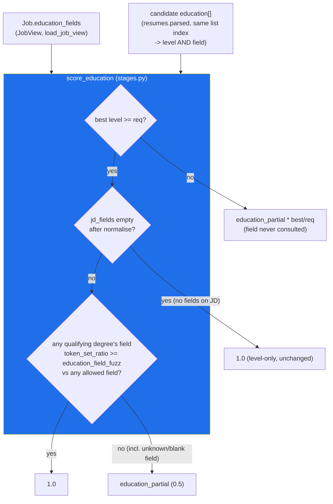

# ADR-028: Education Field-of-Study Relevance (ADR-009 §7 resolution)

**Status:** Accepted — implemented, gate-green on branch `feat/education-field-relevance`; reviewer
APPROVE, security PASS, ranking-evals PASS, `./scripts/verify.sh all` green.
**Date:** 2026-08-01

## Context

ADR-009 §7 left `jd.education.fields` as an **OPEN DECISION FOR A HUMAN**: `score_education` compared
only the candidate's best degree **level** against `jd.education.min_level`; the JD's `education.fields`
list (e.g. `["Computer Science", "Software Engineering", "Data Engineering"]`) was read nowhere in the
scorer — field-relevance was decorative in the shipped contract. Two options were on the table: extend
the scorer to read `fields`, or drop `fields` from the JD contract as unused. The 4a/4c corpus's r14/r11
education twin was deliberately built to survive either resolution (both twins' fields are JD-allowed, so
that pair turns on level alone), so it did not force the decision.

**Human decision (2026-08-01): EXTEND the scorer.** `fields` stays in the JD contract and is now load-bearing.

## Decision

### Algorithm (`score_education`, `core/src/pipeline/matching/stages.py`)

Backward-compatible signature — the two new parameters are keyword-only with defaults that reproduce
today's behaviour exactly when a caller passes neither:

```python
def score_education(
    candidate_levels: Iterable[str | None],
    jd_min_level: str | None,
    *,
    candidate_fields: Iterable[str | None] = (),
    jd_fields: Iterable[str] = (),
    weights: MatchWeights = DEFAULT_WEIGHTS,
) -> float:
```

1. `jd_min_level` unset → `1.0` (unchanged — no level bar means education is automatically satisfied).
2. `req = _LEVEL_ORDER.get(jd_min_level, 0)`. Levels and fields are paired by zipping the *same*
   `candidate_levels`/`candidate_fields` iteration index-for-index (`zip_longest`, `fillvalue=None`), so a
   candidate's field is always read from the same degree entry as its level — never a different one.
3. No usable ranked level → `0.0` (unchanged).
4. `best = max` rank over all degrees. If `best < req` (candidate does not meet the level bar), the field
   axis is **never consulted** — return is `weights.education_partial * (best / req)`, byte-identical to
   pre-ADR-028 behaviour. Field relevance only ever applies to a candidate who already clears the level bar.
5. `best >= req`. Normalise `jd_fields` (drop empty/whitespace-only entries, lowercase, collapse whitespace,
   strip control chars). If the JD lists **no** fields after normalisation → `1.0` (level-only, **unchanged**
   — this is the compatibility case that keeps every pre-existing JD/corpus fixture without a `fields` list
   scoring exactly as before).
6. Otherwise, take only the degree(s) whose level actually meets `req` (`qualifying`) and fuzzy-match each
   one's field against every allowed field via `rapidfuzz.fuzz.token_set_ratio(candidate, allowed) / 100.0
   >= weights.education_field_fuzz`. Any qualifying-level degree with a matching field → full credit `1.0`.
   No match on any qualifying degree → capped at `weights.education_partial` (default `0.5`) — the
   candidate meets the level bar but not in a relevant field.

`token_set_ratio` was chosen (not `ratio`/`partial_ratio`/`WRatio`) because it tolerates word-order and
partial-token differences ("Computer Science" vs "Science, Computer") without the over-permissiveness that
made `WRatio` unsafe for the evidence-verifier decision in ADR-009 §1 — a different metric for a different
job (field-name matching, not substring-in-chunk matching).

### New knob: `education_field_fuzz`

`MatchWeights.education_field_fuzz: float = Field(default=0.85, ge=0, le=1)`
(`core/src/schemas/matching.py`) — sibling to `education_partial`/`evidence_verify_fuzz`, **not** part of
either the top-level or structured weight sum, so the existing sums-to-1.0 validator is unaffected. Wired
through `Settings.match_education_field_fuzz: float = 0.85` and `weights_from_settings`
(`education_field_fuzz=settings.match_education_field_fuzz`), covered by
`test_every_match_field_is_declared_on_settings`'s parametrize list and the settings-defaults test, same
pattern as every other `match_*` weight.

### `JobView` / `load_job_view` (`core/src/pipeline/matching/orchestrator.py`)

`JobView` gains `education_fields: tuple[str, ...]`. `load_job_view` populates it from the same parsed JD
JSON as `education_min_level`:
`education_fields=tuple(f for f in (edu.get("fields") or []) if isinstance(f, str) and f.strip())`.

### Call site

The orchestrator builds `candidate_levels` and `candidate_fields` from a **single** iteration over
`parsed.get("education", [])`, guaranteeing index alignment between a candidate's degree level and its
field before either is passed to `score_education`:

```python
edu_entries = parsed.get("education", []) or []
candidate_levels = [_level_from_degree(e.get("degree")) for e in edu_entries]
candidate_fields = [e.get("field") for e in edu_entries]
edu = score_education(
    candidate_levels,
    job.education_min_level,
    candidate_fields=candidate_fields,
    jd_fields=job.education_fields,
    weights=weights,
)
```

`tests/evals/run_evals.py` was extended the same way so the live corpus run exercises the new behaviour,
not just unit fixtures.

## The unknown-field decision, and its counter-risk

`_field_matches` treats a `None` or blank candidate field as **no match** (penalized), not as
benefit-of-the-doubt. Rationale: the JD explicitly asked for a field; full education credit is awarded
only when the scorer can *confirm* a qualifying-level degree in an allowed field. An unknown field cannot
confirm that, so it does not earn the `1.0`.

**Counter-risk, stated explicitly:** this over-penalizes a genuinely-qualified candidate whose résumé
parse dropped the `field` value (LLM extraction miss, malformed résumé section, etc.) — that candidate
caps at `education_partial` even though their real degree may well be in an allowed field. This is
accepted for v1 because (a) the corpus shows no fixture is currently affected by a missing-field false
negative, and (b) the failure mode is a demotion, not a rejection — the candidate still surfaces, just with
a lower education sub-score (10% of the structured score, itself 60% of `score_final`). If this proves too
harsh in practice, two mitigation levers exist without changing the scorer's shape: raise the recall of
field parsing at the resume-ingest LLM-extraction stage, or relax the unknown-field case to
benefit-of-the-doubt (treat `None`/blank as a pass) — a one-line change in `_field_matches`, deliberately
not made here so the harsher, more defensible-to-a-recruiter default ships first.

## Corpus impact

Allowed JD fields in the affected fixture(s): Computer Science, Software Engineering, Data Engineering.
Only bachelor+-level candidates whose qualifying degree is in a **non-allowed** field are demoted:

| Fixture | Field | Change | `score_final` delta |
|---|---|---|---|
| r06 (Drew Patel) | Design and Computation | education 1.0 → 0.5 | −0.030 |
| r12 (Reese Dawson) | Communications | education 1.0 → 0.5 | −0.030 |
| r17 (Harper Nakamura) | Visual Communication Design | education 1.0 → 0.5 | −0.030 |

All three were already in `must_not_surface_in_topk` — the field cap sinks already-adversarial candidates
further, it does not newly exclude anyone. `precision@5 = 1.0` is preserved. The r14/r11 education twin
(ADR-009 §7's motivating pair) is **byte-identical**: r14's field is JD-allowed (stays 1.0), r11 is
associate-level (below-level — field is never consulted per step 4 above); the twin's gap is unchanged at
`+0.03673591`.

**Falsifiable control:** `_assert_education_field_relevance` (`core/tests/evals/run_evals.py`) plus the
`education_field_relevance` block in `core/tests/evals/fixtures/labels.json` (committed `d67ac9a`) assert,
under the real engine, that each `field_demoted` fixture scores `1.0` with `jd_fields=()` (isolating the
field cap from a below-level partial), `weights.education_partial` with fields on (kills a scorer reverted
to level-only), and `1.0` again at `education_field_fuzz=0.0` (kills a match-everything mutation). Both
mutations were run and watched RED before the control was accepted. This closes the round-5 F2 "open
decision" that `labels.json` had documented since Phase 4a.

## Accepted residuals

Two security LOW findings, neither a regression from this branch's baseline:

- **`Education.fields` has no per-string `max_length`** (`core/src/schemas/jobs.py`) — the list itself is
  capped at 20 entries (`max_length=20`), but an individual field string is bounded only by the upstream
  LLM-output/description size caps, not a dedicated per-item length limit.
- **Candidate `parsed` JSONB `field` is trusted as `str | None`** with no additional validation at the
  `score_education` call site — the same pre-existing trust model as the adjacent `_level_from_degree`
  read of `parsed.get("education", [])[i].get("degree")`, which this change does not tighten or loosen.

## Architecture Diagram (Mermaid)



## Consequences

- `score_education`'s field axis is now load-bearing wherever a JD supplies `education.fields`; every JD
  that omits it (the entire pre-ADR-028 corpus/production population, until JD authors start populating it)
  scores exactly as before.
- Resolves ADR-009 §7. The mermaid node in ADR-009 and the README's ranking-algorithm section are updated
  to reflect that fields are read, not ignored.
- Introduces one new tunable (`education_field_fuzz`, default `0.85`) to the already-large `MatchWeights`
  surface; it follows the exact same settings-wiring pattern as every other `match_*` weight, so it does not
  add a new class of configuration risk.
- Carries forward the unknown-field-penalizes-by-default posture as a stated, revisitable choice — see
  "counter-risk" above — rather than silently baking it in as an assumed-obvious default.

## Alternatives Considered

- **Drop `fields` from the JD contract as unused** (ADR-009 §7 option 2) — rejected by the human decision;
  the field was already being populated by JD extraction and recruiters expect it to matter.
- **Benefit-of-the-doubt on unknown/blank candidate field** (treat as a pass) — rejected for v1; the JD
  explicitly asked for a field, and the current résumé-parse pipeline's field-extraction recall was not
  independently re-measured as part of this change, so defaulting to "assume it matches" would be an
  unverified assumption stacked on an unverified assumption. Left as a documented, one-line mitigation
  lever, not implemented.
- **Consult field for below-level degrees too** (e.g. penalize a below-level, wrong-field degree harder) —
  rejected; below-level candidates already get a proportionally reduced `education_partial * best/req`
  score, and stacking a field penalty on top would double-penalize the same shortfall along two axes for a
  candidate who was never going to clear the bar regardless of field.
- **`rapidfuzz.fuzz.ratio` or `.WRatio` instead of `.token_set_ratio`** — not re-measured against a
  dedicated field-name corpus in this change (ADR-009 §1's evidence-verifier metric choice does not
  transfer directly, since it is a different matching task); `token_set_ratio`'s word-order/partial-overlap
  tolerance was judged the right fit for short field-of-study strings and is exercised by the falsifiable
  corpus control above.

## Cross-references

ADR-009 §7 (the open decision this ADR resolves); ADR-009 §1 (the evidence-verifier fuzzy-match precedent,
a different metric for a different job); `core/tests/evals/fixtures/labels.json`'s
`education_field_relevance` block and `_assert_education_field_relevance`
(`core/tests/evals/run_evals.py`) — the falsifiable corpus control.
