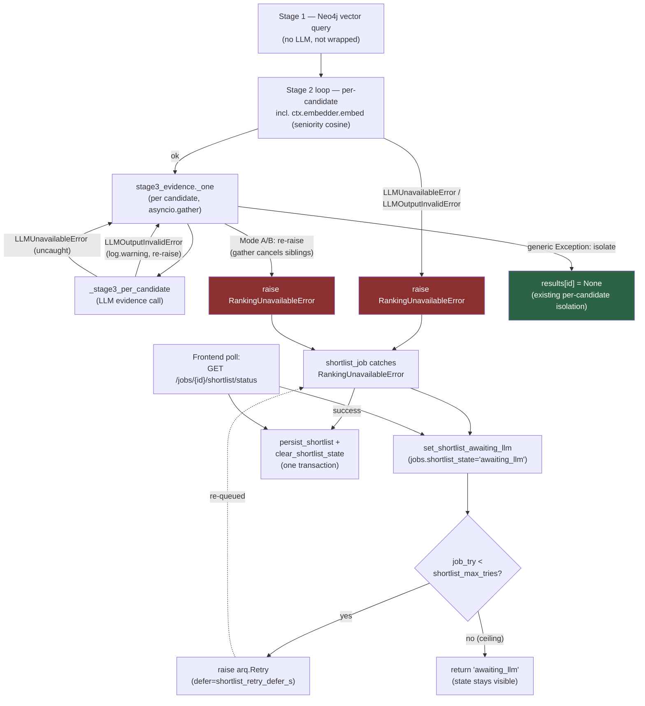

# ADR-029: Fail-closed ranking (FU-7, ADR-021 §2 + §6 implementation)

**Status:** Accepted — implemented, gate-green on branch `feat/fu7-fail-closed-ranking`; reviewer APPROVE,
security PASS, ranking-evals PASS, `./scripts/verify.sh all` green.
**Date:** 2026-08-02

## Context

ADR-021 scoped six decisions arising from the 2026-07-19/20 incident. Decision 3 ("honest résumé parse
status") shipped as [ADR-027](027-honest-resume-parse-status-fu7.md). **Decisions 2 ("fail-closed ranking")
and 6 ("reasoning-model handling" / empty-content) were designed but deferred** — this ADR implements both.

The problem decision 2 exists to close: when stage 3 (evidence extraction) hit `LLMOutputInvalidError` for
a candidate, the orchestrator logged a warning and returned `None` for that candidate's evidence. A `None`
evidence object flows into stage 4 as a zero on evidence (0.3) and motivation (0.1) — **40% of the final
composite** — silently, with no signal to the recruiter that the score means "the LLM failed" rather than
"the candidate is weak." This is ADR-009's residual gap and register item 11 of
`docs/process/ranking-metrics-explainer.html`: a technical failure indistinguishable from a genuinely weak
candidate.

## Decision

### Fail closed on BOTH Mode A and Mode B — human-approved 2026-08-01

ADR-021 §2 literally scoped fail-closed behavior for Mode B (`LLMOutputInvalidError`, invalid/empty output)
only; Mode A (`LLMUnavailableError` — timeout, connection error, 5xx, 429) was left to propagate and fail
the job loudly, on the reasoning that an outright outage is already visible.

**Human decision: fail closed on both.** The "a degraded ranking that reaching human eyes is worse than no
ranking" principle (ADR-021 §2's own rationale) applies identically to a timeout: a candidate ranked with a
silently-zeroed evidence component because the LLM timed out is exactly as misleading as one zeroed because
the LLM returned malformed JSON. Both failure modes now retry until the provider recovers (same-provider
retry for now — decision 1 / failover, still deferred, will make retry smarter later without changing this
ADR's contract).

### Mechanism — `RankingUnavailableError` (`core/src/pipeline/matching/orchestrator.py`)

A new domain exception:

```python
class RankingUnavailableError(RuntimeError):
    """Stage-3 evidence could not complete because the LLM failed (Mode A
    availability or Mode B invalid output). The shortlist must fail closed:
    do NOT persist silently-degraded rows. ADR-021 §2 / ADR-029."""
```

Three call sites changed, all inside `generate_shortlist`'s forward-shortlist path:

- **`_stage3_per_candidate`** — previously caught `LLMOutputInvalidError`, logged a warning, and returned
  `None` (silently zeroing that candidate). Now: keep the `log.warning`, then **re-raise**.
  `LLMUnavailableError` was already uncaught here and continues to propagate.
- **`stage3_evidence._one`** — previously a blanket `except Exception` isolated any per-candidate failure to
  `None` (partial-failure isolation: one bad candidate didn't sink the shortlist). Now catches
  `(LLMOutputInvalidError, LLMUnavailableError)` **first** and re-raises — `asyncio.gather`'s default
  behavior propagates the first raised exception and cancels the sibling tasks, which is the desired
  effect: one Mode A/B failure withholds the *whole* shortlist (ADR-021 §2 explicitly rejects partial
  shortlists). The broad `except Exception` stays **after** it, so a genuinely unexpected per-candidate
  error (not an LLM failure) still isolates to `None` — that isolation is preserved, just narrowed to
  exclude the two typed LLM failure modes.
- **`generate_shortlist`** — wraps **both** the stage-2 per-candidate loop (the seniority-cosine
  `ctx.embedder.embed(...)` call can itself raise `LLMUnavailableError` on an embedder outage) **and** the
  `stage3_evidence` call, each in `try/except (LLMOutputInvalidError, LLMUnavailableError) as exc: raise
  RankingUnavailableError(str(exc)) from exc`. Stage 1 (Neo4j vector query, no LLM involved) is not
  wrapped. This guarantees every Mode A/B failure anywhere in the forward shortlist's LLM/embedder path
  surfaces as a single typed `RankingUnavailableError` — critically, no bare `LLMUnavailableError` can
  escape `generate_shortlist` uncaught, which would **not** trigger an arq retry (a plain uncaught exception
  does not — see ADR-027's "Notes / corrections" on the same arq fact).

Scoring math is byte-unchanged; the eval corpus's fake/real LLM always returns valid output, so no
fail-closed path is exercised by `run_evals.py` and ranking-evals stayed green trivially.

### State representation — dedicated columns, not a `job_status` value

`jobs` gains three nullable columns (idempotent `ALTER TABLE ... ADD COLUMN IF NOT EXISTS`, inline `CHECK`
on the state column, matching the convention already used for `shortlist_top_percent` and ADR-026's
withdrawal columns):

```sql
ALTER TABLE jobs ADD COLUMN IF NOT EXISTS shortlist_state TEXT
    CHECK (shortlist_state IN ('awaiting_llm'));
ALTER TABLE jobs ADD COLUMN IF NOT EXISTS shortlist_state_reason TEXT;
ALTER TABLE jobs ADD COLUMN IF NOT EXISTS shortlist_state_at TIMESTAMPTZ;
```

**Not a new `job_status` enum value.** Same reasoning as ADR-026 decision 1: `job_status` describes the
draft/open/closed/archived *lifecycle*; `awaiting_llm` is an orthogonal *ranking* state — a job can be
`open` and awaiting a ranking retry at the same time, and conflating the two axes would force awkward
states ("closed but also awaiting_llm?"). Every existing row reads back "no state" (`NULL`, no default).

`core/src/services/shortlist_service.py` adds three functions:

```python
async def set_shortlist_awaiting_llm(conn, job_id, *, reason: str) -> None
async def clear_shortlist_state(conn, job_id) -> None
async def get_shortlist_state(conn, job_id, *, user_id: UUID | None = None) -> ShortlistStateOut | None
```

`get_shortlist_state` raises `NotFoundError` when the job does not resolve for the given scope (mirroring
`get_job`), which is what the API route below turns into a 404.

### Worker — `shortlist_job` fail-closed + bounded retry (`core/src/worker/matching_tasks.py`)

Mirrors the ADR-027 pattern in `resume_tasks.py` (manual `job_try` check, explicit `arq.Retry`):

```python
try:
    result = await generate_shortlist(job_id, ctx=mc, weights=..., ...)
except RankingUnavailableError as exc:
    async with conn.transaction():
        await set_shortlist_awaiting_llm(conn, job_id, reason=str(exc))
    job_try = ctx.get("job_try", 1)
    if job_try < settings.shortlist_max_tries:
        log.warning("shortlist_job.awaiting_llm job_id=%s try=%s reason=%s", ...)
        raise Retry(defer=settings.shortlist_retry_defer_s) from exc
    log.warning("shortlist_job.awaiting_llm_exhausted job_id=%s tries=%s", ...)
    return "awaiting_llm"
async with conn.transaction():
    await persist_shortlist(conn, result)
    await clear_shortlist_state(conn, job_id)
```

- No shortlist is persisted on a Mode A/B failure — the `set_shortlist_awaiting_llm` write and the
  `raise Retry` both happen inside the `try:` whose `finally:` releases the job's advisory lock, so the lock
  is released *before* arq reschedules the job (the retry re-acquires it cleanly).
- Below the retry ceiling (`job_try < settings.shortlist_max_tries`), the task raises `arq.Retry` and arq
  re-queues it after `shortlist_retry_defer_s` seconds.
- At the ceiling, the task returns the string `"awaiting_llm"` instead of retrying further — the
  `shortlist_state` row stays set (visible in the UI), and a human can trigger a fresh run via "Generate."
  This is a deliberate stop, not a silent give-up: `shortlist_state_reason`/`_at` remain queryable.
- A successful run persists the shortlist **and** clears any prior `awaiting_llm` state in the same
  transaction — recovery is atomic with respect to a concurrent status read.
- `"awaiting_llm"` was added to the module docstring's status-string list, alongside the pre-existing
  terminal statuses.

### Settings (`core/src/settings.py`)

```python
shortlist_max_tries: int = Field(default=20, ge=1, le=1000)
shortlist_retry_defer_s: float = 45.0
```

`shortlist_max_tries` gets an explicit upper sanity cap (`le=1000`) — addressing the same class of residual
ADR-027 left open for `resume_parse_max_tries` (no cap there). These are worker knobs, not `MatchWeights`;
they are not part of `weights_from_settings`.

### API — status route (`core/src/api/routes/shortlist.py`)

```
GET /jobs/{job_id}/shortlist/status
    -> { "job_id", "state": "awaiting_llm" | null, "reason": string | null, "at": iso8601 | null }
```

Uses the same RBAC readers as `list_shortlist`, and — this is the change made mid-build in response to
reviewer/security findings (commits `295ed95` red, `524d9fc` green) — is **job-assignment-scoped exactly
like `get_job`**: a hiring_manager *session* scoped to jobs they are not assigned to gets a 404, identical
to a genuinely nonexistent `job_id`. The route was initially built unscoped, which both (a) leaked ranking
state as an existence oracle across every job in the company to any authenticated reader, and (b) was an
IDOR — a hiring manager could poll the ranking status of a job they have no assignment to. Scoping it
through `scoped_user_id_or_403` + `get_shortlist_state(..., user_id=...)`'s `NotFoundError`-on-no-match
closes both: the 404-vs-200 split can no longer be used to probe which job IDs exist, and a manager cannot
read another job's ranking state.

### Frontend

`api_client.get_shortlist_status(job_id)` passthrough; `_render_shortlist_cards` reads the status
before/after `list_shortlist`. If `state == "awaiting_llm"` and no entries exist yet, the cards fragment
renders "Waiting for AI to rank candidates…" — distinct from the pre-existing "Generating…" message — and
**keeps the same `hx-trigger` poll**, bounded by the existing `_MAX_SHORTLIST_POLL_ATTEMPTS` give-up. Once
entries exist, the normal cards render regardless of state (a stale `awaiting_llm` flag from a prior failed
attempt does not block a subsequent successful shortlist from displaying).

#### Amendment — 2026-08-18 (branch `fix/regenerate-shortlist-no-feedback`)

The decision itself is preserved: cards render when `entries` exist. What changed is the polling gate and
a correction to the text above.

**The decision is unchanged:** a successful run clears `awaiting_llm` in the same transaction as the write,
so the case described — *"entries from success + stale awaiting_llm flag from prior failure"* — **cannot
actually occur**. A successful persist atomically clears the flag.

**The reachable case is its reverse:** entries from a prior successful run exist, while a *current* failure
has set `awaiting_llm` with a retry queued. The old behavior left the recruiter with a stale list and no
sign that a retry was queued. This branch adds a banner for exactly this case: `if entries and
awaiting_llm, render "previous run ... retry queued automatically"`. (ADR-043 adds the sibling `ranking`
state for the parallel case when a *new* run is still in flight.)

The cards themselves still render unchanged; the polling gate was the real defect. The old gate checked
`not entries`, correct only for a first Generate. The new gate checks `(not entries) or ranking or
awaiting_llm`, allowing polling to continue when a *fresh* run is in flight even though old entries
still exist — the core fix for regenerate not updating the UI.

### §6 — empty-content detection (`core/src/pipeline/llm/client.py`)

Both `_chat_openai` and `_chat_native` already raised `LLMOutputInvalidError` when `content` was not a
string. Extended: after the `isinstance(content, str)` check, an empty-or-whitespace-only `content` now
also raises `LLMOutputInvalidError`, via a shared `_empty_content_message(reasoning_present: bool) -> str`
helper that produces a PII-free diagnostic — `"response content was empty (possibly reasoning model
exhausted token budget); reasoning_present=<bool>"` — and is logged as a warning before the raise.
`reasoning_present` is read from the `reasoning` field on the OpenAI-compat path (`message.get("reasoning")
or choices[0].get("reasoning")`) and the `thinking` field on the native path (`payload.get("thinking")`),
distinguishing reasoning-token exhaustion from other empty-content causes.

**Comment correction.** The code comment at `client.py`'s json-mode block previously implied `think: false`
reliably suppresses reasoning and that switching to `llm_ollama_native` gives "a reliable thinking-off
path." Per ADR-021 §6's own measurement (579 chars of `reasoning` on the compat path, 1173 chars of
`thinking` on the native path, both with `think: false` set), **neither path suppresses reasoning for
`gpt-oss:20b`.** The comment now states this directly and cites ADR-021 §6: detection (this ADR's
empty-content handling) is the primary control, not a prevention mechanism, because no flag reliably
prevents the failure mode.

## Architecture Diagram (Mermaid)



## Accepted residuals (non-blocking, recorded not fixed)

- **Reverse-match keeps per-candidate isolation — fail-closed is NOT extended there this slice.**
  `rank_job_matches`/`reverse_match_job` (via `_evidence` in the reverse-match path) still catch a blanket
  `Exception` per job-candidate and isolate to `None`. This is deliberately out of scope: ADR-021 §2 scopes
  the *forward* shortlist path (`generate_shortlist` → `shortlist_entries`) only, and this ADR does not
  widen that scope. Recorded as a follow-up, mirroring how the withdrawn-candidate read fix was split across
  two PRs (#43 → #46) rather than done in one pass.
- **Same-provider retry until decision 1 lands.** `shortlist_max_tries`/`shortlist_retry_defer_s` retry
  against the single configured provider; ADR-021 decision 1 (ordered provider chain, per-provider circuit
  breakers, failover on availability errors) is still deferred. Once it ships, a Mode A failure during
  ranking will fail over to a second provider before exhausting the retry ceiling, rather than retrying the
  same (possibly still-down) endpoint `shortlist_max_tries` times.
- **`awaiting_llm` at the retry ceiling stays set until the next successful run or a fresh "Generate."**
  There is no separate alerting or auto-escalation when a job hits the ceiling — it is visible in the UI and
  via the status route, and a human must notice and re-trigger it. This is the same "visibility over
  silence, not automation" posture ADR-021 already accepted for decision 2.
- **Decision 4 (degraded-parse visibility on `ResumeParsed`) is still deferred**, unchanged by this ADR.

## Consequences

- An LLM outage or invalid-output failure during forward ranking now blocks shortlist production instead of
  silently zeroing 40% of a candidate's composite score. A recruiter sees "Waiting for AI to rank
  candidates…" and the job retries automatically; they are never shown a shortlist entry whose evidence and
  motivation components are secretly a technical failure.
- `generate_shortlist`'s partial-failure isolation is now bifurcated: a genuinely unexpected per-candidate
  error still isolates to `None` (one weird candidate doesn't sink the run), but a real LLM failure (Mode A
  or B) withholds the *entire* shortlist. This is a deliberate narrowing of what "isolation" means, not a
  removal of it.
- Operationally, a shortlist run against a persistently-down or persistently-malformed-output provider now
  consumes up to `shortlist_max_tries` arq attempts spaced `shortlist_retry_defer_s` apart before giving up
  visibly, rather than either hanging silently or producing a degraded shortlist on the first attempt.
- Register item 11 in `docs/process/ranking-metrics-explainer.html` moves from a documented Gap to a
  ratifiable policy (the retry ceiling and defer interval are the two operator-facing numbers left to own).

## Alternatives Considered

- **Fail closed on Mode B only, as ADR-021 §2 literally scoped** — rejected by the human decision. Leaving
  Mode A (timeout/outage) to propagate uncaught would still silently strand the job at whatever state it was
  in before `RankingUnavailableError` existed for outages specifically, and the visibility argument for Mode
  B applies identically to Mode A: neither failure mode should look like "the candidate is weak" or "nothing
  is happening."
- **Per-candidate quarantine (drop only the LLM-failed candidates from the shortlist, keep the rest)** —
  rejected, same reasoning ADR-021 §2 already gave for the Mode-B case: an incomplete shortlist is easy to
  miss, and a recruiter who doesn't notice five candidates silently vanished may make a decision on a
  truncated pool. Rejected again here for symmetry with Mode A.
- **A new `job_status` enum value (e.g. `'ranking_unavailable'`) instead of dedicated columns** — rejected
  for the same reason ADR-026 rejected an enum `withdrawn` value: `job_status` is a lifecycle axis
  (draft/open/closed/archived) and `awaiting_llm` is an orthogonal ranking-state axis; conflating them would
  produce states like "closed AND awaiting_llm" that are awkward to reason about and would require every
  `job_status` consumer to learn a new value that means something different in kind from the existing ones.
- **Unbounded retry (no `shortlist_max_tries` ceiling)** — rejected; an unbounded retry against a
  persistently-broken provider would tie up an arq worker slot indefinitely and never surface a visible
  give-up state. The ceiling with an explicit `le=1000` upper bound (unlike `resume_parse_max_tries` in
  ADR-027, which shipped with none) was chosen deliberately to close that class of residual up front.
- **Retry with unbounded backoff growth instead of a fixed `shortlist_retry_defer_s`** — not implemented;
  a fixed defer interval is the simplest thing that works and matches the fixed 15s defer ADR-027 already
  uses for résumé-parse retries. Backoff growth is a future refinement, not blocking.

## Cross-references

ADR-021 §2/§6 (source scoping, now implemented here); ADR-021 §3 / ADR-027 (the sibling FU-7 slice this ADR
follows, including the arq-retry-mechanics correction this ADR reuses: a plain uncaught exception does not
trigger an arq retry, only `arq.Retry` does); ADR-026 decision 1 (the dedicated-columns-not-an-enum-value
precedent this ADR's `shortlist_state` columns follow); ADR-009 (the residual this ADR closes) /
`docs/process/ranking-metrics-explainer.html` register item 11.
