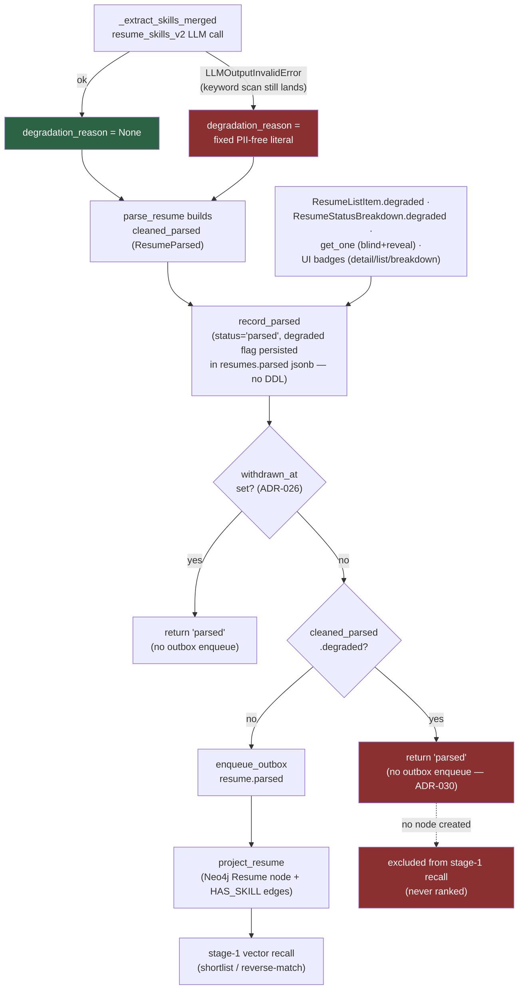

# ADR-030: Degraded-parse visibility (FU-7 §4, ADR-021 §4 implementation)

**Status:** Accepted — implemented, gate-green on branch `feat/fu7-degraded-parse-visibility`.
**Date:** 2026-08-02

## Context

ADR-021 scoped six decisions arising from the 2026-07-19/20 incident. Decision 3 ("honest résumé parse
status") shipped as [ADR-027](027-honest-resume-parse-status-fu7.md); decisions 2 and 6 ("fail-closed
ranking" and "empty-content detection") shipped as [ADR-029](029-fail-closed-ranking-fu7.md). **Decision 4
("degraded-parse visibility") was designed but deferred until now — this ADR implements it.**

The problem decision 4 exists to close, from ADR-021 §4's own incident record: on 2026-07-19, résumé SKILLS
extraction hit `LLMOutputInvalidError` for 10 of 16 résumés in a batch (`gpt-oss:20b` exhausted its token
budget on reasoning before emitting content). `_extract_skills_merged` caught the error and silently fell
back to the deterministic keyword-vocabulary scan — the résumé was still marked `status='parsed'` and later
ranked, on skills data that was quietly incomplete. Nothing distinguished this from a clean parse: not the
list view, not the résumé detail page, not the per-job status breakdown. The only way to find out was to
read worker logs for `parse_resume.skills_llm_failed`. This is documented in
`docs/process/ranking-metrics-explainer.html`'s "Two operational realities" section.

## Decision

When skills extraction falls back to the keyword scan, mark the résumé's parse **degraded**, PERSIST a
PII-free reason, make the degradation VISIBLE in every read surface, and EXCLUDE the résumé from ranking
until it is re-parsed — consistent with the ADR-029 fail-closed stance that a degraded result reaching human
eyes is worse than a plainly-absent one.

**Scope note (unchanged from ADR-021 §4):** "degraded" here means specifically the `resume_skills_v2`
`LLMOutputInvalidError` catch in `_extract_skills_merged`. Core-parse failure (already `status='failed'`,
ADR-027) and cover-letter failure (already non-fatal and silent by design — a résumé's parse must never fail
because its optional cover letter's LLM call did) are separate paths, out of scope here.

### Schema — rides the existing `resumes.parsed` jsonb, no DDL

`ResumeParsed` (`core/src/schemas/resumes.py`) gains two fields:

```python
degraded: bool = False
degradation_reason: str | None = Field(default=None, max_length=200)
```

Both are persisted verbatim in the existing `resumes.parsed` jsonb column — **no DDL change**. `extra` is
already `"ignore"` on this model, so a pre-feature row with neither key reads back `degraded=False`. Neither
field is PII: they flow through `ResumeOut` unredacted, under both blind and reveal.

`ResumeListItem` gains `degraded: bool = False`, read from the jsonb
(`COALESCE((parsed->>'degraded')::bool, false)`) so a degraded résumé is flagged in the LIST — the
incident's actual blind spot was the list looking complete.

`ResumeStatusBreakdown` gains `degraded: int = Field(ge=0)`, documented explicitly as a **sub-count of
`parsed`** (degraded ⊆ parsed), not a disjoint peer bucket like `withdrawn`: `parsed` keeps counting every
parsed row; `degraded` additionally reports how many of them fell back to the keyword scan. A job with 7
parsed résumés, 2 degraded, reports `parsed=7, degraded=2` — never subtracted out of `parsed`.

### Mechanism — `_extract_skills_merged` returns a reason, `parse_resume` threads it, projection is skipped

`_extract_skills_merged` (`core/src/worker/resume_tasks.py`) now returns
`tuple[list[ResumeSkill], str | None]` instead of a bare list. On the `except LLMOutputInvalidError` catch
around the `resume_skills_v2` call, it sets a **fixed, PII-free literal**:

```python
degradation_reason = "skills extraction failed (AI); using keyword-scan fallback"
```

This reason NEVER interpolates `str(exc)` — an upstream LLM response body can reflect résumé content back
verbatim (the same class of leak ADR-027 fixed for `failure_reason`), and `degradation_reason` lands in a
cleartext, blind-review-exposed column exactly like `failure_reason` does. The full exception is still
logged separately (`parse_resume.skills_llm_failed`), unchanged from before this ADR. On a clean LLM call
the reason is `None`.

`parse_resume` captures the reason and sets `ResumeParsed.degraded=(reason is not None)` /
`degradation_reason=reason` when building `cleaned_parsed`, so the flag survives the existing
`_drop_invalid_rows` lossy-cleaning pipeline into the persisted jsonb.

**Projection skip.** After `record_parsed` writes the row and after the pre-existing ADR-026
withdrawn-during-parse skip, a new check mirrors it exactly:

```python
if cleaned_parsed.degraded:
    log.info("parse_resume.degraded_skip_projection resume_id=%s", resume_id_str)
    return "parsed"   # persisted + visible, but NOT projected -> excluded from ranking
```

A degraded résumé is persisted (`status='parsed'`, `degraded=True`) and visible in every read surface, but
the `resume.parsed` outbox enqueue — the event that drives Neo4j graph projection — is **skipped entirely**.
No projection means no `Resume` node, which means no stage-1 vector-recall hit, which means the résumé
cannot be ranked. This is the same mechanism ADR-026 already uses for a withdrawn-during-parse race, applied
to a new trigger condition. No new task-status string is introduced — `parse_resume` still returns one of
`"parsed"` / `"missing"` / `"stale"` / `"failed"`; the résumé-status state machine (`uploaded` → `parsing` →
`parsed`/`failed`) is unchanged. A later successful re-parse (today: re-upload) runs the normal path and
projects.

The outbox payload's exclude-set (`_OUTBOX_PARSED_EXCLUDE`) explicitly drops `degraded`/`degradation_reason`
too, so a clean parse's projection payload stays byte-identical to before this ADR — the flag is a read-side
visibility surface, not a projection signal (a degraded résumé never reaches the enqueue call at all, so
this is defence-in-depth against a future refactor that moves the skip).

### Read layer (`core/src/services/resume_service.py`)

- `list_for_job` reads the `degraded` column via the same `COALESCE` and passes it into `ResumeListItem`.
- `status_breakdown` UNIONs a sixth `'degraded'` bucket row into the existing five-bucket
  `GROUP BY status` query: `count(*) WHERE status='parsed' AND withdrawn_at IS NULL AND
  COALESCE((parsed->>'degraded')::bool,false) IS TRUE`. The `withdrawn_at IS NULL` guard matters: a
  withdrawn-then-degraded résumé is already counted in the `withdrawn` peer bucket (via the `CASE WHEN
  withdrawn_at IS NOT NULL THEN 'withdrawn'` branch), so counting it again here would double-count it out of
  the degraded⊆parsed invariant.
- `get_one` needed no change — `ResumeOut.parsed` already carries the full `ResumeParsed`, so `degraded` /
  `degradation_reason` flow through under both blind and reveal (confirmed: neither is PII, neither is
  touched by the blind-masking path).

### Visibility surfaces (frontend)

- **Résumé detail** (`resume_detail.html`): a `pill-degraded` badge next to the status pill, plus a banner
  when `parsed.degraded` — `degradation_reason` (or a fixed fallback string) plus an explicit statement that
  the résumé is excluded from shortlists until re-parsed. Rendered unconditionally of blind/reveal state,
  the same way the withdrawal banner already is (`degraded` is not PII).
- **Résumé list rows** (`resumes_table.html`): a compact `pill-degraded` badge when `resume.degraded`, with
  a `title` tooltip explaining the fallback and the ranking exclusion.
- **Status breakdown widget** (`resume_status_breakdown.html`): the Parsed row shows an inline
  `(N degraded)` suffix, always rendered (even at zero) so the widget consistently names the surface — the
  same pattern the withdrawn row already established.

### Ranking exclusion — verified, not new scoring code

Exclusion is entirely a consequence of the projection skip above (no Neo4j node → no stage-1 recall
candidate → never reaches stage 2–4). A new integration test
(`core/tests/integration/test_resume_degraded_excluded_from_shortlist_pg.py`) seeds one degraded résumé and
one clean résumé against the same job, projects both through the real path, generates a shortlist against a
real Postgres+Neo4j, and asserts only the clean résumé appears. Scoring math is byte-unchanged — the eval
corpus has no degraded fixtures, so `ranking-evals` stays green trivially, same as ADR-029's precedent.

## Architecture Diagram (Mermaid)



## Consequences

- A résumé whose skills extraction silently degraded is now visible everywhere a recruiter looks — the list,
  the detail page, and the per-job status breakdown — instead of only in worker logs. The incident's
  specific blind spot (10 of 16 résumés looked complete and ranked worse than they should have, invisibly)
  cannot recur unnoticed.
- A degraded résumé is excluded from every shortlist/reverse-match until it is re-parsed. This trades
  short-term pool completeness for not silently ranking on incomplete skill data — the same tradeoff
  ADR-029 already made for a whole-shortlist LLM failure, applied here at résumé granularity.
- `resumes.parsed`'s jsonb shape gained two keys with no DDL migration and no schema-version bump needed —
  `extra="ignore"` plus field defaults make old rows and new rows both read correctly.
- The outbox/projection payload is unaffected for a clean parse (byte-identical to before this ADR); a
  degraded parse simply never reaches the enqueue call.
- `docs/process/ranking-metrics-explainer.html`'s "Two operational realities" section's partial-parse
  paragraph, which described this exact gap as unresolved ("no way to distinguish this from a clean parse
  without reading the server logs"), is now stale and updated alongside this ADR.

## Accepted residuals (non-blocking, recorded not fixed)

- **No in-place re-parse route this slice.** `parse_resume` only claims `uploaded`/`parsing` rows
  (`_PARSEABLE_STATUSES`); a degraded résumé is already `status='parsed'`, so nothing today re-enqueues it.
  The only way to re-attempt a degraded résumé's parse is to **re-upload** it (a new résumé row, new parse
  attempt). A dedicated `POST /resumes/{id}/reparse` — resetting status to `uploaded`, re-enqueuing
  `parse_resume`, and un-projecting any stale Neo4j node first (there shouldn't be one, since degraded rows
  are never projected, but a defensive un-project guards a future code path that changes that) — is a
  natural follow-up, deliberately not built here.
- **Degraded scoping is skills-extraction only.** A core-parse failure already routes to `status='failed'`
  (ADR-027) and is excluded from ranking by virtue of never reaching `parsed` at all. A cover-letter
  extraction/LLM failure is non-fatal by design and does not set `degraded` — a résumé's parse must never
  fail, or be marked degraded, because its optional cover letter's LLM call did. If cover-letter-specific
  visibility is wanted later, it needs its own decision (a cover letter is optional; résumé skills are not).
- **A withdrawn-then-degraded résumé is counted once, in `withdrawn`, not `degraded`.** The
  `status_breakdown` SQL's `withdrawn_at IS NULL` guard on the degraded UNION branch means a résumé that was
  both degraded and later withdrawn shows only in the `withdrawn` peer bucket, consistent with `withdrawn`
  already being computed independently of `status` for every other bucket in the same query.

## Alternatives Considered

- **Rank on incomplete skills but mark the ranking degraded (rank-but-mark)** — rejected. This is the same
  choice ADR-021 §4 made at design time and ADR-029 reaffirmed for the whole-shortlist case: a degraded
  result that still reaches a recruiter's shortlist risks being read as a genuine (if middling) score, not a
  technical caveat. Consistency with the fail-closed posture already shipped for LLM ranking failures argued
  for exclusion here too, at résumé granularity.
- **A new résumé status value (e.g. `'degraded'`) instead of a jsonb flag on the existing `'parsed'`
  status** — rejected. `resume_status` already carries the parse-lifecycle meaning (uploaded/parsing/
  parsed/failed); degradation is an orthogonal *quality* axis on an already-`parsed` row, not a new
  lifecycle state — the same reasoning ADR-026 and ADR-029 already used to reject new enum values for
  `withdrawn` and `awaiting_llm` respectively. A jsonb-only flag also avoided any DDL change.
- **Build the dedicated re-parse route in this slice** — rejected for scope; the spec explicitly deferred it
  as a follow-up, and re-upload is a working (if less convenient) escape hatch today. Building it would also
  need its own security pass (who may re-parse, whether it should un-project a stale node defensively) that
  is better done as its own reviewed change.
- **Interpolate the caught exception into `degradation_reason` for operator convenience** — rejected on the
  same PII-at-rest reasoning ADR-027 already established for `failure_reason`: `degradation_reason` is a
  cleartext, blind-review-exposed column, and an upstream LLM response body can echo résumé content back
  verbatim. The fixed literal plus the separately-logged full exception preserves debuggability without the
  leak surface.

## Cross-references

ADR-021 §4 (source scoping, now implemented here); ADR-029 (the fail-closed precedent this ADR's exclusion
mirrors, and the `degradation_reason` PII-free-by-construction pattern shared with `failure_reason`);
ADR-026 decision 1 (the withdrawn-during-parse projection skip this ADR's degraded skip mirrors verbatim);
ADR-027 (the `failure_reason` cleartext-at-rest precedent `degradation_reason` follows);
`docs/process/ranking-metrics-explainer.html` "Two operational realities" (the gap this ADR closes).
