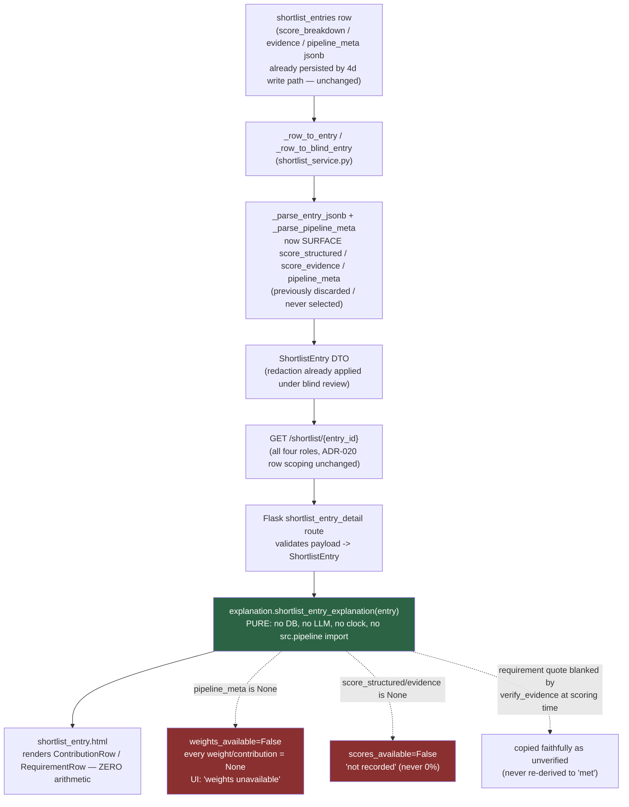

# ADR-031: "Why this rank?" defense pack, slice 1 (ROADMAP card #1)

**Status:** Accepted — implemented, gate-green on branch `feat/why-this-rank-defense-pack`, HEAD `637c6bd`.
**Date:** 2026-08-04

## Context

`docs/ROADMAP.md` card #1 pitches a per-candidate "defense pack": one click on a shortlisted candidate
opens a plain-language explanation of why they rank where they do — each sub-score's contribution to
`score_final`, the verified evidence quotes per requirement, and (as a later slice) an exportable
decision-rationale record. The card's own "First slice" note scoped this down to "a deterministic score
composition + verified evidence panel on the shortlist entry page (no LLM)".

Everything this slice renders was already computed and persisted by the existing 4-stage matching engine
and 4d write path: `shortlist_entries.score_breakdown` / `evidence` / `pipeline_meta` jsonb
(`core/src/models/ddl.py:194-207`). Nothing about ranking was missing — what was missing was a read surface
that showed the arithmetic and the evidence honestly, using the weights that actually produced the number
on screen.

**Scope, stated up front:** no LLM, no DDL change, no scoring-math change. This ADR records a display-only
addition and the honesty rules that govern it.

## Decision

Ship the deterministic score-composition + verified-evidence panel on the shortlist entry detail page
(`GET /shortlist/<uuid:entry_id>` in the Flask workflow UI), single-sourced from one new pure function, and
make every "we don't actually know this" case say so instead of inventing a plausible-looking number.

### Mechanism

- `ShortlistEntry` (`core/src/schemas/matching.py`) gains `score_structured` and `score_evidence`
  (`float | None = Field(default=None, ge=0, le=1)`), plus `pipeline_meta: PipelineMeta | None`, mirroring
  the shape `JobMatchEntry` already had for the reverse-match direction.
- The read path previously **discarded** the first two fields: `_parse_entry_jsonb`
  (`core/src/services/shortlist_service.py`) popped `score_structured`/`score_evidence` off the
  `score_breakdown` jsonb before validating it (`ScoreBreakdown` is `extra="forbid"`, so they had to be
  removed to validate at all), and `pipeline_meta` was never selected on the blind read path. Both are now
  surfaced — on the blind path (`_row_to_blind_entry`) and the non-blind path alike.
- A new pure, display-only module, `core/src/services/explanation.py`, exports
  `shortlist_entry_explanation(entry: ShortlistEntry) -> ShortlistExplanation`. No DB, no LLM, no clock, no
  randomness, and no import from `src.pipeline` — every number it emits is read verbatim off the DTO, or is
  the product of two numbers read verbatim off the DTO.
- The Flask route (`core/frontend/app.py::shortlist_entry_detail`) validates the raw API payload into a
  `ShortlistEntry` and calls that one function; `shortlist_entry.html` performs **zero arithmetic** — it
  renders the `ContributionRow`/`RequirementRow` fields the function already computed.

**This single-sourcing was a review finding and is load-bearing.** The first implementation mirrored the
`weight * score = contribution` arithmetic a second time in Jinja, which meant the mutation-provable test
suite was only guarding a function the user never sees — a template could silently drift from the function
without any test catching it. Moving the arithmetic into `explanation.py` and having the template render
only its output was proven, by mutation, to close that gap: corrupting `explanation.py` now fails a
frontend-level test, because the template has nothing left to compute independently.

### The honesty decisions

These are the substance of this ADR.

1. **Weights come from `entry.pipeline_meta.weights`, never from current settings or `DEFAULT_WEIGHTS`.**
   `pipeline_meta` is the reproducibility stamp recorded at the moment this specific row was generated
   (ADR-010). The panel uses that stamp's weights and only that stamp's weights. Explaining a historical
   score with today's weights would present fabricated arithmetic as an audit trail — and this matters more,
   not less, once ROADMAP card #3 (Policy Studio) potentially makes weights tunable: a shortlist ranked
   under one weight profile must never be re-explained under a different one.
2. **No `pipeline_meta` means `weights_available=False`, and every weight/contribution on the panel is
   `None`** — never a silently substituted default. This covers a legacy row generated before `pipeline_meta`
   existed, or one whose stamp could not be read back. The raw sub-scores (which came off the row itself,
   not off the stamp) are still shown; only the weighted arithmetic is withheld. The UI states "weights
   unavailable" rather than rendering a number that looks authoritative but was invented.
3. **A malformed stamp is treated as unavailable, never resurrected as `DEFAULT_WEIGHTS`.** This was a
   *surviving mutant* the reviewer found: the invariant ("an unreadable stamp must not fall back to
   defaults") was stated in `_parse_pipeline_meta`'s docstring and, at the time, enforced by nothing —
   a mutant that substituted `DEFAULT_WEIGHTS` on a parse failure still passed the suite. It is now enforced
   by a dedicated test asserting a malformed `pipeline_meta` jsonb value parses to `None`, not to defaults.
4. **An unrecorded sub-score renders "not recorded", never an affirmative "0%" — and, symmetrically, a
   genuine `0.0` renders as "0", never as "not recorded".** `score_structured`/`score_evidence` are `None`
   on a pre-4d row or one whose folded value was unreadable; "this candidate scored 0% on structured" would
   be a positive false claim about a real candidate, so the panel says "not recorded" instead. The second
   direction was itself a *surviving mutant* introduced by the fix for the first: an implementation that
   special-cased "falsy means not recorded" (`if not score`) rather than "`is None` means not recorded" would
   also swallow a real `0.0`. Both directions are now guarded by tests. This matters in practice, not just in
   theory: `_motivation_score` returns `0.0` for every candidate who submitted no cover letter, so a genuine
   zero is the common case, not an edge case.
5. **Anti-fabrication verdicts are copied faithfully off `entry.evidence.requirements`, never re-derived.**
   A requirement whose quote `verify_evidence` blanked (status demoted `met` → `missing`, `evidence` set to
   `""`, confidence capped at `SCRUBBED_CONFIDENCE_CAP`) is rendered exactly as the DTO already states it —
   unverified — never re-evaluated by this module into "met". `explanation.py` has no code path that inspects
   a quote's content or recomputes a verdict; it only copies the seven `RequirementRow` fields off the
   corresponding `RequirementEvidence`.

### Direction boundary (ADR-009 residual, unchanged)

The panel is **forward-only**: it explains a forward-shortlist ranking against a job's requirements. Reverse
-match `score_final` tops out at 0.9 under default weights because `rank_job_matches` omits the motivation
term (ADR-009's own residual, still open) — a shared panel would silently mislabel the two scales as
comparable when they are not. `shortlist_entry_explanation` is named for, and only accepts, a
`ShortlistEntry`; it does not accept a `JobMatchEntry`. Extending an equivalent panel to reverse-match is
unscoped future work, and ADR-009's residual stays open there until that happens.

### Privacy

The panel consumes only the already-redacted DTO. The redaction boundary is **server-side**, inside
`shortlist_service._row_to_blind_entry` (ADR-006 §4, ADR-011) — `explanation.py`'s own module docstring
states it may never open a connection or re-read `resumes.parsed` to reach around the DTO.

Record the security review's finding on this honestly: the *original* black-box HTML PII scan for this
panel was **inert**. It planted PII only in extra top-level keys the redaction whitelist already drops, and
it monkeypatched the API client — so the test never actually drove a request through the server-side
redaction boundary at all, and it still passed with that boundary hypothetically removed. It was replaced
with `test_entry_detail_real_blind_read_renders_no_pii`, which drives a raw-PII row through the *real*
`_row_to_blind_entry`, round-trips it through `model_dump_json()` the same way the API response does, and
renders the page — and which kills both known redaction mutants (M1 and M2). No live PII leak ever existed
in this feature; the server-side boundary was mutation-proven throughout. The gap was in the test's ability
to prove that, not in the boundary itself.

## Architecture Diagram (Mermaid)

## Consequences

- A recruiter or auditor opening a shortlist entry now sees the actual weighted arithmetic behind
  `score_final`, plus every requirement's verified quote and status, instead of an opaque number — the
  literal "evidence-backed ranking" payoff the ROADMAP card names.
- The panel can never show numbers that misrepresent what is known: a legacy or malformed row degrades to
  explicit "unavailable"/"not recorded" states rather than plausible-looking substitutes.
- `pipeline_meta` (the full reproducibility stamp: `model_gen`, `model_emb`, `prompt_versions`, `git_sha`,
  `timings_ms`, `weights`) is now serialized on every shortlist list entry and the detail response, to all
  four roles — a payload-shape and disclosure change with its own accepted-residual entry below.
- Scoring, persistence, and the outbox/projection paths are byte-unchanged; this slice is read-only.
- Extending an equivalent panel to reverse-match, and the optional grounded-LLM narrative + PDF/record
  export named in the ROADMAP card as slice 2, remain future work.

## Accepted residuals (non-blocking, recorded not fixed)

- **PipelineMeta disclosure (security finding 2, Low, accepted).** The full `PipelineMeta` object is now
  serialized to all four roles (`admin`/`recruiter`/`hiring_manager`/`auditor`) on both
  `GET /shortlist/{entry_id}` and every entry of `GET /jobs/{job_id}/shortlist`. Previously the full stamp
  was gated to admin/recruiter reads; other roles saw only `git_sha[:12]` via the export. Accepted because:
  none of the six fields is PII; `PipelineMeta` is `extra="forbid"`; nothing in it is rendered into HTML
  unescaped; this is an offline app; and the reproducibility trail is the explicit point of an auditor-facing
  defense pack. Optional later hardening, not done here: truncate to `git_sha[:12]` for parity with the old
  export gating, or gate `prompt_versions`/`timings_ms` specifically.
- **Payload growth.** `pipeline_meta` now rides every entry of the shortlist list response
  (roughly 200-400 bytes/entry); no detail-only response model was split out for slice 1.
- **Backend read path validates uncaught (security N-3, unreachable today).** The new `ge=0, le=1` bound on
  `score_structured`/`score_evidence` is a genuinely new rejection surface. Proven unreachable in practice —
  `_evidence_completeness` is `∈ [0, 1]` for every `MatchWeights` the model accepts, checked exhaustively and
  over all 20 corpus fixtures — but a hand-corrupted row would still raise a `ValidationError` **uncaught** on
  the API read path (`_row_to_entry`/`_row_to_blind_entry`; the Flask frontend route degrades gracefully via
  its own `try/except ValidationError`, the backend API route does not). This joins a pre-existing family of
  uncaught read-path validates in `shortlist_service.py`; see the source-comment fix in this same change for
  the precise wording of where the fallback actually lives.
- **N-1 corpus finding (carried forward, not from this branch).** `ranking-evals` surfaced a pre-existing
  corpus defect present identically on `main`: the `skill_missing_must` ordering pair is inert against
  `weights.skill = 0`. Recorded in `core/tests/evals/README_4c_twins.md` (§4 addendum) as a follow-up owned
  by the corpus owner, not by this ADR.
- **Slice 2 deferred.** The optional grounded-LLM narrative (which would need to be gated by the same
  `verify_evidence` anti-fabrication discipline so it can only reference verified quotes) and the PDF /
  timestamped decision-rationale export named in the ROADMAP card are **not** in this slice.

## Alternatives Considered

- **Recompute the contribution arithmetic in the Jinja template** — rejected (and was in fact the first
  implementation, then reverted after review). Duplicating `weight * score = contribution` in two places
  means the mutation-provable unit tests only guard the copy nobody looks at; single-sourcing in
  `explanation.py` is what let mutation testing prove the template can't silently drift from the honesty
  rules.
- **Fall back to `DEFAULT_WEIGHTS` when `pipeline_meta` is missing or malformed** — rejected. A weight the
  candidate was never actually ranked against would produce arithmetic that looks like an audit trail but
  isn't. Every fallback path in this feature says "unavailable" instead.
- **Render a `0` when a sub-score was never recorded** — rejected as a positive false claim about a real
  candidate ("this person scored 0%"); "not recorded" is the true statement, and the module makes only the
  claim it can support.
- **Build a shared explanation helper for both forward-shortlist and reverse-match** — rejected for this
  slice. The two directions' `score_final` scales are not comparable (ADR-009), and a helper honest about
  that difference is more scope than "no scoring-math change, no new component" calls for; forward-only,
  named accordingly, is the narrower and more honest cut.
- **Add a detail-only response model that omits `pipeline_meta` from the list route to limit payload
  growth** — deferred, not rejected outright; the accepted residual above records it as available future
  hardening rather than a blocker for this slice.

## Cross-references

ADR-006 §4 / ADR-011 (the server-side redaction boundary this panel's PII decision relies on and does not
reopen); ADR-009 (the reverse-match `score_final` scale mismatch this panel's direction boundary defers to);
ADR-010 (the `pipeline_meta` reproducibility stamp this panel's weight-honesty rule reads from);
`docs/ROADMAP.md` card #1 (the feature pitch and slice split this ADR implements slice 1 of);
`core/tests/evals/README_4c_twins.md` (the carried-forward N-1/N-2 corpus findings surfaced by this
change's `ranking-evals` run, owned separately from this ADR).
