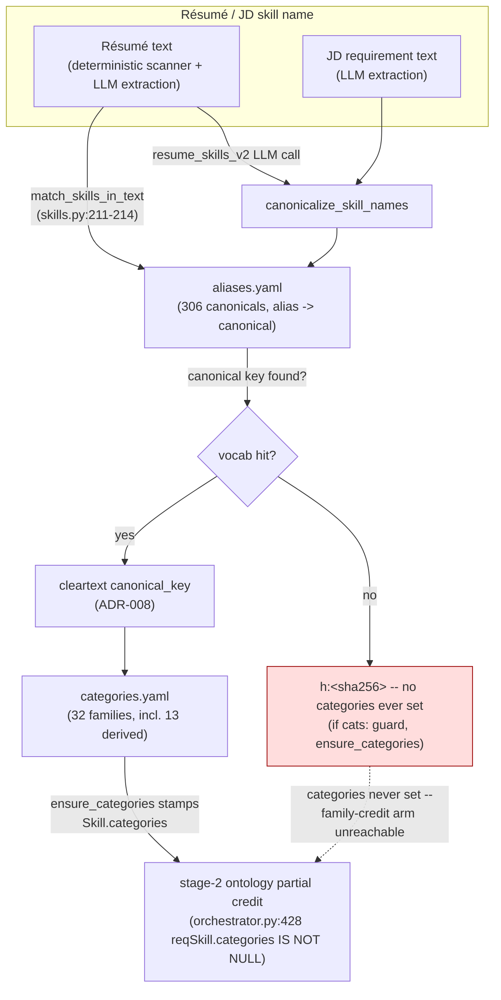

# ADR-042: Skill vocabulary — merge the derived domain families (`feat/a2-vocabulary-families`)

**Status:** Accepted (closes ROADMAP.md A2 — the vocabulary half; the competency-scoring model stays
deferred, see below)
**Date:** 2026-08-14

## Context

ROADMAP A2 was framed for a week as "the vocabulary is too small." Measured against 1,802 real SFU
canonical job descriptions (9,176 qualification statements, 1,222 distinct titles, 449 departments), the
shipped 72-canonical vocabulary — a software-engineering ontology (`javascript`, `react`, `docker`,
`kafka`…) — recognised only **15.6%** of real qualification statements. The real problem was not size, it
was domain: SFU postings are overwhelmingly administrative, academic and professional-services work, and
the vocabulary was built for IT postings.

The fix already existed. `docs/process/skill-vocabulary/derived-families.yaml` was produced from the same
corpus in PR #69 — 13 families, 234 terms, each member selected because it clears a frequency floor in the
real qualification-statement text (`financial administration` 65 occurrences, `budgeting` 183, `student
services` 92, and so on) — but was never merged into the two files the matching pipeline actually reads. It
sat as a derivation with no consumer. This ADR is the merge, not a new derivation.

## Decision

### 1. Merge 234 terms / 13 families into both shipped vocabulary files

`core/src/pipeline/skill_data/categories.yaml`: 19 families → **32** (13 new: `finance`,
`student_affairs`, `academic_programs`, `research_admin`, `human_resources`, `communications`,
`governance_policy`, `leadership_management`, `analysis_reporting`, `equity_indigenous`,
`facilities_operations`, `interpersonal_core`, `health_wellness`). `core/src/pipeline/skill_data/aliases.yaml`:
72 canonicals → **306**. Measured coverage of the same 1,802-JD corpus: **15.6% → 54.8%**, a +39.2-point
gain. The remaining 45.2% is a genuine long tail (MRI/MEG methods, microfabrication, study-permit
requirements, other role-specific knowledge) that needs the Phase 3.3 projection-time classifier, not more
curation.

**Both files, not just `categories.yaml`, and this is deliberate, not redundant.** `categories_for()`
(`skills_graph.py:353-355`) reads `categories.yaml` alone and stamps a Skill node with its family, which is
what stage-2 ontology partial credit reads. But the deterministic résumé free-text scanner
(`match_skills_in_text`, `skills.py:211-214`) reads **only** `aliases.yaml`. A term present in
`categories.yaml` but absent from `aliases.yaml` gets a cleartext canonical key if a JD names it, but is
**never found in a résumé's free text** — the coverage gain this merge exists to deliver would not
materialise for résumés at all, only for JD-side requirement extraction. This is not hypothetical: the nine
terms that were already shipping before this branch (`collaboration`, `leadership`, `mentoring`, `project
management`, `problem solving`, `stakeholder management`, `teamwork`, `time management`, `curriculum
development`) were all categories-only for exactly this reason, and this merge adds them to
`aliases.yaml` too (`categories.yaml` accumulates families rather than replacing — a term keeps its old
family and gains the new one; pinned by `test_already_shipping_term_accumulates_its_new_family_without_losing_the_old`).

### 2. The competency-scoring decision — deferred, and why deferral doesn't gate this

Many derived terms are competencies (communication, leadership, problem-solving), not named tools. The
scorer's `years × recency × ontology_weight` model is semantically odd for "three years of interpersonal
skills, last used 2024." Three options were on the table (score competencies on a different model; exclude
them from must-have penalties; decide per-competency as curated) and none was chosen.

**It does not need to be chosen for this merge to ship, because adding a term is strictly better than the
status quo under every one of those options.** Today, an out-of-vocabulary competency is hashed by ADR-008:
`ensure_categories` only runs Cypher when `categories_for()` returns a non-empty list (`skills_graph.py:363-364`,
`if cats:`), so a hashed skill's `categories` property is never set — stage 2's family-credit arm requires
`reqSkill.categories IS NOT NULL` (`orchestrator.py:428`) and is unreachable for it. The skill scores `0.0`
unless the résumé happens to contain a byte-identical normalised string, **and** every `REQUIRES` edge is
written `must=True` (`tasks.py:264`), so it also trips the ×0.5 `must_have_miss_penalty`. After the merge, a
candidate who genuinely has the competency matches and stops being penalised. There is no configuration of
the still-undecided scoring model in which the pre-merge behaviour was preferable. The model question is
real and should still be revisited with pilot data — this is a deferral, not an answer.

### 3. `rest api design` (with `c++`, `hudson`, `julia`) stays family-less, and this is now test-enforced

These four canonicals must never be given a family, before or after this merge —
`test_gate_critical_canonical_stays_familyless` (`core/tests/unit/test_skill_vocabulary_families.py:194`)
pins it. `rest api design` is the load-bearing one: the `skill_missing_must` ordering pair
(`r01_casey_rivera` vs `r18_casey_rivera_missing_must_have`, `thresholds.toml:402`) isolates a genuinely
missing must-have skill, and the pair's designed gap depends on `rest api design` carrying an unambiguous
`ontology_weight = 0` when absent — no family credit at all. Measured directly: putting `rest api design`
into a family collapses the pair's gap from **0.1489 to 0.0289** — an **80% collapse** — and the ordering
pair still technically *passes* (`r01` still outranks `r18`), so the gap shrinking to near-nothing would not
itself fail the gate. Only two assertions would catch a regression here:
`_assert_must_have_penalty_fires_on_r18` (which checks the penalty mechanism is armed at all) and this
branch's new `test_gate_critical_canonical_stays_familyless` (which checks the specific term). Before this
branch, the second of those two did not exist — a well-intentioned "give REST API design a family, it's a
real skill" edit would have shipped silently.

## The cap regression

The most transferable finding in this branch, and worth its own section because it was not caused by
touching scoring logic at all — it was caused by the vocabulary getting *bigger*.

`_MAX_SKILLS = 80` in `src/worker/resume_tasks.py` mirrored `ResumeParsed.skills`'s own `max_length=80`
schema cap. With a 72-canonical vocabulary, the deterministic free-text scanner could name at most 72
distinct skills, so the 80-cap was **unreachable by construction** — nothing stated that invariant anywhere,
and nothing enforced it, because nothing needed to: the two numbers happened to make the cap a no-op.

At 306 canonicals that stops being true. An ordinary administrative résumé's deterministic scan can exceed
80 hits on its own (a reproducing test fixture, `test_extract_skills_merged_trailing_technical_skills_survive_admin_overflow`,
builds 100 filler administrative terms plus 6 trailing technical ones — 106 total — to demonstrate the
failure mode; a real résumé's exact count will vary with its vocabulary density). Under the pre-fix code
(deterministic scan ordered *before* the LLM-extracted skills, capped at 80), a résumé with a trailing
`TECHNICAL SKILLS` section — a common layout — had that section truncated away entirely: the scan filled all
80 slots on administrative terms before ever reaching `python`, `docker`, `airflow`, `kubernetes`. The
recruiter is then shown a candidate lacking a skill their résumé plainly lists, on exactly the résumé
population this branch exists to serve.

Fixed in `_extract_skills_merged` (`resume_tasks.py:104,247-254`) two ways together — neither alone is
sufficient:
1. **LLM-extracted skill names are merged first, the deterministic scan second**, before the cap is
   applied. The LLM half carries `years`/`last_used_year` (recency-scoring input the scan can never
   recover — it only matches a bare vocabulary term against text), so it is the strictly richer half and
   must never be the one a cap truncates.
2. **`_MAX_SKILLS` raised from 80 to 400** — above the 306-canonical vocabulary with headroom, so the
   deterministic scan itself can never be the thing that gets truncated away by an undersized cap again.
   `ResumeParsed.skills`'s own `max_length` was raised to 400 in step with it, so nothing downstream
   silently drops rows the merge already capped correctly.

Reordering alone would not have been enough — the LLM does not see every scanner-only technical term, so a
résumé whose only mention of `airflow` is a bare word in a skills list still needs the raised cap to survive.

**On why the reorder is still part of the fix — stated correctly, because an earlier draft of this ADR got it
wrong.** That draft claimed a résumé with more than 400 administrative scan hits would truncate the LLM half
under the old ordering. That is **impossible by construction**, and this ADR disproves it two paragraphs
above: `match_skills_in_text` returns deduplicated canonicals drawn from the alias table, so the scan can
name at most **306** distinct skills at today's vocabulary — it cannot produce 400 hits at all. The contrast
with the original defect is exactly arithmetic: 306 > 80 made that failure *reachable*, whereas 306 < 400
makes this one *unreachable*. Pleading rarity does not rescue an impossibility.

The reorder earns its place for two other reasons. It is the **correct precedence** — the years-bearing half
is strictly richer and should never be the half a cap sacrifices, independent of whether a cap currently
bites. And it is the **guard for future vocabulary growth**: `aliases.yaml`'s header already plans a further
spelling-recall pass, and the cap-versus-vocabulary coupling is now test-enforced precisely because the next
few hundred canonicals would otherwise re-arm the original defect against a green suite.

**One second-order effect of the reorder, worth knowing.** `_build_summary_text` embeds `parsed.skills[:30]`
(`resume_tasks.py:962`), so merge order decides *which* 30 skills enter the résumé vector that feeds stage-1
coarse recall. Net this is an improvement — the vocabulary merge alone would have flooded those 30 slots with
administrative filler and evicted `python` — but a scanner-only skill the LLM did not name can now fall out
of the embedded text where previously it could not, if the LLM returns 30 or more names. Bounded, because
stage-2 skill scoring reads `HAS_SKILL` edges, which are complete regardless of the embedding slice. The eval
corpus is blind to it: the worst merged skill count across all 20 fixtures is **9**, against a 30-slot slice.

**The existing pre-branch test for this cap, `test_extract_skills_merged_is_capped_at_400`'s predecessor,
mocked the scanner and asserted only that truncation happened at 80 — never that a real, specific skill
survived it.** A test that only proves "the cap is enforced" cannot distinguish a correctly-ordered cap from
one that truncates the wrong half; it took a merge-blocking review to notice the survivorship gap, not the
original test suite.

## Architecture Diagram (Mermaid)

The diagram makes the "why both files" decision visible: a term only reaches `categories.yaml`'s family
credit if it first resolves through `aliases.yaml`'s cleartext path — a categories-only term never gets a
chance to be found in résumé text at all.

## Consequences

- Real-SFU-postings coverage of qualification statements rises from 15.6% to 54.8%. The remaining 45.2% is
  a long tail the Phase 3.3 classifier still needs to address; this merge does not reduce that scope, it
  narrows what is left in it.
- The competency scoring model (`years × recency × ontology_weight`) is unchanged and still semantically odd
  for a competency. This is a known, accepted gap — not resolved by this branch — pending pilot data.
- `_MAX_SKILLS` moved from 80 (silently unreachable) to 400 (headroom above the 306-canonical vocabulary).
  `ResumeParsed.skills.max_length` moved with it. A résumé with more than 400 distinct skills is still
  truncated, now on `years`/`last_used_year`-bearing LLM-extracted names last rather than the deterministic
  scan first.
- `rest api design`/`c++`/`hudson`/`julia` remain family-less, and a future attempt to give any of them a
  family will fail `test_gate_critical_canonical_stays_familyless` rather than silently shrinking an
  ordering-control gap.
- The evals corpus does not exercise any of the 13 new families — see ROADMAP A3, "the eval corpus is
  structurally blind to this entire change." A green `./scripts/verify.sh all` on this branch is not
  evidence this merge scores correctly; it is evidence it did not break the pre-existing 19-family, 72-term
  surface the corpus does cover.

## Alternatives Considered

- **Wait for the competency-scoring decision before merging any vocabulary.** This was the operating
  assumption for roughly a week before this branch and cost real time — see ROADMAP's "why this stopped
  being a blocker." Rejected once it was checked directly: every option under consideration for scoring
  competencies is an improvement over the pre-merge `0.0`-and-penalised status quo, so the scoring question
  does not need an answer to know the vocabulary merge is net-positive.
- **Merge only into `categories.yaml`.** Rejected — confirmed by direct inspection that the deterministic
  résumé scanner reads only `aliases.yaml`; a categories-only merge would extract the terms from JDs but
  never find them in résumé text, which is most of the value this merge is for.
- **Give `rest api design` a family since it plausibly belongs in `backend`/`devops`.** Rejected — it is the
  one canonical the `skill_missing_must` ordering control depends on staying at an unambiguous
  `ontology_weight = 0`. Measured cost of doing it anyway: an 80% collapse of that pair's gap. If this
  canonical is ever given a family, the ordering control needs a different fixture pair first.
- **Raise `_MAX_SKILLS` without reordering LLM-before-scan.** Rejected — the scan-first ordering was the
  actual cause of the reproduced failure (a large administrative scan filling the cap before the technical
  section is reached); raising the cap alone leaves the ordering defect in place for any résumé whose scan
  hits still exceed the new, larger cap.
