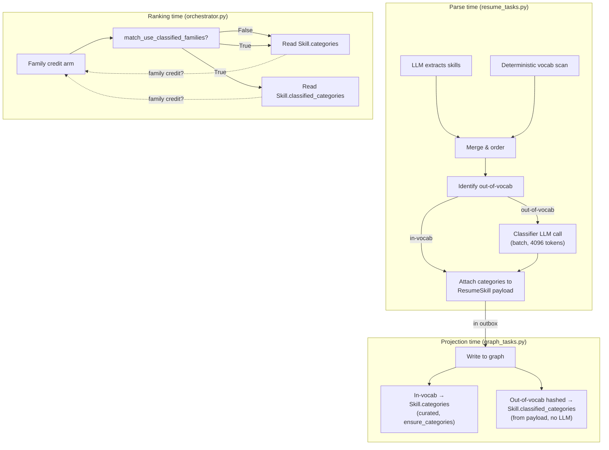

# ADR-044: Parse-time skill-family classifier for out-of-vocabulary names (`feat/skill-family-classifier`)

**Status:** Accepted (closes ROADMAP A2 Phase 3.3, slice 1 — classify out-of-vocab skills at parse time to prevent irreversible loss; the decision to enable ranking with classified families is deferred)
**Date:** 2026-08-19

## Context

Skills outside the 306-canonical vocabulary are hashed one-way at projection by [`skills_graph._canonical_key_for_normalised`](../../core/src/pipeline/skills_graph.py#L286) and can never earn family credit: `ensure_categories` only writes a Skill node's `categories` when `categories_for()` returns a non-empty list (`skills_graph.py:363-364`), and a hashed skill's key is not in that lookup table. This means:

- **Hashed skill case:** the résumé-extracted phrase is irreversibly discarded, the skill scores `0.0` with `reason="missing"`, and the ×0.5 `must_have_miss_penalty` fires.
- **Curated in-vocab case:** the phrase finds a `categories.yaml` family, earns family credit, might pass a requirement the candidate actually has.

The hash is one-way by design (ADR-008: "the résumé side never calls the LLM at projection"). But **out-of-vocabulary skills are a choice the hash makes permanent** — once a résumé projects without classification, every future projection of the same phrase stays hashed. ROADMAP A2 puts **45.2% of real SFU qualification statements** in this category; they are lost irreversibly at every projection after parse.

## Decision

### 1. Classify at parse time, not projection

The résumé skills LLM call already happens in `_extract_skills_merged` (`resume_tasks.py:247-293`), and there is no drain deadline there (unlike the 4-second budget at projection, `settings.py`'s `outbox_max_skill_resolutions_per_drain`). A second LLM call at parse is feasible; a per-skill call at projection is not.

**The design ensures ADR-008's invariant stays intact by construction, not merely by discipline:** `Skill.classified_categories` is a separate property from the curated `Skill.categories`, and projection itself makes **no LLM call**. It only writes whatever the parse-time classifier attached to the outbox payload. The call site is fixed to one place (parse); the off-path is provably inert (a Cypher parameter gates it).

### 2. Conservative by construction

The classifier module ([`skill_classifier.py`](../../core/src/pipeline/skill_classifier.py)) is built to fail safely:

- **A family the model invents (not in `known_families()`) is dropped.** The result is `None` (absent from the return dict), which is identical to today's pre-feature behaviour for that skill.
- **No confident answer → the skill's key is ABSENT from the result.** An explicit empty list or a name the model never addressed both mean "no family assigned", never returned as `[]` in the result.
- **At most `_MAX_FAMILIES_PER_SKILL = 2` families per skill.** Family credit is transitive across the whole résumé (`orchestrator.py` matches ANY résumé skill in a family), so unbounded breadth would amplify false credit.
- **Only called on `unclassified_names()` output** — in-vocab canonicals are structurally unreachable, never merely untested.
- **Best-effort, never fatal:** Any LLM failure (transient error, schema-invalid output, even a stray `ValidationError`) yields an empty result. The résumé parse continues and succeeds. Logs are count-only; a skill name is never interpolated into a log line ([`validation_error_digest`](../../core/src/pipeline/llm.py) is used for `pydantic.ValidationError` specifically because v2's `str(ValidationError)` embeds the offending value).

### 3. The flag: `match_use_classified_families`, default `False`

The classifier writes its assignments to `Skill.classified_categories` (in Neo4j), and scoring reads this property only when `match_use_classified_families=True`. The flag is:

- **A real Cypher parameter** ([`orchestrator.py:458`](../../core/src/pipeline/matching/orchestrator.py#L458)), so the off-path is provably inert: `($use_classified AND c.classified_categories IS NOT NULL AND ...)` folds entirely to `false` when the flag is `False`, regardless of what's on the graph.
- **Threaded explicitly through `MatchingContext`** ([`settings.py:213`](../../core/src/settings.py#L213), `matching_context.py`) so the decision is visible and deliberate.
- **Default `False`,** until the accuracy measurement and shared-node problem are resolved (below).

## The live measurements

The work included a live probe against the real tailnet `gpt-oss:20b` because the unit suite mocks the LLM entirely and cannot detect some failure modes. Two defects were found invisible to all 5,387 unit and 524 integration tests:

### Defect 1: `_CLASSIFY_MAX_TOKENS = 1024` was a silent no-op

At `max_tokens=1024`, the model's discarded reasoning trace consumed the entire budget ([ADR-021 §6](021-llm-output-validation-retry-only-json.md) — `think:false` does NOT reliably suppress it on `gpt-oss:20b` on either path). The JSON content came back empty, and the classifier assigned **0 of 6 real out-of-vocabulary skills.**

At `max_tokens=4096`, all **6 of 6** were assigned. This defect was completely invisible to every gate the repo runs — tests passed, coverage was high, the feature worked perfectly in the test environment — because the test harness mocks `llm.chat_json` wholesale. Raised to `4096` ([`skill_classifier.py:76`](../../core/src/pipeline/skill_classifier.py#L76)); the value is a **reviewed constant, not a deploy knob**, per the spec.

**This is a hard constraint:** the thinking trace is a feature of the reasoning model and is not under the caller's control. Do not lower this value again in future "optimisation" passes without reprobing against a real model.

### Defect 2: doubtful guesses land on matchable families — attempted fix, and it FAILED

The prompt originally offered an empty list as the fallback for a name no family fits, and never named the
non-matchable buckets at all. Live, doubtful names landed on real, matchable families instead:

- `expert scientific knowledge of MRI and MEG research methods` → **`bi`**, *stably, in every run*
- `wildlife habitat restoration planning` → `bi`
- `experience operating a confocal microscope` → `bi`
- `knowledge of laboratory biosafety protocols` → `bi` in one run, `qa` in another

`bi` is a real, matchable family whose curated members are `[power bi, excel, dynamics 365, sharepoint, vba,
ssrs]` (`categories.yaml:70`). Family credit is transitive across the whole résumé
([`orchestrator.py:450-461`](../../core/src/pipeline/matching/orchestrator.py)) — *any* résumé skill in the
matched family credits the requirement. So with credit enabled, **a candidate whose résumé lists Excel would
earn credit toward "expert scientific knowledge of MRI and MEG research methods."** That is the product
telling a recruiter someone holds a qualification they plainly do not, which is worse than the `0.0` it
replaces.

**The attempted fix did not work, and that is the finding.** The prompt was rewritten to name the
non-matchable families and to instruct the model to prefer them over a doubtful specific family, explaining
the transitive-credit reason (`skill_classifier.py:160-169`). Measured over two live runs of the same sixteen
phrases, before and after:

| | abstentions (`other`/`domain`) | `MRI … research methods` | `wildlife habitat restoration` |
|---|---|---|---|
| before the instruction | 1 | `bi` | `domain` (correct) |
| after, run 1 | **0** | `bi` | `bi` |
| after, run 2 | **0** | `bi` | `bi` |

Abstentions went **down**, not up. The instruction made it measurably worse on this sample. `gpt-oss:20b`
does not act on it.

**The prompt change is kept anyway**, because it is harmless and states the intent honestly for a future
model — but it is recorded here as *attempted and failed*, so no future session re-tries prompting as though
nobody thought of it. The response to this defect is the credit gate below, not the prompt.

**Why consensus voting was rejected without being built:** the two clearly wrong assignments are *stable*
across runs while several correct-but-uncertain ones vary, so an agreement filter would preserve the errors
and discard the good answers — at triple the inference cost.

### Defect 3: the same input gives different families across runs

Identical inputs, identical model, different answers:

- `wildlife habitat restoration planning` → `domain` once, `bi` twice
- `experience with donor stewardship and gift processing` → `finance` / `support`
- `proficiency in ArcGIS spatial analysis` → `data` / `analysis_reporting`
- `experience with academic timetabling and room scheduling` → `facilities_operations` / `academic_programs`
- `experience in trades apprenticeship coordination` → `student_affairs` / `human_resources`

One of those alternatives grants credit and the other does not (`domain` is non-matchable). Two consequences
worth stating: **any single measurement of this classifier is weak evidence** — the numbers above are from
two runs and should be re-measured over more before anyone acts on them; and **two candidates with the same
out-of-vocabulary phrase can receive different families**, which interacts badly with the shared-node
residual recorded below.

## Consequences

- **Stops the irreversible loss — of the CLASSIFICATION, not the name.** Be precise about what is and is not recovered: the skill NAME is still hashed one-way at projection and remains unrecoverable. What is now captured, before the hash, is the FAMILY derived from that cleartext name, written to `classified_categories`. That derivation could never be redone later, so every résumé projected before this branch is permanently unclassified and re-parsing is the only way to fill it in. From here it is captured on every parse.
- **Does NOT change ranking today.** With the default `match_use_classified_families=False`, the classified clause is gated by a real Cypher parameter (`$use_classified AND ...`), so it folds to `false` for every graph state rather than being skipped by convention. Proven, not asserted: a merge-blocking mutation pass killed both the "remove the gate" and "hardcode it true" mutants against real Neo4j, and an integration test compares stage-2 rows and scores with and without classifier data present and requires them identical.
- **Does NOT close the 45.2% tail.** The 45.2% figure is about out-of-vocabulary *requirements* on the job side, which this branch does not touch. The credit arm still requires `reqSkill.categories IS NOT NULL` ([`orchestrator.py:450`](../../core/src/pipeline/matching/orchestrator.py#L450)), so even with the flag on, a classified family only helps when the *requirement* is in-vocabulary and the *candidate's* evidence is not. The job side (slice 2) is clearly scoped separate work.

## Accepted residuals

### R1: Shared Skill nodes — two candidates overwrite each other's classified families

Skill nodes are shared across résumés ([`resume_tasks.py:1228-1229`](../../core/src/worker/resume_tasks.py#L1228-1229)) by design (they are a global vocabulary, not per-résumé). Two candidates whose résumés list the same out-of-vocabulary phrase both MERGE to the same Skill node and both call `SET s.classified_categories`. The second writer overwrites the first.

**Current impact:** Inert while the flag is off. The field is read but ignored.

**Escalates to major the day the flag is switched on:** If a re-parse of the same résumé *declines* to classify a phrase (the classifier returns no family), the prior value is never cleared, leaving stale classification from a different résumé. **This must be fixed before the flag is enabled.** The fix is to clear `classified_categories` whenever writing a hashed skill, whether or not the classifier assigned a family ([`resume_tasks.py:1193-1201`](../../core/src/worker/resume_tasks.py#L1193-1201)).

### R2: Classifier sees pre-redaction skill names

The classifier receives skill names directly from `ordered` ([`resume_tasks.py:265`](../../core/src/worker/resume_tasks.py#L265)), which is the list before any PII redaction. A skill assigned to `classified_categories` can describe a string that is no longer in the stored Skill node's cleartext `name` after redaction ([`resume_tasks.py:270`](../../core/src/worker/resume_tasks.py#L270) vs [`resume_tasks.py:735`](../../core/src/worker/resume_tasks.py#L735)). The family description is inferred from the original, possibly-redacted phrase.

**Current impact:** Inert while the flag is off. Worth noting for future use.

### R3: `_ClassifyFamiliesOut.categories` is uncapped

Unlike other LLM-facing schemas (e.g. `ResumeSkillDetails`), the classifier's schema `_ClassifyFamiliesOut` does not constrain the result dict size ([`skill_classifier.py:134`](../../core/src/pipeline/skill_classifier.py#L134)). Bounded in practice by `max_tokens` (4096) and the downstream filter that keeps only known families, but not by the schema itself.

## What must be true before anyone enables the flag

1. **A real accuracy measurement.** The live probe against gpt-oss:20b found the basic instability described above. A proper accuracy test (true positives, false positives, coverage of the 45.2% tail) must run before the flag moves from `False` to `True`. The eval corpus cannot measure this because it is structurally blind to the classifier (all 20 fixtures hold only in-vocabulary skills).

2. **The shared-node problem (R1 above) is fixed.** Overwriting needs both prevention (clearing `classified_categories` on every hashed-skill write) and a test that re-parsing with decline clears the prior value.

## Alternatives considered

- **Classify at projection time instead.** Rejected — the 4-second outbox-drain budget is incompatible with an LLM call. Every job's projection could block waiting for model throughput.
- **Write classified families to the curated `categories` property.** Rejected — curated and inferred provenance must stay distinguishable in the graph forever. A schema field documenting a family's source (curated vs. classified) is the right design, and separating the properties is cleaner than a single mixed field.
- **Make the flag a config-only tunable (not threaded through).** Rejected — the off-path must be provably inert, not merely "usually" inert because no caller happens to set the flag. A Cypher parameter enforces this. A config-only approach requires checking the flag in application code and conditionally building the query.

## Architecture Diagram (Mermaid)

## Gate state

- **Unit:** 5,387 tests @ 94%+ coverage, all green. Cannot see LLM behaviour; mocks `chat_json` wholesale.
- **Integration:** 524 tests, all green. Includes end-to-end projection tests (`test_skill_family_classifier_projection_e2e.py`), which seed the classifier output directly and assert it lands on the graph and reads correctly.
- **Live probe:** Against the real tailnet `gpt-oss:20b`. Found defects 1 and 2 (above). Defect 3 (non-determinism) is characteristic of reasoning models and acceptable; the prompt revision did not eliminate it, only made it less severe.

