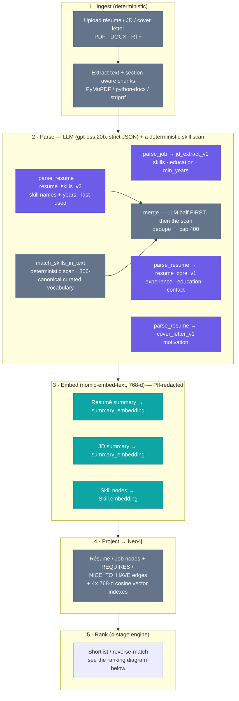
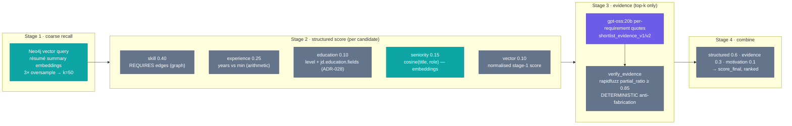
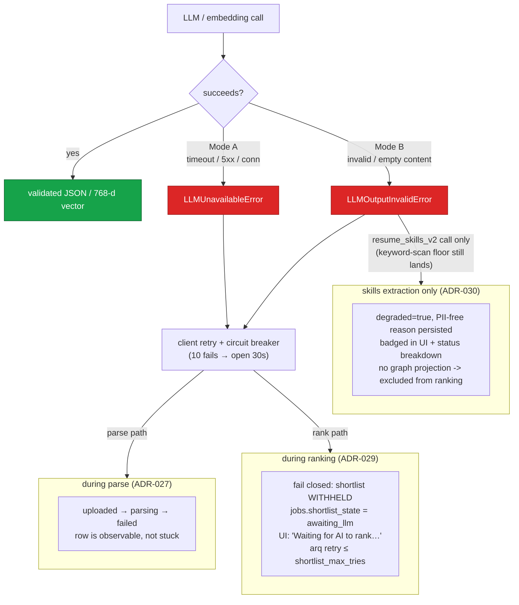
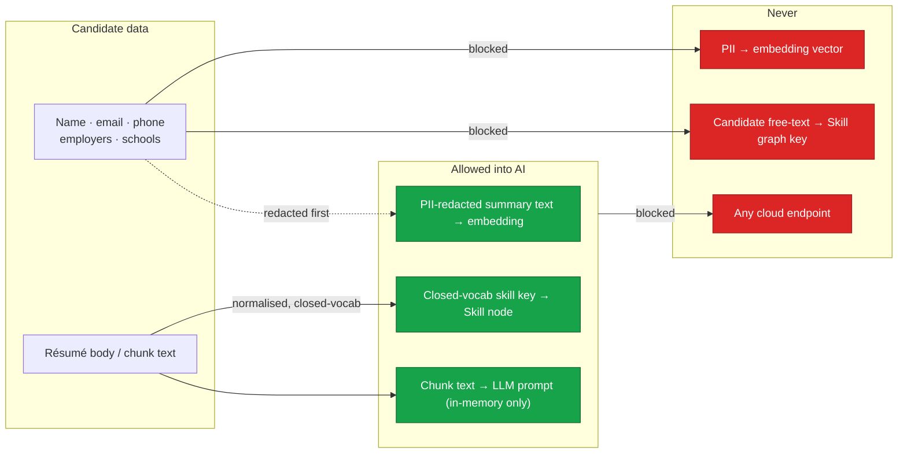

# AI Usage in the Recruiter Assistant — One-Pager

**Audience:** engineers, reviewers, and HR/compliance readers who need to know *exactly* where and how
AI touches a candidate's data. **Scope:** every LLM call, every embedding, and the guardrails around them.

> **Three principles that constrain everything below.**
> 1. **Offline-only.** All inference runs on a self-hosted, OpenAI-compatible Ollama endpoint set via
>    `LLM_BASE_URL` — this team's is the GPU host **aria-gb10** over Tailscale (`host.docker.internal:11434`
>    only if you run your own Ollama on the app box). **No cloud AI call exists anywhere in the codebase**,
>    by design (PIPEDA/FIPPA).
> 2. **PII never enters an embedding.** Candidate identity is redacted before any text is embedded, and the
>    skill graph is PII-free *by construction*. See [Privacy boundaries](#privacy-boundaries).
> 3. **AI is assistive, not authoritative.** Every LLM output is validated against a strict schema; the
>    anti-fabrication check on evidence is **deterministic (rapidfuzz), not an LLM**; and a failed AI call
>    **withholds** a ranking rather than silently degrading it (ADR-029).

---

## Models & infrastructure

| Role | Model | Where | Key facts |
|---|---|---|---|
| **Generation** (structured extraction, evidence) | `gpt-oss:20b` | local Ollama / Tailscale peer | A **reasoning** model — allocates tokens to a hidden reasoning trace, so `max_tokens` must budget reasoning *plus* JSON output (ADR-021 §6). Called only via strict-JSON mode. |
| **Embeddings** | `nomic-embed-text` | same endpoint | **768-dim, cosine.** One number, one place: `settings.llm_embedding_dim` is the single source of the 768-d contract and the Neo4j `vector.dimensions`. |
| **Transport** | `LLMClient` (hand-rolled `httpx`) | `core/src/pipeline/llm/client.py` | OpenAI-compatible chat / JSON-mode / embeddings + Ollama-native `/api/chat` path. Retries (default 2), **circuit breaker** (10 consecutive failures → open 30 s), `llm_timeout_s` (120 s default; ADR-021 recommends 150–170 s on the measured peer). |
| **Embedding cache** | `CachedEmbedder` | Redis read-through | 90-day TTL; batches text, dedupes repeat embeds. |
| **Vector store** | Neo4j | 4× 768-d cosine indexes | `resume_summary_idx` (Résumé), the Job summary index, and the Skill-node index power stage-1 recall and the skill graph. |

Failure taxonomy the whole system keys off:
- **`LLMUnavailableError`** — *Mode A*, availability (timeout / connection / 5xx / 429).
- **`LLMOutputInvalidError`** — *Mode B*, output invalidity (non-JSON, schema-invalid, or **empty content**
  from reasoning-token exhaustion — detected explicitly, ADR-029 §6).

---

## Where AI touches the data — end to end

> **Legend:** 🟪 purple = LLM generation · 🟩 teal = embeddings · ⬜ grey = deterministic (no AI).
> Text extraction, chunking, skill-graph keys, and evidence verification are all deterministic.
> **Résumé skills are both** — the LLM's named skills are merged with a deterministic scan over the
> curated vocabulary. See the note under the call-site table.

---

## Every AI call site

### LLM (generation, strict-JSON mode)

| # | Prompt | Call site | Purpose | `max_tokens` | Output schema |
|---|---|---|---|---|---|
| 1 | `jd_extract_v1` | `worker/tasks.py::parse_job` | Structured JD from raw text (required/nice-to-have skills, education level + **fields**, min years) | 2048 | `JDExtracted` |
| 2 | `resume_core_v1` | `worker/resume_tasks.py::parse_resume` | Core résumé: experience, education, contact | 3072 | `ResumeCore` |
| 3 | `resume_skills_v2` | `worker/resume_tasks.py::parse_resume` | Résumé skill names **with `years` / `last_used_year`** — merged with a deterministic scan, never used alone (see below) | 1536 | `ResumeSkillDetails` |
| 4 | `cover_letter_v1` | `worker/resume_tasks.py::parse_resume` | Cover-letter motivation (feeds the motivation sub-score) | 1024 | `CoverLetterParsed` |
| 5 | `shortlist_evidence_v1` / `v2` | `pipeline/matching/orchestrator.py` (ranking **stage 3**) | Per-requirement evidence quotes from résumé chunks; `v2` adds a cover-letter block | 2048 (`match_evidence_max_tokens`) | `EvidenceObjectIngest` |

Every call goes through `chat_json(...)`, which enforces JSON mode, validates against the schema, and
retries once (`max_retries=1`) before raising `LLMOutputInvalidError`.

**Call 3 is not an LLM-only output, and that matters more since [ADR-042](adr/042-skill-vocabulary-domain-families.md).**
`_extract_skills_merged` *always* runs a deterministic scan (`match_skills_in_text`) over the curated
vocabulary — **306 canonicals**, up from 72 — and merges it with call 3: LLM names **first**, so their
`years`/`last_used_year` survive the 400-item cap, then a dedupe. The two halves are complementary. The
LLM half carries recency data a name-only scan can never recover; the scan half catches vocabulary terms
the LLM did not name. On the administrative and academic résumés this product mostly sees, the scan is a
substantial share of the result, not a safety net.

When call 3 fails validation the scan stands **alone** and the parse is marked `degraded` (ADR-030, under
[Resilience](#resilience--failure-handling)) — so the scan is both the normal-path co-author and the
failure-path fallback. An earlier version of this page documented only the second role.

### Embeddings (`nomic-embed-text`, 768-d)

| Embed | Call site | Consumed by |
|---|---|---|
| Résumé summary → `Resume.summary_embedding` | `worker/resume_tasks.py` | Stage-1 coarse recall (`resume_summary_idx`) + the `vector` sub-score |
| JD summary → `Job.summary_embedding` | `worker/tasks.py::parse_job` | Reverse-match stage-1 recall |
| Skill node → `Skill.embedding` | `pipeline/skills_graph.py` | Skill-graph vector neighbourhood (job side only — never candidate free-text) |
| `[job.title, recent_title]` (transient) | `orchestrator.py` (ranking **stage 2**) | The `seniority` sub-score = `cosine(jd.title, most-recent role title)` |

---

## The ranking engine — what is AI vs deterministic

Only **stage 3 uses the generation model**, and only for the top-k candidates. Its output is never
trusted raw: `verify_evidence` re-checks every quote against the real chunk text with a **deterministic**
fuzzy match (rapidfuzz `partial_ratio ≥ 0.85`) and scrubs anything it can't find (ADR-022/023). Embeddings
appear in stage 1 (recall) and the stage-2 seniority sub-score. Everything else is arithmetic on the graph.

---

## Resilience & failure handling

- **Reasoning-token exhaustion** (`gpt-oss:20b` returns empty content) is detected explicitly and raised as
  `LLMOutputInvalidError` with a diagnostic, rather than flowing into an opaque JSON error (ADR-029 §6).
  No `think:false` flag reliably disables reasoning for this model, so **detection is the primary control.**
- **Fail-closed ranking (ADR-029):** a candidate is **never** silently scored 0 on the 40 % of the composite
  that depends on the LLM (evidence + motivation). The whole shortlist is withheld and retried instead.
- **Honest parse status (ADR-027):** a résumé whose parse times out moves to `failed`, not a silent
  `uploaded`, so it can't vanish from a shortlist unnoticed.
- **Degraded-parse visibility (ADR-030):** when skills extraction (Mode B) falls back to a deterministic
  keyword scan, the résumé is marked `degraded` (persisted on the existing `resumes.parsed` jsonb, no DDL),
  badged in the list/detail UI and the per-job status breakdown, and — same fail-closed reasoning as
  ADR-029 — excluded from ranking (its `resume.parsed` graph-projection event is never enqueued) until it is
  re-parsed.

---

## Privacy boundaries

- **PII never enters embeddings (ADR-007).** A deterministic scrub redacts the candidate's name / email /
  phone (whitespace-flexible) from any text handed to the embedder. A vector of a header chunk is
  PII-equivalent under PIPEDA/FIPPA, so it is scrubbed at the embed boundary.
- **Skill graph is PII-free by construction (ADR-008).** `Skill.canonical_key` is either a closed-vocab
  cleartext term or a salted hash — **never** untrusted résumé free text — so a model that fumbles a name
  into `skills[]` cannot leak it into a node or its embedding.
- **The outbox carries no PII (ADR-007 §7).** Chunk text, embeddings, and the raw summary are dropped from
  the outbox payload; the system of record for text is the encrypted-at-rest `resumes.parsed` column.
- **At-rest note.** Display redaction (blind review) is *display-only*; `resumes.parsed` retains cleartext
  candidate data encrypted via pgcrypto. This is accepted for v1 (ADR-007 §6) — not to be confused with the
  embedding boundary above, which is absolute.

---

## Pointers

| Topic | Source |
|---|---|
| LLM client (retry / breaker / JSON mode / empty-content) | `core/src/pipeline/llm/client.py` |
| Prompts | `core/src/prompts/templates/*.j2` |
| Parse workers | `core/src/worker/{tasks,resume_tasks}.py` |
| Ranking engine | `core/src/pipeline/matching/{orchestrator,stages}.py` |
| Skill graph (PII-by-construction) | `core/src/pipeline/skills_graph.py` · ADR-008 |
| Embedding / PII boundary | ADR-007 |
| Evidence anti-fabrication | ADR-022 · ADR-023 |
| Fail-closed ranking · honest parse status | ADR-029 · ADR-027 |
| Degraded-parse visibility | ADR-030 |
| Education field relevance | ADR-028 |
| HR-facing metrics + ratification register | `docs/process/ranking-metrics-explainer.html` |
