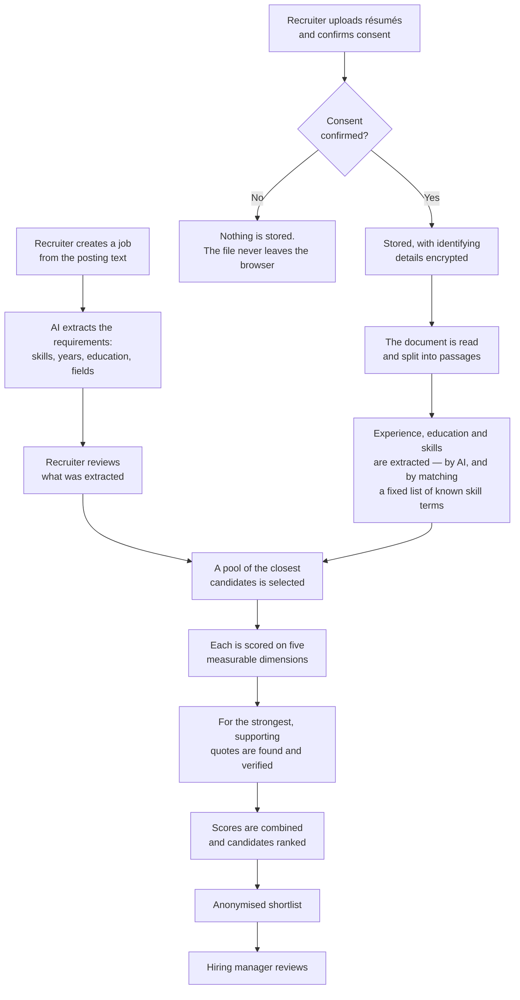
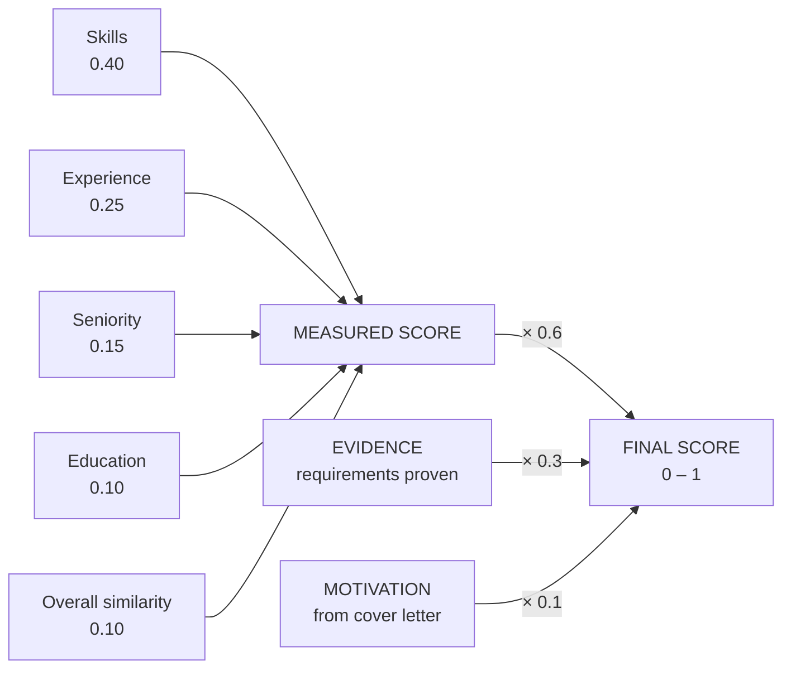

# How this system scores candidates

**A guide for HR & hiring managers**

What the tool does, how to get good results from it, and the seventeen policy decisions only you can answer.
Every score it produces is the arithmetic consequence of a choice someone made — this guide puts those
choices in front of you.

> Markdown edition of `ranking-metrics-explainer.html`. The two are kept identical; the HTML version renders
> the diagrams as pictures.

---

## In one paragraph

You give the system a job description and a set of résumés. It reads each résumé, compares it against the
job, and returns a ranked shortlist. For the strongest candidates it also pulls out the actual sentences from
their résumé that prove each requirement is met, and checks every quote against the real document before
showing it to you. Candidates' names and contact details are hidden by default; revealing one is a
deliberate, recorded action. Nothing is sent to any outside service.

---

## Setting up a job

*Half the system, and the half you have the most control over.*

You create a requisition by giving the system the posting itself — the description text, pasted or uploaded.
**The system then reads that posting with AI and extracts a structured set of requirements from it:** a job
title, the required skills (each with an optional minimum number of years), the skills that are desirable
rather than required, an overall minimum years of experience, a required education level and any named
fields of study, plus location and responsibilities.

> ### The single most important thing to understand about this tool
>
> **Candidates are scored against what the system extracted, not against your prose.** If the extraction
> misses a requirement, no candidate is ever credited for it. If it turns a passing mention into a required
> skill, every candidate is penalised for lacking it. The extracted requirements are shown to you on the job
> page — **read them before you generate a shortlist**, every time. It is thirty seconds and it is the
> difference between a shortlist you can defend and one you cannot.
>
> This matters more than usual right now, because of two things. Every skill the system pulls out of a
> posting is currently treated as *mandatory* — the "desirable" distinction is extracted but not yet used in
> scoring (decision 4). And the vocabulary problem in "what is not finished" below means a real posting's
> requirements are only partly recognised — roughly half, as of the latest vocabulary update, up from about
> one statement in six before it. Check the extraction; do not assume it caught everything.

### The settings you choose per job

- **Blind review** — on by default. Hides candidate identity from the shortlist. It can be turned off for a
  job, which permanently un-blinds every candidate on it for everyone thereafter; that action is recorded.
- **Retention period** — between 30 and 730 days, 180 by default. See the caveat in "what is not finished":
  it is recorded but not yet enforced automatically.
- **Shortlist size** — you can keep the whole ranked list or cap it to a top percentage. The default keeps
  everything.
- **Assigned hiring managers** — this is what controls access. A hiring manager sees only the requisitions
  they are assigned to.

### The lifecycle

A job moves **draft → open → closed → archived**, and only in that direction. There is no way back: a closed
requisition cannot be reopened, it would have to be recreated. Worth knowing before you close one.

Jobs can also be created in bulk from a spreadsheet, which runs the same extraction on each.

---

## What it does, step by step

*Both sides are read by AI. Consent is a hard gate on the candidate side: without the tick, no candidate data
is stored at all. Skills are found two ways — the AI names them, and the system separately matches the résumé
against a fixed list of known skill terms. A skill that list does not contain can be missed even when the
résumé states it plainly, which is the coverage limit described further down.*

**Selecting the pool.** The system picks up to 50 résumés whose content is closest to the job description, by
meaning rather than keyword. Only résumés uploaded for that specific job are eligible.

**Scoring.** Every candidate in the pool is scored on skills, experience, education, seniority and overall
similarity. This part is pure arithmetic and fully repeatable — the same résumé against the same job always
produces the same number.

**Finding evidence.** For the top 15 candidates, the system goes back into the résumé and pulls out the
sentences that prove each requirement is met. Every quote is checked against the real document before anyone
sees it.

**Ranking.** The three parts are combined into one number between 0 and 1, and candidates are ordered by it.

---

## Finding jobs for a candidate — the other direction

The system also runs the comparison the other way round: take one candidate and find which requisitions they
fit. Useful when someone strong applies for a role that is already filled, or when you want to know where
else a shortlisted person could go.

It uses the same measured dimensions and the same evidence checking as the shortlist. Two differences matter.
**It does not include the cover-letter component**, so its scores top out at 0.9 rather than 1.0 — **never
put a reverse-match score next to a shortlist score**, they are on different scales. And it does not yet have
two of the protections the shortlist direction has: the automatic ranking-quality checks that run before
every release do not cover this direction, and if the AI fails partway through, this direction publishes what
it has rather than withholding the result. Both are being addressed. Until then it is sound for "who else
should we look at", and not the place to make a final call.

---

## How to get good results from it

*The practical things that make the difference. Worth reading once before you start.*

**Read what the system extracted from your posting.** Covered above and repeated here because it is the whole
game: scoring runs against the extracted requirements, not your text. Check them on the job page before
generating a shortlist.

**Write the job description in specifics, not adjectives.** The system matches on named skills and stated
requirements. "Strong communicator with attention to detail" gives it nothing to work with; "three years
administering student records systems" does. The clearer and more concrete the posting, the better the
extraction — and therefore the shortlist.

**Treat rank 16 and below as "not yet assessed", not "weak" — and the screen now says so.** Evidence
gathering runs for the top 15 only, and evidence is a large share of the final number. A candidate sitting
at 16 has not been examined in the same depth as one at 15 — they have not been judged and found wanting.
As of 13 August the explanation panel states this itself: it shows **"not assessed"** for those candidates
instead of a zero, and warns that their overall score is not comparable with the scores above the cut-off.
The cut-off has not moved — it is now disclosed rather than left for you to remember. If your pool is large
and the cut matters, shortlist in batches rather than assuming the tail is sorted.

**Never compare scores across two different job postings.** One of the five dimensions is scored *relative to
the other candidates in that batch*, so the strongest résumé in any pool scores full marks on it regardless
of how good it actually is. A 0.78 on one requisition and a 0.78 on another are not the same thing. Scores
rank candidates *within* a competition; they do not measure them against an absolute bar.

**A missing quote is not proof a candidate lacks something.** The quote checker is deliberately strict, and
it occasionally rejects a genuine quote — most often when the sentence it wants to cite is long and it tries
to shorten it. When a requirement shows as unproven, that means "not demonstrated to the system's
satisfaction", not "the candidate does not have it". Check the résumé before ruling anyone out on that basis.

**Check that everyone actually processed.** A résumé that failed to process, or that only partly processed,
is held back from the shortlist rather than ranked on incomplete information. The job page shows these
counts. If a batch of candidates seems to have vanished, look there before concluding they scored badly.

---

## What the score is made of

*Every candidate's final number, decomposed. All scores run from 0 to 1.*

*Two layers. The five measured dimensions combine into one score, which is then worth 60% of the final
number.*

**Skills — 0.40.** Each required skill is scored on how long it was used, how recently, and how closely it
matches. Recent use scores full marks; within five years, less; older, less again. A closely related skill
earns half credit. **Missing a mandatory skill halves the whole skills score** — it does not disqualify. A
strong candidate missing one required skill can still outrank a weaker one who has it. **Unless the candidate
is well over the required years of experience**, in which case the penalty is lighter, on the reasoning that
a long career is itself circumstantial evidence for a skill the résumé did not spell out. See decision 3 —
that one has fairness implications.

**Experience — 0.25.** Measured against the minimum the job states. Meeting it scores full marks.
Substantially exceeding it scores slightly *lower* — deliberate handling of over-qualification, with a floor
so it never costs much. When the job states no minimum years, every candidate scores full marks on this row, and
the panel discloses this as **"not assessed"** — no comparison happened, so the score is a default, not a
judgement. See decision 16.

**Seniority — 0.15.** Compares the candidate's most recent job title against the job's title. When no
readable title is found, the score falls back to zero, and the panel discloses this as **"not assessed"** —
no comparison happened, so the score is a default, not a judgement. See decision 11.

**Education — 0.10.** Reads the level, from secondary school through doctorate. Meeting or exceeding the
required level scores full marks; below it earns partial credit. When the job states no minimum education level,
every candidate scores full marks on this row, and the panel discloses this as **"not assessed"** — no comparison
happened. When no education section can be read from the résumé at all, the score falls back to zero, and the
panel discloses this as **"not assessed"** — no comparison happened, and notably, this is *lower* than a
candidate whose degree is below the bar, who earns partial credit. See decisions 16 and 17. Where the job names
particular fields of study, a qualifying degree in an unnamed field is capped at partial credit.

**Overall similarity — 0.10.** How closely the résumé as a whole resembles the posting. Scored relative to
the rest of the pool — which is why scores are not comparable between requisitions.

### And the two parts on top

**Evidence — 0.30.** What share of the job's requirements were proven with a verified quote from the résumé.
Fully met counts one, partly met counts a half, unproven counts nothing.

**Motivation — 0.10.** Read from the cover letter only. A candidate who did not submit one scores zero here.
See decision 12.

---

## Why you can trust the quotes

The obvious risk in using AI for hiring is fabrication — the system asserting a candidate holds an
accreditation they never claimed. The protection is that **every quote shown to you must be traceable to a
specific, real passage of that candidate's own document.** A quote that cannot be matched back is deleted
before anyone sees it, the requirement is downgraded to unproven, and it earns no credit toward the score.
Quotes are checked one candidate at a time, so one person's text can never be attributed to another.

Two honest caveats, because you should know the shape of the protection and not just that it exists. It is a
close-match test, not a character-for-character one, so a quote that stays mostly faithful to a real passage
but embellishes part of it can still pass — the system cannot invent a qualification out of nothing, but it
can overstate one. And the test errs in the other direction too, sometimes rejecting a genuine quote, which
is why an unproven requirement should prompt you to check rather than to conclude.

---

## Privacy, consent and the record

### Consent is a hard gate

The upload form requires an explicit confirmation that the candidate consented to this processing under
PIPEDA and FIPPA. Without it the file is never sent and never stored. The confirmation is kept permanently
against the upload.

### What is hidden, and from whom

- Names, email addresses, phone numbers and cover letter text are **encrypted** in storage.
- Identifying details are **removed before any text reaches the scoring**, so the ranking cannot be
  influenced by who someone is.
- Under blind review a hiring manager sees the shortlist with names, contact details and identifying
  filenames removed — including from the evidence quotes, so a letterhead cannot leak a name.
- Hiring managers see only the requisitions they are assigned to. One they are not assigned to is
  indistinguishable from one that does not exist.

### Revealing a candidate

Un-blinding is deliberate and recorded. A recruiter or administrator performs it; the record naming *who*
revealed *which candidate*, *when* and *for which job* is written **before** anything is decrypted, so an
identity cannot be viewed without leaving a trace. A hiring manager cannot reveal a candidate themselves —
the request goes through a recruiter, and that second pair of hands is what makes blind review mean
something. Turning blind review off for a whole job is also recorded.

---

## Decisions we need from you

*Fifteen choices currently encoded as numbers in the software. None of them are facts — each is hiring
policy, and each needs an owner who confirms it reflects ours.*

The question for each is not "is this working?" It is **"is this what we intend?"** Every one of these is
adjustable without a code change or a release, so a different answer costs a conversation, not a project.

| # | What the system does today | Why only you can settle it |
|---|---|---|
| 1 | Skills count for 40% of the measured score, experience 25%, seniority 15%, education 10%, overall similarity 10% — and the measured score is 60% of the final number, evidence 30%, motivation 10%. | Defensible for a technical role, possibly indefensible for a credential-regulated one. It is the shape of what we say we value. |
| 2 | Missing a mandatory skill halves the skills score rather than excluding the candidate. | Decides whether "required" genuinely means required, or is a strong preference. |
| 3 | That penalty is **softened** for a candidate well above the required years who matched most other requirements. | **Read this one carefully.** More years of experience buys a lighter penalty for lacking a required skill. Whatever the reasoning, the effect favours longer careers, which interacts with decisions 8 and 9 and carries age-related fairness risk. |
| 4 | Every skill named in a posting is treated as **mandatory**. "Desirable" cannot currently be expressed. | This is why the penalty in decision 2 applies to nearly everyone. The system is making a strictness judgement for you, always in the same direction. |
| 5 | Where a posting names fields of study, a qualifying degree in an unnamed field is capped at partial credit — and a degree whose field cannot be read is treated as not matching. | The cap size is policy. So is penalising an unreadable field, which can under-credit a genuinely qualified person because of how their résumé was formatted. |
| 6 | Only the top 15 candidates are assessed on evidence. | A hard cliff: candidate 16 scores zero on a large share of the final number by where the work stops, not by merit. |
| 7 | A skill with no stated duration counts as fully meeting the years requirement. | A generous default, and it fires often — résumés rarely state years per skill. |
| 8 | Candidates with more than twice the required experience are scored down, though never below 0.8. | Deliberate down-weighting of over-qualification. Carries obvious age-proxy risk and should be a conscious, defended choice. |
| 9 | Skills used within two years score full marks; within five, less; older, less again. | Penalises career breaks, parental leave and caring responsibilities. The clearest human-rights exposure on this page. |
| 10 | Overall similarity is scored relative to the batch, not absolutely. When every candidate ties — most often a batch of one — a candidate's own **"Why this rank?" page** says **"not assessed"** instead of full marks. | The best of a weak field still scores full marks on that dimension, and *that* is not disclosed anywhere. The disclosure is on the detail page only: the shortlist cards and the CSV export still show the bare number. |
| 11 | Seniority compares job titles; when no readable title is found the score falls back to zero, and a candidate's **"Why this rank?" page** says **"not assessed"**. | The candidate still loses the whole seniority weighting — the page tells you the number was never measured, it does not give the marks back. As with decision 10, the cards and the CSV export still show the bare zero. |
| 12 | A cover letter is worth 10%; candidates without one score zero there. | A structural penalty for not submitting a document that may have been optional in the posting. |
| 13 | If the AI is unavailable, the shortlist is withheld and shown as waiting rather than published with candidates silently scored zero. It retries, then stops and waits for a person. | The safe behaviour is already chosen. What is yours is the patience: how long we wait before a human is asked to step in. |
| 14 | Consent is one confirmation per upload batch, with no record of wording or its own timestamp. | May not satisfy per-candidate consent evidence obligations. Worth checking against our retention and subject-access commitments. |
| 15 | Personal qualities — communication, leadership, judgement — would be scored on the same "years of use and how recently" model as technical skills. | **An open question, not yet settled.** "Three years of interpersonal skills, last used 2024" is not a meaningful statement, and the recency rule would penalise a career break on *communication* exactly as on a software tool. How we handle these needs deciding before the system is used on postings that lean on them — which at SFU is most of them. |
| 16 | When a posting states no minimum years of experience, or no minimum education level, every candidate scores full marks on that row — it reflects the posting, not the candidate. A candidate's **"Why this rank?" page** says **"not assessed"** to indicate no comparison happened. | The marks are still awarded and still count toward the composite; the disclosure says the dimension did not discriminate, it does not stop it inflating everyone equally. As with decisions 10 and 11, the shortlist cards and the CSV export still show the bare number. |
| 17 | When no education can be read from a résumé at all, education falls back to zero, which is **lower** than a candidate whose degree is below the posting's bar, who earns partial credit. A candidate's **"Why this rank?" page** says **"not assessed"**. | A document-formatting failure is being scored more harshly than genuinely lacking the qualification — a limit of parsing the document, not a finding about the candidate. This is decision 5's unreadable-*field* problem one level up. As with decisions 10 and 11, the shortlist cards and the CSV export still show the bare zero. |

---

## What is not finished

*Stated plainly, because you should not learn it from a surprise.*

**Skill matching is substantially better on our real postings, but the gap is not closed.** The system
recognises skills from a curated vocabulary that was originally built for software roles and, as of an
update landed 14 August 2026, has been extended with terms drawn from our own archive of SFU job
descriptions. Measured against that same archive, it now recognises **54.8%** of real qualification
statements, up from **15.6%** before the update — but that leaves **45.2%** still unrecognised: a genuine
long tail of specialized, regulatory and role-specific language (think MRI/MEG methods, microfabrication,
study-permit requirements) that the vocabulary still doesn't cover and will need further, different work to
close. Until that lands, results on an unmodified real posting will still understate some candidates'
skills — less often than before the update, but still routinely. **This remains the item that most affects
whether the tool is useful to you on a posting we did not write for this system.**

**Signing in is now required, and accounts can be issued to recruiters and administrators.** This corrects
what an earlier version of this page told you. Until 13 August the underlying service accepted instructions
from anyone who could reach it on the network without signing in at all — someone on that network could have
changed a job's settings, including switching blind review off, without appearing in the record as
themselves. **That is now closed:** every action that changes anything requires a real sign-in, the service
refuses to start at all in a configuration that would leave the door open, and deactivating someone's account
now takes effect immediately rather than whenever their session happened to expire. Scoring and stored data
were never affected by this; it was about who could reach the service.

All four kinds of account — administrator, recruiter, hiring manager and auditor — can now be issued. The
protection against a malicious link (a page that tries to make your browser act on this service while you
are signed in) now covers all twelve of our state-changing screens, up from three, and an auditor finally
has a screen of their own (below).

**Auditors now have a screen — and the underlying record was less reachable than we said.** An auditor can
open **Access record** and read what has happened: who revealed which candidate, who changed someone's
role, who withdrew or reinstated a file, and when. Correcting an earlier version of this page: the problem
was not only that the screen was missing. The service had **no way to read its own access record at all**,
so producing one meant an engineer querying the database by hand. That is now a page.

**One thing is deliberately not shown there.** When a candidate's file is withdrawn, whoever did it can
record a free-text reason, and that text can name the candidate or describe their circumstances. Those
reasons are recorded but **withheld** on the screen — the auditor sees that a reason exists, not what it
says. Whether an auditor should be able to read them is a decision for you, not for us; ask an
administrator if a specific one is needed for a review.

**Retention is recorded but not automatic.** Each job carries a retention period, but nothing deletes
anything when it expires — removal is currently a manual process. If our retention schedule is a commitment
to candidates, it needs to be met by hand for now.

**A few smaller things.** The access record can now be read on screen, but not yet exported — handing it to
someone else still means asking an engineer. Uploaded files themselves are access-restricted but not encrypted, though the personal details
inside the database are. The explanation panel used to show a below-cut-off candidate's evidence as a flat
zero; it now says "not assessed" instead, and flags that their overall score is not comparable with those
above the cut-off.

---

## What we would like from you

1. **Work through the seventeen decisions** and record an owner and an answer for each. They are designed to be
   worked through in a single session. Changing any of them is a configuration change, not a development
   project.
2. **Look at decisions 3, 8 and 9 together, with legal input.** Individually each is defensible; together
   they consistently favour longer, unbroken careers, and that is the combination most likely to produce
   adverse impact.
3. **Tell us what you want decision 15 to be.** It is genuinely undecided, and it matters more at SFU than
   the technical-skill questions do.
4. **Give us two or three real postings to test against.** Most of the vocabulary gap has now been closed;
   real postings are the best way to find out whether the remaining ~45% gap, and the further work meant to
   close it, are on track.

---

Prepared for HR and compliance review. Everything here was read from the running system rather than from
design documents; where the two disagreed, the system's actual behaviour is what is described.

Weights and thresholds are configuration — changing a ratified number does not require a release. Anything
listed as unfinished is engineering work with an owner, not an unknown.

If you find something here that does not match what the system does, that is a fault in this document.
Please say so.
